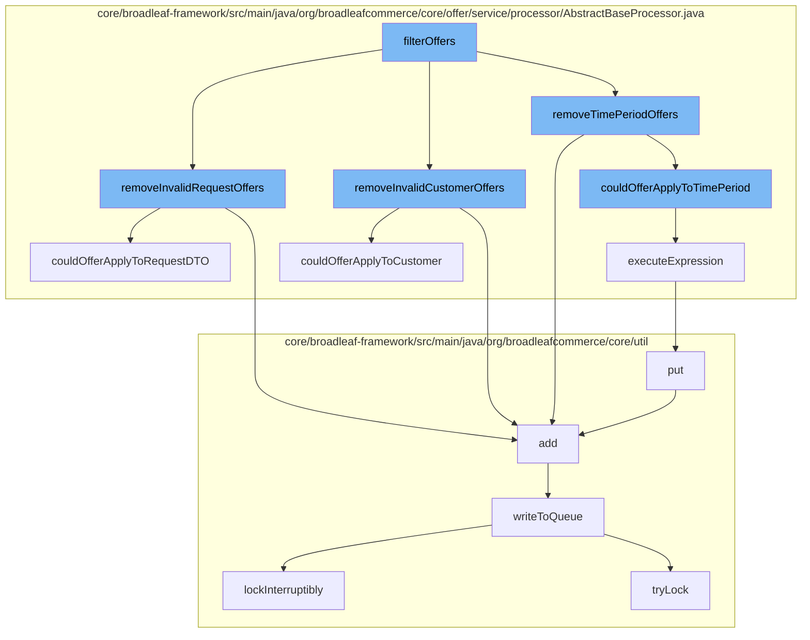

This document will cover the process of filtering and validating offers in the BroadleafCommerce-demo repository. The process includes the following steps:

1. Filtering offers
2. Removing invalid request offers
3. Removing invalid customer offers
4. Removing time period offers
5. Checking if the offer could apply to the time period
6. Executing the expression
7. Writing to the queue



<SwmSnippet path="/core/broadleaf-framework/src/main/java/org/broadleafcommerce/core/offer/service/processor/AbstractBaseProcessor.java" line="355">

---

# Filtering Offers

The `filterOffers` function initiates the process. It calls `removeInvalidRequestOffers`, `removeInvalidCustomerOffers`, and `removeTimePeriodOffers` to filter out invalid offers.

```java
    protected List<Offer> removeInvalidRequestOffers(List<Offer> offers) {
        RequestDTO requestDTO = null;
        if (BroadleafRequestContext.getBroadleafRequestContext() != null) {
            requestDTO = BroadleafRequestContext.getBroadleafRequestContext().getRequestDTO();
        }

        List<Offer> offersToRemove = new ArrayList<Offer>();
        for (Offer offer : offers) {
            if (!couldOfferApplyToRequestDTO(offer, requestDTO)) {
                offersToRemove.add(offer);
            }
        }
        // remove all offers in the offersToRemove list from original offers list
        for (Offer offer : offersToRemove) {
            offers.remove(offer);
        }
        return offers;

    }
```

---

</SwmSnippet>

<SwmSnippet path="/core/broadleaf-framework/src/main/java/org/broadleafcommerce/core/offer/service/processor/AbstractBaseProcessor.java" line="355">

---

# Removing Invalid Request Offers

`removeInvalidRequestOffers` function checks if the offer can be applied to the request. If not, the offer is added to the `offersToRemove` list and then removed from the original offers list.

```java
    protected List<Offer> removeInvalidRequestOffers(List<Offer> offers) {
        RequestDTO requestDTO = null;
        if (BroadleafRequestContext.getBroadleafRequestContext() != null) {
            requestDTO = BroadleafRequestContext.getBroadleafRequestContext().getRequestDTO();
        }

        List<Offer> offersToRemove = new ArrayList<Offer>();
        for (Offer offer : offers) {
            if (!couldOfferApplyToRequestDTO(offer, requestDTO)) {
                offersToRemove.add(offer);
            }
        }
        // remove all offers in the offersToRemove list from original offers list
        for (Offer offer : offersToRemove) {
            offers.remove(offer);
        }
        return offers;

    }
```

---

</SwmSnippet>

<SwmSnippet path="/core/broadleaf-framework/src/main/java/org/broadleafcommerce/core/offer/service/processor/AbstractBaseProcessor.java" line="538">

---

# Removing Invalid Customer Offers

`couldOfferApplyToCustomer` function checks if the offer can be applied to the customer. If not, the offer is considered invalid.

```java
    /**
     * Private method which executes the appliesToCustomerRules in the Offer to determine if this Offer
     * can be applied to the Customer.
     *
     * @param offer
     * @param customer
     * @return true if offer can be applied, otherwise false
     */
    protected boolean couldOfferApplyToCustomer(Offer offer, Customer customer) {
        boolean appliesToCustomer = false;
        
        String rule = null;
        OfferOfferRuleXref ruleXref = offer.getOfferMatchRulesXref().get(OfferRuleType.CUSTOMER.getType());
        if (ruleXref != null && ruleXref.getOfferRule() != null) {
            rule = ruleXref.getOfferRule().getMatchRule();
        }

        if (rule != null) {
            HashMap<String, Object> vars = new HashMap<String, Object>();
            vars.put("customer", customer);
            Boolean expressionOutcome = executeExpression(rule, vars);
```

---

</SwmSnippet>

<SwmSnippet path="/core/broadleaf-framework/src/main/java/org/broadleafcommerce/core/offer/service/processor/AbstractBaseProcessor.java" line="355">

---

# Removing Time Period Offers

`removeTimePeriodOffers` function checks if the offer can be applied to the time period. If not, the offer is considered invalid.

```java
    protected List<Offer> removeInvalidRequestOffers(List<Offer> offers) {
        RequestDTO requestDTO = null;
        if (BroadleafRequestContext.getBroadleafRequestContext() != null) {
            requestDTO = BroadleafRequestContext.getBroadleafRequestContext().getRequestDTO();
        }

        List<Offer> offersToRemove = new ArrayList<Offer>();
        for (Offer offer : offers) {
            if (!couldOfferApplyToRequestDTO(offer, requestDTO)) {
                offersToRemove.add(offer);
            }
        }
        // remove all offers in the offersToRemove list from original offers list
        for (Offer offer : offersToRemove) {
            offers.remove(offer);
        }
        return offers;

    }
```

---

</SwmSnippet>

<SwmSnippet path="/core/broadleaf-framework/src/main/java/org/broadleafcommerce/core/offer/service/processor/AbstractBaseProcessor.java" line="283">

---

# Checking if the Offer Could Apply to the Time Period

`couldOfferApplyToTimePeriod` function checks if the offer can be applied to the time period by executing the MVEL expression in the `appliesToOrderRules`.

```java
    /**
     * Private method used by couldOfferApplyToOrder to execute the MVEL expression in the
     * appliesToOrderRules to determine if this offer can be applied.
     *
     * @param expression
     * @param vars
     * @return a Boolean object containing the result of executing the MVEL expression
     */
    public Boolean executeExpression(String expression, Map<String, Object> vars) {
        Map<String, Class<?>> contextImports = new HashMap<>();

        expression = usePriceBeforeAdjustments(expression);
        contextImports.put("OfferType", OfferType.class);
        contextImports.put("FulfillmentType", FulfillmentType.class);
        return MvelHelper.evaluateRule(expression, vars, EXPRESSION_CACHE, contextImports);

    }
```

---

</SwmSnippet>

<SwmSnippet path="/core/broadleaf-framework/src/main/java/org/broadleafcommerce/core/offer/service/processor/AbstractBaseProcessor.java" line="283">

---

# Executing the Expression

`executeExpression` function executes the MVEL expression to determine if the offer can be applied.

```java
    /**
     * Private method used by couldOfferApplyToOrder to execute the MVEL expression in the
     * appliesToOrderRules to determine if this offer can be applied.
     *
     * @param expression
     * @param vars
     * @return a Boolean object containing the result of executing the MVEL expression
     */
    public Boolean executeExpression(String expression, Map<String, Object> vars) {
        Map<String, Class<?>> contextImports = new HashMap<>();

        expression = usePriceBeforeAdjustments(expression);
        contextImports.put("OfferType", OfferType.class);
        contextImports.put("FulfillmentType", FulfillmentType.class);
        return MvelHelper.evaluateRule(expression, vars, EXPRESSION_CACHE, contextImports);

    }
```

---

</SwmSnippet>

<SwmSnippet path="/core/broadleaf-framework/src/main/java/org/broadleafcommerce/core/util/queue/ZookeeperDistributedQueue.java" line="503">

---

# Writing to the Queue

`writeToQueue` function writes the offer to the queue for further processing.

```java
    protected int writeToQueue(List<? extends T> entries, final long timeout) throws InterruptedException {
        if (entries == null || entries.isEmpty()) {
            return 0;
        }
        
        int entryCount = 0;
        long waitTime = timeout;
        synchronized (QUEUE_MONITOR) {
            while (true) {
                boolean locked = false;
                DistributedLock lock = getQueueAccessLock();
                if (timeout < 0L) {
                    lock.lockInterruptibly();
                    locked = true;
                } else if (timeout > 0L && waitTime > 0L) {
                    long start = System.currentTimeMillis();
                    locked = lock.tryLock(waitTime, TimeUnit.MILLISECONDS);
                    long end = System.currentTimeMillis();
                    waitTime -= (end - start);
                } else {
                    locked = lock.tryLock();
```

---

</SwmSnippet>

&nbsp;

*This is an auto-generated document by Swimm AI 🌊 and has not yet been verified by a human*

<SwmMeta version="3.0.0" repo-id="Z2l0aHViJTNBJTNBQnJvYWRsZWFmQ29tbWVyY2UtZGVtbyUzQSUzQWdpbGFkbmF2b3Q=" repo-name="BroadleafCommerce-demo" doc-type="flows"><sup>Powered by [Swimm](/)</sup></SwmMeta>
