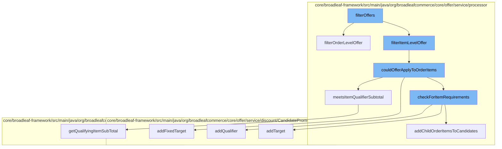

This document will cover the process of filtering offers in the BroadleafCommerce-demo project. We'll cover:

1. The initiation of the offer filtering process
2. Filtering of item level offers
3. Checking if the offer could apply to order items
4. Checking for item requirements
5. Adding child order items to candidates



<SwmSnippet path="/core/broadleaf-framework/src/main/java/org/broadleafcommerce/core/offer/service/processor/ItemOfferProcessorImpl.java" line="89">

---

# The initiation of the offer filtering process

The `filterOffers` function initiates the offer filtering process. It calls `filterOrderLevelOffer` and `filterItemLevelOffer` functions to filter order level and item level offers respectively.

```java
                    //support legacy offers                   
                    PromotableCandidateItemOffer candidate = createCandidateItemOffer(qualifiedItemOffers, offer, order);
                   
                    if (!candidate.getLegacyCandidateTargets().contains(promotableOrderItem)) {
                        candidate.getLegacyCandidateTargets().add(promotableOrderItem);
                    }
                    offerCreated = true;
                    continue;
                }
                itemLevelQualification = true;
                break;
            }
            for (PromotableFulfillmentGroup fulfillmentGroup : order.getFulfillmentGroups()) {
                if(couldOfferApplyToOrder(offer, order, promotableOrderItem, fulfillmentGroup)) {
                    if (!isNewFormat) {
                        //support legacy offers
                        PromotableCandidateItemOffer candidate = createCandidateItemOffer(qualifiedItemOffers, offer, order);
                        if (!candidate.getLegacyCandidateTargets().contains(promotableOrderItem)) {
                            candidate.getLegacyCandidateTargets().add(promotableOrderItem);
                        }
                        offerCreated = true;
```

---

</SwmSnippet>

<SwmSnippet path="/core/broadleaf-framework/src/main/java/org/broadleafcommerce/core/offer/service/processor/ItemOfferProcessorImpl.java" line="86">

---

# Filtering of item level offers

The `filterItemLevelOffer` function is responsible for filtering item level offers. It calls the `couldOfferApplyToOrderItems` function to check if the offer could apply to order items.

```java
        for (PromotableOrderItem promotableOrderItem : order.getDiscountableOrderItems()) {
            if(couldOfferApplyToOrder(offer, order, promotableOrderItem)) {
                if (!isNewFormat) {
                    //support legacy offers                   
                    PromotableCandidateItemOffer candidate = createCandidateItemOffer(qualifiedItemOffers, offer, order);
                   
                    if (!candidate.getLegacyCandidateTargets().contains(promotableOrderItem)) {
                        candidate.getLegacyCandidateTargets().add(promotableOrderItem);
                    }
                    offerCreated = true;
                    continue;
                }
                itemLevelQualification = true;
                break;
            }
            for (PromotableFulfillmentGroup fulfillmentGroup : order.getFulfillmentGroups()) {
                if(couldOfferApplyToOrder(offer, order, promotableOrderItem, fulfillmentGroup)) {
                    if (!isNewFormat) {
                        //support legacy offers
                        PromotableCandidateItemOffer candidate = createCandidateItemOffer(qualifiedItemOffers, offer, order);
                        if (!candidate.getLegacyCandidateTargets().contains(promotableOrderItem)) {
```

---

</SwmSnippet>

<SwmSnippet path="/core/broadleaf-framework/src/main/java/org/broadleafcommerce/core/offer/service/processor/AbstractBaseProcessor.java" line="86">

---

# Checking if the offer could apply to order items

The `couldOfferApplyToOrderItems` function checks if the offer could apply to order items. It calls `checkForItemRequirements` and `meetsItemQualifierSubtotal` functions to check for item requirements and if the offer meets item qualifier subtotal respectively.

```java
    protected CandidatePromotionItems couldOfferApplyToOrderItems(Offer offer, List<PromotableOrderItem> promotableOrderItems) {
        CandidatePromotionItems candidates = new CandidatePromotionItems();
        if (offer.getQualifyingItemCriteriaXref() == null || offer.getQualifyingItemCriteriaXref().size() == 0) {
            candidates.setMatchedQualifier(true);
        } else {
            for (OfferQualifyingCriteriaXref criteriaXref : offer.getQualifyingItemCriteriaXref()) {
                if (criteriaXref.getOfferItemCriteria() != null) {
                    checkForItemRequirements(offer, candidates, criteriaXref.getOfferItemCriteria(), promotableOrderItems, true);
                    if (!candidates.isMatchedQualifier()) {
                        break;
                    }
                }
            }           
        }

        if (offer.getType().equals(OfferType.ORDER_ITEM) && BooleanUtils.isTrue(offer.getUseListForDiscounts())) {
            for (OfferPriceData offerPriceData : offer.getOfferPriceData()) {
                PromotableOrderItem qualifyingOrderItem = findQualifyingItemForPriceData(offerPriceData, promotableOrderItems);
                if (qualifyingOrderItem != null) {
                    candidates.addFixedTarget(offerPriceData, qualifyingOrderItem);
                    candidates.setMatchedTarget(true);
```

---

</SwmSnippet>

<SwmSnippet path="/core/broadleaf-framework/src/main/java/org/broadleafcommerce/core/offer/service/processor/AbstractBaseProcessor.java" line="210">

---

# Checking for item requirements

The `checkForItemRequirements` function checks for item requirements. It calls `addChildOrderItemsToCandidates` function to add child order items to candidates.

```java
    protected void checkForItemRequirements(Offer offer, CandidatePromotionItems candidates, OfferItemCriteria criteria, List<PromotableOrderItem> promotableOrderItems, boolean isQualifier) {
        boolean matchFound = false;
        int criteriaQuantity = criteria.getQuantity();
        int matchedQuantity = 0;

        if (criteriaQuantity > 0) {
            // If matches are found, add the candidate items to a list and store it with the itemCriteria
            // for this promotion.
            for (PromotableOrderItem item : promotableOrderItems) {
                if (couldOrderItemMeetOfferRequirement(criteria, item)) {
                    if (isQualifier) {
                        candidates.addQualifier(criteria, item);
                    } else {
                        candidates.addTarget(criteria, item);
                        addChildOrderItemsToCandidates(offer, candidates, criteria, promotableOrderItems, item);
                    }
                    matchedQuantity += item.getQuantity();
                }
            }
            matchFound = (matchedQuantity >= criteriaQuantity);
        }
```

---

</SwmSnippet>

<SwmSnippet path="/core/broadleaf-framework/src/main/java/org/broadleafcommerce/core/offer/service/processor/AbstractBaseProcessor.java" line="239">

---

# Adding child order items to candidates

The `addChildOrderItemsToCandidates` function adds child order items to candidates. This is the final step in the offer filtering process.

```java
    protected void addChildOrderItemsToCandidates(Offer offer, CandidatePromotionItems candidates, OfferItemCriteria criteria, List<PromotableOrderItem> promotableOrderItems, PromotableOrderItem item) {
        if (offer.getApplyToChildItems()) {
            final List<OrderItem> childItems = item.getOrderItem().getChildOrderItems();
            if (CollectionUtils.isEmpty(childItems)) {
                return;
            }

            List<PromotableOrderItem> filteredItems = new ArrayList<>();
            filteredItems.addAll(promotableOrderItems);
            CollectionUtils.filter(filteredItems, new Predicate<PromotableOrderItem>() {
                @Override
                public boolean evaluate(PromotableOrderItem promotableOrderItem) {
                    return childItems.contains(promotableOrderItem.getOrderItem());
                }
            });

            for (PromotableOrderItem promotableOrderItem : filteredItems) {
                candidates.addTarget(criteria, promotableOrderItem);
            }
        }
    }
```

---

</SwmSnippet>

&nbsp;

*This is an auto-generated document by Swimm AI 🌊 and has not yet been verified by a human*

<SwmMeta version="3.0.0" repo-id="Z2l0aHViJTNBJTNBQnJvYWRsZWFmQ29tbWVyY2UtZGVtbyUzQSUzQWdpbGFkbmF2b3Q=" repo-name="BroadleafCommerce-demo" doc-type="flows"><sup>Powered by [Swimm](/)</sup></SwmMeta>
