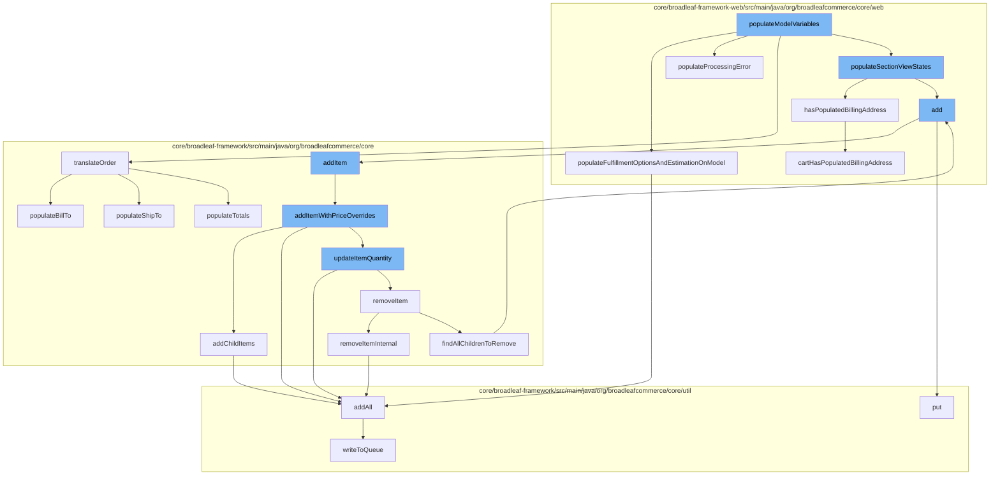

This document will cover the process of handling a one-page checkout in the BroadleafCommerce-demo repository. The process includes the following steps:

1. Populating model variables
2. Adding items to the cart
3. Updating item quantities
4. Removing items from the cart
5. Managing billing and shipping addresses
6. Writing to the distributed queue.



<SwmSnippet path="/core/broadleaf-framework-web/src/main/java/org/broadleafcommerce/core/web/processor/OnePageCheckoutProcessor.java" line="379">

---

# Populating model variables

The `populateModelVariables` function is the starting point of the checkout process. It calls several other functions to populate the model with necessary data for the checkout process.

```java
    /**
     * A helper method to retrieve all fulfillment options for the cart and estimate the cost of applying
     * fulfillment options on the first shippable fulfillment group.
     *
     */
    protected void populateFulfillmentOptionsAndEstimationOnModel(Map<String, Object> localVars) {
        List<FulfillmentOption> fulfillmentOptions = fulfillmentOptionService.readAllFulfillmentOptions();
        Order cart = CartState.getCart();

        if (!(cart instanceof NullOrderImpl) && cart.getFulfillmentGroups().size() > 0 && hasPopulatedShippingAddress(cart)) {
            Set<FulfillmentOption> options = new HashSet<>();
            options.addAll(fulfillmentOptions);
            FulfillmentEstimationResponse estimateResponse = null;
            try {
                estimateResponse = fulfillmentPricingService.estimateCostForFulfillmentGroup(fulfillmentGroupService.getFirstShippableFulfillmentGroup(cart), options);
            } catch (FulfillmentPriceException e) {

            }

            localVars.put("estimateResponse", estimateResponse);
        }
```

---

</SwmSnippet>

<SwmSnippet path="/core/broadleaf-framework/src/main/java/org/broadleafcommerce/core/order/service/OrderServiceImpl.java" line="655">

---

# Adding items to the cart

The `addItem` function is used to add items to the cart. It calls `addItemWithPriceOverrides` to add items with price overrides if any.

```java
    @Override
    @Transactional(value = "blTransactionManager", rollbackFor = {AddToCartException.class})
    public Order addItem(Long orderId, OrderItemRequestDTO orderItemRequestDTO, boolean priceOrder) throws AddToCartException {
        // Don't allow overrides from this method.
        orderItemRequestDTO.setOverrideRetailPrice(null);
        orderItemRequestDTO.setOverrideSalePrice(null);
        return addItemWithPriceOverrides(orderId, orderItemRequestDTO, priceOrder);
    }
```

---

</SwmSnippet>

<SwmSnippet path="/core/broadleaf-framework/src/main/java/org/broadleafcommerce/core/order/service/OrderServiceImpl.java" line="664">

---

# Updating item quantities

The `addItemWithPriceOverrides` function is responsible for updating the quantity of items in the cart. It calls `updateItemQuantity` to update the quantity of an item.

```java
    @Override
    @Transactional(value = "blTransactionManager", rollbackFor = { AddToCartException.class })
    public Order addItemWithPriceOverrides(Long orderId, OrderItemRequestDTO orderItemRequestDTO, boolean priceOrder) throws AddToCartException {
        Order order = findOrderById(orderId);
        preValidateCartOperation(order);
        if (getAutomaticallyMergeLikeItems()) {
            OrderItem item = findMatchingItem(order, orderItemRequestDTO);
            if (item != null && item.getParentOrderItem() == null) {
                orderItemRequestDTO.setQuantity(item.getQuantity() + orderItemRequestDTO.getQuantity());
                orderItemRequestDTO.setOrderItemId(item.getId());
                try {
                    return updateItemQuantity(orderId, orderItemRequestDTO, priceOrder);
                } catch (RemoveFromCartException e) {
                    throw new AddToCartException("Unexpected error - system tried to remove item while adding to cart", e);
                } catch (UpdateCartException e) {
                    throw new AddToCartException("Could not update quantity for matched item", e);
                }
            }
        }
        try {
            // We only want to price on the last addition for performance reasons and only if the user asked for it.
```

---

</SwmSnippet>

<SwmSnippet path="/core/broadleaf-framework/src/main/java/org/broadleafcommerce/core/order/service/OrderServiceImpl.java" line="851">

---

# Removing items from the cart

The `removeItemInternal` function is used to remove items from the cart. It calls `removeItem` to remove an item from the cart.

```java
    protected Order removeItemInternal(Long orderId, Long orderItemId, boolean priceOrder) throws WorkflowException {
        OrderItemRequestDTO orderItemRequestDTO = new OrderItemRequestDTO();
        orderItemRequestDTO.setOrderItemId(orderItemId);
        CartOperationRequest cartOpRequest = new CartOperationRequest(findOrderById(orderId), orderItemRequestDTO, priceOrder);
        Session session = em.unwrap(Session.class);
        FlushMode current = session.getHibernateFlushMode();
        if (!autoFlushRemoveFromCart) {
            //Performance measure. Hibernate will sometimes perform an autoflush when performing query operations and this can
            //be expensive. It is possible to avoid the autoflush if there's no concern about queries in the flow returning
            //incorrect results because something has not been flushed to the database yet.
            session.setHibernateFlushMode(FlushMode.MANUAL);
        }
        ProcessContext<CartOperationRequest> context;
        try {
            context = (ProcessContext<CartOperationRequest>) removeItemWorkflow.doActivities(cartOpRequest);
        } finally {
            if (!autoFlushRemoveFromCart) {
                session.setHibernateFlushMode(current);
            }
        }
        context.getSeedData().getOrder().getOrderMessages().addAll(((ActivityMessages) context).getActivityMessages());
```

---

</SwmSnippet>

<SwmSnippet path="/core/broadleaf-framework/src/main/java/org/broadleafcommerce/core/payment/service/OrderToPaymentRequestDTOServiceImpl.java" line="204">

---

# Managing billing and shipping addresses

The `populateBillTo` function is used to populate the billing address for the order. It iterates over the payments of the order and populates the billing address if it exists.

```java
    @Override
    public void populateBillTo(Order order, PaymentRequestDTO requestDTO) {
        for (OrderPayment payment : order.getPayments()) {
            if (payment.isActive()) {
                Address billAddress = payment.getBillingAddress();
                if (billAddress != null) {
                    populateAddressInfo(requestDTO.billTo(), billAddress);
                }
            }
        }
    }
```

---

</SwmSnippet>

<SwmSnippet path="/core/broadleaf-framework/src/main/java/org/broadleafcommerce/core/util/queue/ZookeeperDistributedQueue.java" line="503">

---

# Writing to the distributed queue

The `writeToQueue` function is used to write the order data to a distributed queue for further processing.

```java
    protected int writeToQueue(List<? extends T> entries, final long timeout) throws InterruptedException {
        if (entries == null || entries.isEmpty()) {
            return 0;
        }
        
        int entryCount = 0;
        long waitTime = timeout;
        synchronized (QUEUE_MONITOR) {
            while (true) {
                boolean locked = false;
                DistributedLock lock = getQueueAccessLock();
                if (timeout < 0L) {
                    lock.lockInterruptibly();
                    locked = true;
                } else if (timeout > 0L && waitTime > 0L) {
                    long start = System.currentTimeMillis();
                    locked = lock.tryLock(waitTime, TimeUnit.MILLISECONDS);
                    long end = System.currentTimeMillis();
                    waitTime -= (end - start);
                } else {
                    locked = lock.tryLock();
```

---

</SwmSnippet>

&nbsp;

*This is an auto-generated document by Swimm AI 🌊 and has not yet been verified by a human*

<SwmMeta version="3.0.0" repo-id="Z2l0aHViJTNBJTNBQnJvYWRsZWFmQ29tbWVyY2UtZGVtbyUzQSUzQWdpbGFkbmF2b3Q=" repo-name="BroadleafCommerce-demo" doc-type="flows"><sup>Powered by [Swimm](/)</sup></SwmMeta>
