This document will cover the process of handling one-page checkout in BroadleafCommerce-demo, which includes:

1. Populating model variables
2. Adding items to the wishlist
3. Handling fulfillment options and estimation
4. Processing errors
5. Writing to the distributed queue.

```mermaid
graph TD;
subgraph core/broadleaf-framework-web/src/main/java/org/broadleafcommerce/core/web
  populateModelVariables:::mainFlowStyle --> populateFulfillmentOptionsAndEstimationOnModel
end
subgraph core/broadleaf-framework-web/src/main/java/org/broadleafcommerce/core/web
  populateModelVariables:::mainFlowStyle --> populateProcessingError
end
subgraph core/broadleaf-framework/src/main/java/org/broadleafcommerce/core
  populateModelVariables:::mainFlowStyle --> put
end
subgraph core/broadleaf-framework-web/src/main/java/org/broadleafcommerce/core/web
  populateModelVariables:::mainFlowStyle --> populateSectionViewStates
end
subgraph core/broadleaf-framework/src/main/java/org/broadleafcommerce/core
  populateFulfillmentOptionsAndEstimationOnModel --> put
end
subgraph core/broadleaf-framework/src/main/java/org/broadleafcommerce/core
  populateFulfillmentOptionsAndEstimationOnModel --> addAll
end
subgraph core/broadleaf-framework/src/main/java/org/broadleafcommerce/core
  populateProcessingError --> put
end
subgraph core/broadleaf-framework/src/main/java/org/broadleafcommerce/core
  put --> add
end
subgraph core/broadleaf-framework/src/main/java/org/broadleafcommerce/core
  put --> writeToQueue
end
subgraph core/broadleaf-framework-web/src/main/java/org/broadleafcommerce/core/web
  populateSectionViewStates:::mainFlowStyle --> add
end
subgraph core/broadleaf-framework/src/main/java/org/broadleafcommerce/core
  populateSectionViewStates:::mainFlowStyle --> put
end
subgraph core/broadleaf-framework-web/src/main/java/org/broadleafcommerce/core/web
  populateSectionViewStates:::mainFlowStyle --> hasPopulatedBillingAddress
end
subgraph core/broadleaf-framework/src/main/java/org/broadleafcommerce/core
  add:::mainFlowStyle --> addItem
end

classDef mainFlowStyle color:#000000,fill:#7CB9F4
classDef rootsStyle color:#000000,fill:#00FFF4
classDef Style1 color:#000000,fill:#00FFAA
classDef Style2 color:#000000,fill:#FFFF00
classDef Style3 color:#000000,fill:#AA7CB9

%% Swimm:
%% graph TD;
%% subgraph <SwmPath>[core/broadleaf-framework-web/src/main/java/org/broadleafcommerce/core/web/](/core/broadleaf-framework-web/src/main/java/org/broadleafcommerce/core/web/)</SwmPath>
%%   populateModelVariables:::mainFlowStyle --> <SwmToken path="/core/broadleaf-framework-web/src/main/java/org/broadleafcommerce/core/web/processor/OnePageCheckoutProcessor.java" pos="384:5:5" line-data="    protected void populateFulfillmentOptionsAndEstimationOnModel(Map&lt;String, Object&gt; localVars) {">`populateFulfillmentOptionsAndEstimationOnModel`</SwmToken>
%% end
%% subgraph <SwmPath>[core/broadleaf-framework-web/src/main/java/org/broadleafcommerce/core/web/](/core/broadleaf-framework-web/src/main/java/org/broadleafcommerce/core/web/)</SwmPath>
%%   populateModelVariables:::mainFlowStyle --> <SwmToken path="/core/broadleaf-framework-web/src/main/java/org/broadleafcommerce/core/web/processor/OnePageCheckoutProcessor.java" pos="178:1:1" line-data="        populateProcessingError(newModelVars);">`populateProcessingError`</SwmToken>
%% end
%% subgraph <SwmPath>[core/broadleaf-framework/src/main/java/org/broadleafcommerce/core/](/core/broadleaf-framework/src/main/java/org/broadleafcommerce/core/)</SwmPath>
%%   populateModelVariables:::mainFlowStyle --> put
%% end
%% subgraph <SwmPath>[core/broadleaf-framework-web/src/main/java/org/broadleafcommerce/core/web/](/core/broadleaf-framework-web/src/main/java/org/broadleafcommerce/core/web/)</SwmPath>
%%   populateModelVariables:::mainFlowStyle --> <SwmToken path="/core/broadleaf-framework-web/src/main/java/org/broadleafcommerce/core/web/processor/OnePageCheckoutProcessor.java" pos="169:1:1" line-data="        populateSectionViewStates(newModelVars);">`populateSectionViewStates`</SwmToken>
%% end
%% subgraph <SwmPath>[core/broadleaf-framework/src/main/java/org/broadleafcommerce/core/](/core/broadleaf-framework/src/main/java/org/broadleafcommerce/core/)</SwmPath>
%%   <SwmToken path="/core/broadleaf-framework-web/src/main/java/org/broadleafcommerce/core/web/processor/OnePageCheckoutProcessor.java" pos="384:5:5" line-data="    protected void populateFulfillmentOptionsAndEstimationOnModel(Map&lt;String, Object&gt; localVars) {">`populateFulfillmentOptionsAndEstimationOnModel`</SwmToken> --> put
%% end
%% subgraph <SwmPath>[core/broadleaf-framework/src/main/java/org/broadleafcommerce/core/](/core/broadleaf-framework/src/main/java/org/broadleafcommerce/core/)</SwmPath>
%%   <SwmToken path="/core/broadleaf-framework-web/src/main/java/org/broadleafcommerce/core/web/processor/OnePageCheckoutProcessor.java" pos="384:5:5" line-data="    protected void populateFulfillmentOptionsAndEstimationOnModel(Map&lt;String, Object&gt; localVars) {">`populateFulfillmentOptionsAndEstimationOnModel`</SwmToken> --> <SwmToken path="/core/broadleaf-framework-web/src/main/java/org/broadleafcommerce/core/web/processor/OnePageCheckoutProcessor.java" pos="390:3:3" line-data="            options.addAll(fulfillmentOptions);">`addAll`</SwmToken>
%% end
%% subgraph <SwmPath>[core/broadleaf-framework/src/main/java/org/broadleafcommerce/core/](/core/broadleaf-framework/src/main/java/org/broadleafcommerce/core/)</SwmPath>
%%   <SwmToken path="/core/broadleaf-framework-web/src/main/java/org/broadleafcommerce/core/web/processor/OnePageCheckoutProcessor.java" pos="178:1:1" line-data="        populateProcessingError(newModelVars);">`populateProcessingError`</SwmToken> --> put
%% end
%% subgraph <SwmPath>[core/broadleaf-framework/src/main/java/org/broadleafcommerce/core/](/core/broadleaf-framework/src/main/java/org/broadleafcommerce/core/)</SwmPath>
%%   put --> add
%% end
%% subgraph <SwmPath>[core/broadleaf-framework/src/main/java/org/broadleafcommerce/core/](/core/broadleaf-framework/src/main/java/org/broadleafcommerce/core/)</SwmPath>
%%   put --> <SwmToken path="/core/broadleaf-framework/src/main/java/org/broadleafcommerce/core/util/queue/ZookeeperDistributedQueue.java" pos="397:1:1" line-data="        writeToQueue(elementsToAdd, -1L);">`writeToQueue`</SwmToken>
%% end
%% subgraph <SwmPath>[core/broadleaf-framework-web/src/main/java/org/broadleafcommerce/core/web/](/core/broadleaf-framework-web/src/main/java/org/broadleafcommerce/core/web/)</SwmPath>
%%   populateSectionViewStates:::mainFlowStyle --> add
%% end
%% subgraph <SwmPath>[core/broadleaf-framework/src/main/java/org/broadleafcommerce/core/](/core/broadleaf-framework/src/main/java/org/broadleafcommerce/core/)</SwmPath>
%%   populateSectionViewStates:::mainFlowStyle --> put
%% end
%% subgraph <SwmPath>[core/broadleaf-framework-web/src/main/java/org/broadleafcommerce/core/web/](/core/broadleaf-framework-web/src/main/java/org/broadleafcommerce/core/web/)</SwmPath>
%%   populateSectionViewStates:::mainFlowStyle --> <SwmToken path="/core/broadleaf-framework-web/src/main/java/org/broadleafcommerce/core/web/processor/OnePageCheckoutProcessor.java" pos="224:7:7" line-data="        boolean billingPopulated = hasPopulatedBillingAddress(CartState.getCart());">`hasPopulatedBillingAddress`</SwmToken>
%% end
%% subgraph <SwmPath>[core/broadleaf-framework/src/main/java/org/broadleafcommerce/core/](/core/broadleaf-framework/src/main/java/org/broadleafcommerce/core/)</SwmPath>
%%   add:::mainFlowStyle --> <SwmToken path="/core/broadleaf-framework-web/src/main/java/org/broadleafcommerce/core/web/controller/account/BroadleafManageWishlistController.java" pos="70:7:7" line-data="        wishlist = orderService.addItem(wishlist.getId(), itemRequest, false);">`addItem`</SwmToken>
%% end
%% 
%% classDef mainFlowStyle color:#000000,fill:#7CB9F4
%% classDef rootsStyle color:#000000,fill:#00FFF4
%% classDef Style1 color:#000000,fill:#00FFAA
%% classDef Style2 color:#000000,fill:#FFFF00
%% classDef Style3 color:#000000,fill:#AA7CB9
```



We will now diver deeper into the most important parts of this flow.

<SwmSnippet path="/core/broadleaf-framework-web/src/main/java/org/broadleafcommerce/core/web/processor/OnePageCheckoutProcessor.java" line="379">

---

# Populating model variables

The function <SwmToken path="/admin/broadleaf-open-admin-platform/src/main/java/org/broadleafcommerce/openadmin/processor/AdminUserProcessor.java" pos="68:11:11" line-data="    public Map&lt;String, Object&gt; populateModelVariables(String tagName, Map&lt;String, String&gt; tagAttributes, BroadleafTemplateContext context) {">`populateModelVariables`</SwmToken> is the entry point for the checkout process. It prepares the necessary data for the checkout page, including fulfillment options, estimation, and error handling.

```java
    /**
     * A helper method to retrieve all fulfillment options for the cart and estimate the cost of applying
     * fulfillment options on the first shippable fulfillment group.
     *
     */
    protected void populateFulfillmentOptionsAndEstimationOnModel(Map<String, Object> localVars) {
        List<FulfillmentOption> fulfillmentOptions = fulfillmentOptionService.readAllFulfillmentOptions();
        Order cart = CartState.getCart();

        if (!(cart instanceof NullOrderImpl) && cart.getFulfillmentGroups().size() > 0 && hasPopulatedShippingAddress(cart)) {
            Set<FulfillmentOption> options = new HashSet<>();
            options.addAll(fulfillmentOptions);
            FulfillmentEstimationResponse estimateResponse = null;
            try {
                estimateResponse = fulfillmentPricingService.estimateCostForFulfillmentGroup(fulfillmentGroupService.getFirstShippableFulfillmentGroup(cart), options);
            } catch (FulfillmentPriceException e) {

            }

            localVars.put("estimateResponse", estimateResponse);
        }
```

---

</SwmSnippet>

<SwmSnippet path="/core/broadleaf-framework-web/src/main/java/org/broadleafcommerce/core/web/controller/account/BroadleafManageWishlistController.java" line="62">

---

# Adding items to the wishlist

<SwmToken path="/admin/broadleaf-open-admin-platform/src/main/java/org/broadleafcommerce/openadmin/processor/AdminUserProcessor.java" pos="68:11:11" line-data="    public Map&lt;String, Object&gt; populateModelVariables(String tagName, Map&lt;String, String&gt; tagAttributes, BroadleafTemplateContext context) {">`populateModelVariables`</SwmToken> calls the function <SwmToken path="/core/broadleaf-framework-web/src/main/java/org/broadleafcommerce/core/web/processor/OnePageCheckoutProcessor.java" pos="169:1:1" line-data="        populateSectionViewStates(newModelVars);">`populateSectionViewStates`</SwmToken>, with in turn calls the <SwmToken path="/core/broadleaf-framework-web/src/main/java/org/broadleafcommerce/core/web/controller/account/BroadleafManageWishlistController.java" pos="62:5:5" line-data="    public String add(HttpServletRequest request, HttpServletResponse response, Model model,">`add`</SwmToken> function. This function responsible for adding items to the user's wishlist.

```java
    public String add(HttpServletRequest request, HttpServletResponse response, Model model,
                      OrderItemRequestDTO itemRequest, String wishlistName) throws IOException, AddToCartException, PricingException  {
        Order wishlist = orderService.findNamedOrderForCustomer(wishlistName, CustomerState.getCustomer(request));

        if (wishlist == null) {
            wishlist = orderService.createNamedOrderForCustomer(wishlistName, CustomerState.getCustomer(request));
        }
        
        wishlist = orderService.addItem(wishlist.getId(), itemRequest, false);
        wishlist = orderService.save(wishlist, true);

        return getAccountWishlistRedirect();
    }
```

---

</SwmSnippet>

<SwmSnippet path="/core/broadleaf-framework-web/src/main/java/org/broadleafcommerce/core/web/processor/OnePageCheckoutProcessor.java" line="384">

---

# Handling fulfillment options and estimation

<SwmToken path="/admin/broadleaf-open-admin-platform/src/main/java/org/broadleafcommerce/openadmin/processor/AdminUserProcessor.java" pos="68:11:11" line-data="    public Map&lt;String, Object&gt; populateModelVariables(String tagName, Map&lt;String, String&gt; tagAttributes, BroadleafTemplateContext context) {">`populateModelVariables`</SwmToken> also calls the <SwmToken path="/core/broadleaf-framework-web/src/main/java/org/broadleafcommerce/core/web/processor/OnePageCheckoutProcessor.java" pos="384:5:5" line-data="    protected void populateFulfillmentOptionsAndEstimationOnModel(Map&lt;String, Object&gt; localVars) {">`populateFulfillmentOptionsAndEstimationOnModel`</SwmToken> function. It is responsible for retrieving all fulfillment options for the cart and estimating the cost of applying these options on the first shippable fulfillment group.

```java
    protected void populateFulfillmentOptionsAndEstimationOnModel(Map<String, Object> localVars) {
        List<FulfillmentOption> fulfillmentOptions = fulfillmentOptionService.readAllFulfillmentOptions();
        Order cart = CartState.getCart();

        if (!(cart instanceof NullOrderImpl) && cart.getFulfillmentGroups().size() > 0 && hasPopulatedShippingAddress(cart)) {
            Set<FulfillmentOption> options = new HashSet<>();
            options.addAll(fulfillmentOptions);
            FulfillmentEstimationResponse estimateResponse = null;
            try {
                estimateResponse = fulfillmentPricingService.estimateCostForFulfillmentGroup(fulfillmentGroupService.getFirstShippableFulfillmentGroup(cart), options);
            } catch (FulfillmentPriceException e) {

            }

            localVars.put("estimateResponse", estimateResponse);
        }

        localVars.put("fulfillmentOptions", fulfillmentOptions);
    }
```

---

</SwmSnippet>

<SwmSnippet path="/core/broadleaf-framework-web/src/main/java/org/broadleafcommerce/core/web/processor/OnePageCheckoutProcessor.java" line="393">

---

# Processing errors

The <SwmToken path="/core/broadleaf-framework-web/src/main/java/org/broadleafcommerce/core/web/processor/OnePageCheckoutProcessor.java" pos="178:1:1" line-data="        populateProcessingError(newModelVars);">`populateProcessingError`</SwmToken> function is responsible for handling any errors that occur during the checkout process.

```java
                estimateResponse = fulfillmentPricingService.estimateCostForFulfillmentGroup(fulfillmentGroupService.getFirstShippableFulfillmentGroup(cart), options);
            } catch (FulfillmentPriceException e) {

            }

            localVars.put("estimateResponse", estimateResponse);
```

---

</SwmSnippet>

<SwmSnippet path="/core/broadleaf-framework/src/main/java/org/broadleafcommerce/core/util/queue/ZookeeperDistributedQueue.java" line="393">

---

# Writing to the distributed queue

The <SwmToken path="/core/broadleaf-framework/src/main/java/org/broadleafcommerce/core/util/queue/ZookeeperDistributedQueue.java" pos="394:5:5" line-data="    public void put(T e) throws InterruptedException {">`put`</SwmToken> function is called multiple times throughout the checkout process as can be seen in the diagram. It is responsible for adding elements to the distributed queue.

```java
    @Override
    public void put(T e) throws InterruptedException {
        final ArrayList<T> elementsToAdd = new ArrayList<>();
        elementsToAdd.add(e);
        writeToQueue(elementsToAdd, -1L);
    }
```

---

</SwmSnippet>

&nbsp;

*This is an auto-generated document by Swimm AI 🌊 and has not yet been verified by a human*

<SwmMeta version="3.0.0" repo-id="Z2l0aHViJTNBJTNBQnJvYWRsZWFmQ29tbWVyY2UtZGVtbyUzQSUzQWdpbGFkbmF2b3Q=" repo-name="BroadleafCommerce-demo"><sup>Powered by [Swimm](https://app.swimm.io/)</sup></SwmMeta>
