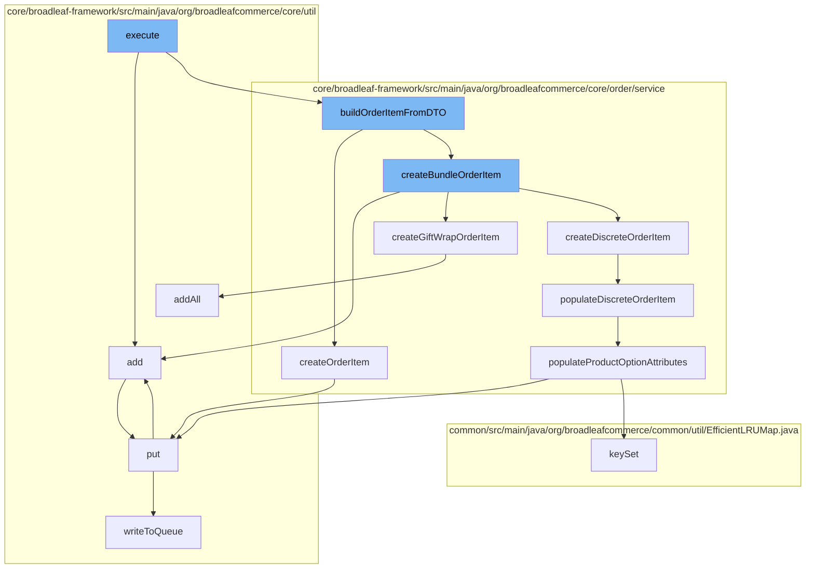

This document will cover the process of adding an order item in the BroadleafCommerce-demo project. The steps include:

1. Execution of the main function
2. Building the order item from DTO
3. Creating the order item
4. Creating the bundle order item
5. Populating the discrete order item
6. Populating product option attributes
7. Adding the item to the resource purge service
8. Putting the item in the distributed queue.



<SwmSnippet path="/core/broadleaf-framework/src/main/java/org/broadleafcommerce/core/order/service/workflow/add/AddOrderItemActivity.java" line="1">

---

## Execution of the Main Function

The `execute` function in `AddOrderItemActivity.java` is the entry point of the order item addition process. It calls the `add` function in `ResourcePurgeServiceImpl.java` and `buildOrderItemFromDTO` in `OrderItemServiceImpl.java`.

```java
/*-
 * #%L
 * BroadleafCommerce Framework
 * %%
 * Copyright (C) 2009 - 2024 Broadleaf Commerce
 * %%
 * Licensed under the Broadleaf Fair Use License Agreement, Version 1.0
 * (the "Fair Use License" located  at http://license.broadleafcommerce.org/fair_use_license-1.0.txt)
 * unless the restrictions on use therein are violated and require payment to Broadleaf in which case
 * the Broadleaf End User License Agreement (EULA), Version 1.1
```

---

</SwmSnippet>

<SwmSnippet path="/core/broadleaf-framework/src/main/java/org/broadleafcommerce/core/order/service/OrderItemServiceImpl.java" line="1">

---

## Building the Order Item from DTO

`buildOrderItemFromDTO` function in `OrderItemServiceImpl.java` is responsible for creating the order item from the provided DTO. It calls `createOrderItem` and `createBundleOrderItem` functions.

```java
/*-
 * #%L
 * BroadleafCommerce Framework
 * %%
 * Copyright (C) 2009 - 2024 Broadleaf Commerce
 * %%
 * Licensed under the Broadleaf Fair Use License Agreement, Version 1.0
 * (the "Fair Use License" located  at http://license.broadleafcommerce.org/fair_use_license-1.0.txt)
 * unless the restrictions on use therein are violated and require payment to Broadleaf in which case
 * the Broadleaf End User License Agreement (EULA), Version 1.1
```

---

</SwmSnippet>

<SwmSnippet path="/core/broadleaf-framework/src/main/java/org/broadleafcommerce/core/order/service/OrderItemServiceImpl.java" line="144">

---

## Creating the Order Item

`createOrderItem` function in `OrderItemServiceImpl.java` creates an order item based on the provided `OrderItemRequest`. It sets the item's name, quantity, order, and other properties.

```java
    @Override
    public OrderItem createOrderItem(final OrderItemRequest itemRequest) {
        final OrderItem item = orderItemDao.create(OrderItemType.BASIC);
        item.setName(itemRequest.getItemName());
        item.setQuantity(itemRequest.getQuantity());
        item.setOrder(itemRequest.getOrder());

        if (itemRequest.getSalePriceOverride() != null) {
            item.setSalePriceOverride(Boolean.TRUE);
            item.setSalePrice(itemRequest.getSalePriceOverride());
        }

        if (itemRequest.getRetailPriceOverride() != null) {
            item.setRetailPriceOverride(Boolean.TRUE);
            item.setRetailPrice(itemRequest.getRetailPriceOverride());
        }

        if (MapUtils.isNotEmpty(itemRequest.getItemAttributes())) {
            Map<String, OrderItemAttribute> attributeMap = item.getOrderItemAttributes();
            if (attributeMap == null) {
                attributeMap = new HashMap<String, OrderItemAttribute>();
```

---

</SwmSnippet>

<SwmSnippet path="/core/broadleaf-framework/src/main/java/org/broadleafcommerce/core/order/service/OrderItemServiceImpl.java" line="1">

---

## Creating the Bundle Order Item

`createBundleOrderItem` function in `OrderItemServiceImpl.java` is responsible for creating a bundle order item. It calls `add` function in `ResourcePurgeServiceImpl.java`, `createGiftWrapOrderItem` and `createDiscreteOrderItem` functions.

```java
/*-
 * #%L
 * BroadleafCommerce Framework
 * %%
 * Copyright (C) 2009 - 2024 Broadleaf Commerce
 * %%
 * Licensed under the Broadleaf Fair Use License Agreement, Version 1.0
 * (the "Fair Use License" located  at http://license.broadleafcommerce.org/fair_use_license-1.0.txt)
 * unless the restrictions on use therein are violated and require payment to Broadleaf in which case
 * the Broadleaf End User License Agreement (EULA), Version 1.1
```

---

</SwmSnippet>

<SwmSnippet path="/core/broadleaf-framework/src/main/java/org/broadleafcommerce/core/order/service/OrderItemServiceImpl.java" line="106">

---

## Populating the Discrete Order Item

`populateDiscreteOrderItem` function in `OrderItemServiceImpl.java` populates the discrete order item with the provided `OrderItemRequest`. It sets the item's SKU, quantity, category, product, order, and other properties.

```java
    protected void populateDiscreteOrderItem(DiscreteOrderItem item, AbstractOrderItemRequest itemRequest) {
        item.setSku(itemRequest.getSku());
        item.setQuantity(itemRequest.getQuantity());
        item.setCategory(itemRequest.getCategory());
        item.setProduct(itemRequest.getProduct());
        item.setOrder(itemRequest.getOrder());
        Map<String, String> attributes = itemRequest.getItemAttributes();
        populateProductOptionAttributes(item, attributes);
        applyAdditionalOrderItemProperties(item);
    }
```

---

</SwmSnippet>

<SwmSnippet path="/core/broadleaf-framework/src/main/java/org/broadleafcommerce/core/order/service/OrderItemServiceImpl.java" line="117">

---

## Populating Product Option Attributes

`populateProductOptionAttributes` function in `OrderItemServiceImpl.java` populates the product option attributes for the order item. It iterates over the provided attributes and adds them to the order item.

```java
    protected void populateProductOptionAttributes(OrderItem item, Map<String, String> attributes) {
        if (attributes != null && attributes.size() > 0) {
            Map<String, OrderItemAttribute> orderItemAttributes = item.getOrderItemAttributes();
            if (item.getOrderItemAttributes() == null) {
                orderItemAttributes = new HashMap<String, OrderItemAttribute>();
                item.setOrderItemAttributes(orderItemAttributes);
            }
            for (String key : attributes.keySet()) {
                String value = attributes.get(key);
                if(value == null){
                    continue;
                }
                OrderItemAttribute attribute = orderItemAttributes.get(key);

                if(attribute == null) {
                    attribute = new OrderItemAttributeImpl();
                }

                attribute.setName(key);
                attribute.setValue(value);
                attribute.setOrderItem(item);
```

---

</SwmSnippet>

<SwmSnippet path="/core/broadleaf-framework/src/main/java/org/broadleafcommerce/core/util/service/ResourcePurgeServiceImpl.java" line="593">

---

## Adding the Item to the Resource Purge Service

`add` function in `ResourcePurgeServiceImpl.java` adds the item to the resource purge service. It checks if the item already exists in the cache, if not, it adds the item to the cache.

```java
        public Long add(Long entry) {
            if (! cache.containsKey(entry)) {
                return cache.put(entry, new Long(System.currentTimeMillis()));
            }
            return null;
        }
```

---

</SwmSnippet>

<SwmSnippet path="/core/broadleaf-framework/src/main/java/org/broadleafcommerce/core/util/queue/ZookeeperDistributedQueue.java" line="393">

---

## Putting the Item in the Distributed Queue

`put` function in `ZookeeperDistributedQueue.java` puts the item in the distributed queue. It creates a list of elements to add and writes them to the queue.

```java
    @Override
    public void put(T e) throws InterruptedException {
        final ArrayList<T> elementsToAdd = new ArrayList<>();
        elementsToAdd.add(e);
        writeToQueue(elementsToAdd, -1L);
    }
```

---

</SwmSnippet>

&nbsp;

*This is an auto-generated document by Swimm AI 🌊 and has not yet been verified by a human*

<SwmMeta version="3.0.0" repo-id="Z2l0aHViJTNBJTNBQnJvYWRsZWFmQ29tbWVyY2UtZGVtbyUzQSUzQWdpbGFkbmF2b3Q=" repo-name="BroadleafCommerce-demo" doc-type="flows"><sup>Powered by [Swimm](/)</sup></SwmMeta>
