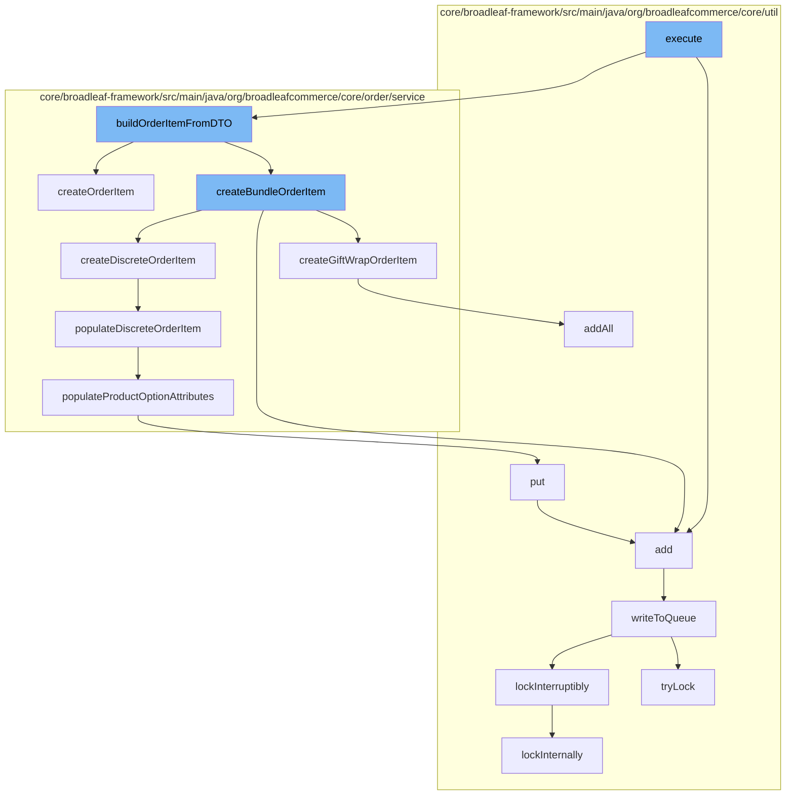

This document will cover the process of adding an order item in the BroadleafCommerce-demo repository. The steps include:

1. Execution of the main function
2. Building the order item from DTO
3. Creating the bundle order item
4. Populating the discrete order item
5. Populating product option attributes
6. Writing to the queue.



<SwmSnippet path="/core/broadleaf-framework/src/main/java/org/broadleafcommerce/core/order/service/workflow/add/AddOrderItemActivity.java" line="1">

---

# Execution of the main function

The process begins with the execution of the main function in the `AddOrderItemActivity` class. This function is responsible for initiating the process of adding an item to the order.

```java
/*-
 * #%L
 * BroadleafCommerce Framework
 * %%
 * Copyright (C) 2009 - 2024 Broadleaf Commerce
 * %%
 * Licensed under the Broadleaf Fair Use License Agreement, Version 1.0
 * (the "Fair Use License" located  at http://license.broadleafcommerce.org/fair_use_license-1.0.txt)
 * unless the restrictions on use therein are violated and require payment to Broadleaf in which case
 * the Broadleaf End User License Agreement (EULA), Version 1.1
```

---

</SwmSnippet>

<SwmSnippet path="/core/broadleaf-framework/src/main/java/org/broadleafcommerce/core/order/service/OrderItemServiceImpl.java" line="144">

---

# Building the order item from DTO

The `buildOrderItemFromDTO` function is called next. This function is responsible for creating an `OrderItem` object from the provided DTO. It sets the necessary attributes such as name, quantity, order, sale price, retail price, and item attributes.

```java
    @Override
    public OrderItem createOrderItem(final OrderItemRequest itemRequest) {
        final OrderItem item = orderItemDao.create(OrderItemType.BASIC);
        item.setName(itemRequest.getItemName());
        item.setQuantity(itemRequest.getQuantity());
        item.setOrder(itemRequest.getOrder());

        if (itemRequest.getSalePriceOverride() != null) {
            item.setSalePriceOverride(Boolean.TRUE);
            item.setSalePrice(itemRequest.getSalePriceOverride());
        }

        if (itemRequest.getRetailPriceOverride() != null) {
            item.setRetailPriceOverride(Boolean.TRUE);
            item.setRetailPrice(itemRequest.getRetailPriceOverride());
        }

        if (MapUtils.isNotEmpty(itemRequest.getItemAttributes())) {
            Map<String, OrderItemAttribute> attributeMap = item.getOrderItemAttributes();
            if (attributeMap == null) {
                attributeMap = new HashMap<String, OrderItemAttribute>();
```

---

</SwmSnippet>

<SwmSnippet path="/core/broadleaf-framework/src/main/java/org/broadleafcommerce/core/order/service/OrderItemServiceImpl.java" line="1">

---

# Creating the bundle order item

The `createBundleOrderItem` function is then called. This function is responsible for creating a bundle order item, which is a type of order item that includes multiple products.

```java
/*-
 * #%L
 * BroadleafCommerce Framework
 * %%
 * Copyright (C) 2009 - 2024 Broadleaf Commerce
 * %%
 * Licensed under the Broadleaf Fair Use License Agreement, Version 1.0
 * (the "Fair Use License" located  at http://license.broadleafcommerce.org/fair_use_license-1.0.txt)
 * unless the restrictions on use therein are violated and require payment to Broadleaf in which case
 * the Broadleaf End User License Agreement (EULA), Version 1.1
```

---

</SwmSnippet>

<SwmSnippet path="/core/broadleaf-framework/src/main/java/org/broadleafcommerce/core/order/service/OrderItemServiceImpl.java" line="106">

---

# Populating the discrete order item

The `populateDiscreteOrderItem` function is called next. This function is responsible for setting the necessary attributes for a discrete order item, which is a type of order item that represents a single product.

```java
    protected void populateDiscreteOrderItem(DiscreteOrderItem item, AbstractOrderItemRequest itemRequest) {
        item.setSku(itemRequest.getSku());
        item.setQuantity(itemRequest.getQuantity());
        item.setCategory(itemRequest.getCategory());
        item.setProduct(itemRequest.getProduct());
        item.setOrder(itemRequest.getOrder());
        Map<String, String> attributes = itemRequest.getItemAttributes();
        populateProductOptionAttributes(item, attributes);
        applyAdditionalOrderItemProperties(item);
    }
```

---

</SwmSnippet>

<SwmSnippet path="/core/broadleaf-framework/src/main/java/org/broadleafcommerce/core/order/service/OrderItemServiceImpl.java" line="117">

---

# Populating product option attributes

The `populateProductOptionAttributes` function is then called. This function is responsible for setting the product option attributes for the order item.

```java
    protected void populateProductOptionAttributes(OrderItem item, Map<String, String> attributes) {
        if (attributes != null && attributes.size() > 0) {
            Map<String, OrderItemAttribute> orderItemAttributes = item.getOrderItemAttributes();
            if (item.getOrderItemAttributes() == null) {
                orderItemAttributes = new HashMap<String, OrderItemAttribute>();
                item.setOrderItemAttributes(orderItemAttributes);
            }
            for (String key : attributes.keySet()) {
                String value = attributes.get(key);
                if(value == null){
                    continue;
                }
                OrderItemAttribute attribute = orderItemAttributes.get(key);

                if(attribute == null) {
                    attribute = new OrderItemAttributeImpl();
                }

                attribute.setName(key);
                attribute.setValue(value);
                attribute.setOrderItem(item);
```

---

</SwmSnippet>

<SwmSnippet path="/core/broadleaf-framework/src/main/java/org/broadleafcommerce/core/util/queue/ZookeeperDistributedQueue.java" line="393">

---

# Writing to the queue

Finally, the `writeToQueue` function is called. This function is responsible for adding the order item to the queue for further processing.

```java
    @Override
    public void put(T e) throws InterruptedException {
        final ArrayList<T> elementsToAdd = new ArrayList<>();
        elementsToAdd.add(e);
        writeToQueue(elementsToAdd, -1L);
    }
```

---

</SwmSnippet>

&nbsp;

*This is an auto-generated document by Swimm AI 🌊 and has not yet been verified by a human*

<SwmMeta version="3.0.0" repo-id="Z2l0aHViJTNBJTNBQnJvYWRsZWFmQ29tbWVyY2UtZGVtbyUzQSUzQWdpbGFkbmF2b3Q=" repo-name="BroadleafCommerce-demo" doc-type="flows"><sup>Powered by [Swimm](/)</sup></SwmMeta>
