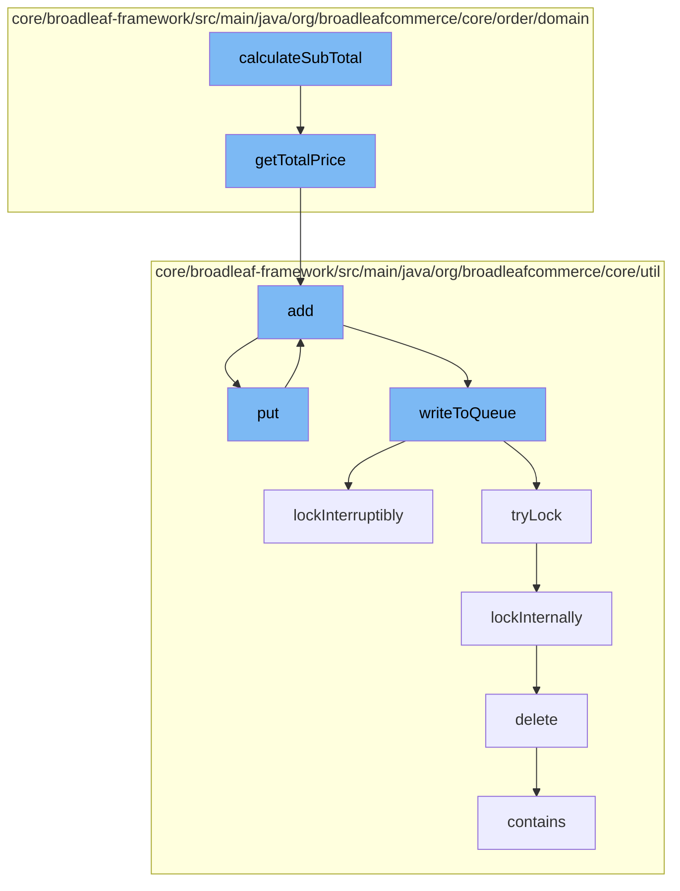

This document will cover the process of calculating the subtotal of an order in the BroadleafCommerce-demo repository. The process involves the following steps:

1. Calculating the total price of bundled items in the order.
2. Adding the total price to a cache.
3. Writing the total price to a distributed queue.
4. Locking the queue to prevent concurrent modifications.
5. Deleting a code type from the database.
6. Checking if the total price is already in the queue.



<SwmSnippet path="/core/broadleaf-framework/src/main/java/org/broadleafcommerce/core/order/domain/BundleOrderItemImpl.java" line="416">

---

# Calculating the total price of bundled items

The `getTotalPrice` method in `BundleOrderItemImpl` calculates the total price of all items in a bundle. If the bundle should be summed, it iterates over each item in the order, adds up their total prices, and multiplies the sum by the quantity. Otherwise, it simply returns the total price of the bundle.

```java
    @Override
    public Money getTotalPrice() {
        Money returnValue = convertToMoney(BigDecimal.ZERO);
        if (shouldSumItems()) {
            for (OrderItem containedItem : getOrderItems()) {
                returnValue = returnValue.add(containedItem.getTotalPrice());
            }
            returnValue = returnValue.multiply(quantity);
        } else {
            returnValue = super.getTotalPrice();
        }
        return returnValue;
    }
```

---

</SwmSnippet>

<SwmSnippet path="/core/broadleaf-framework/src/main/java/org/broadleafcommerce/core/util/service/ResourcePurgeServiceImpl.java" line="593">

---

# Adding the total price to a cache

The `add` method in `ResourcePurgeServiceImpl` adds the total price to a cache if it does not already exist in the cache. The cache is used to store the total prices of all orders.

```java
        public Long add(Long entry) {
            if (! cache.containsKey(entry)) {
                return cache.put(entry, new Long(System.currentTimeMillis()));
            }
            return null;
        }
```

---

</SwmSnippet>

<SwmSnippet path="/core/broadleaf-framework/src/main/java/org/broadleafcommerce/core/util/queue/ZookeeperDistributedQueue.java" line="503">

---

# Writing the total price to a distributed queue

The `writeToQueue` method in `ZookeeperDistributedQueue` writes the total price to a distributed queue. The queue is used to store the total prices of all orders in a distributed manner.

```java
    protected int writeToQueue(List<? extends T> entries, final long timeout) throws InterruptedException {
        if (entries == null || entries.isEmpty()) {
            return 0;
        }
        
        int entryCount = 0;
        long waitTime = timeout;
        synchronized (QUEUE_MONITOR) {
            while (true) {
                boolean locked = false;
                DistributedLock lock = getQueueAccessLock();
                if (timeout < 0L) {
                    lock.lockInterruptibly();
                    locked = true;
                } else if (timeout > 0L && waitTime > 0L) {
                    long start = System.currentTimeMillis();
                    locked = lock.tryLock(waitTime, TimeUnit.MILLISECONDS);
                    long end = System.currentTimeMillis();
                    waitTime -= (end - start);
                } else {
                    locked = lock.tryLock();
```

---

</SwmSnippet>

<SwmSnippet path="/core/broadleaf-framework/src/main/java/org/broadleafcommerce/core/util/lock/ReentrantDistributedZookeeperLock.java" line="335">

---

# Locking the queue to prevent concurrent modifications

The `lockInterruptibly` method in `ReentrantDistributedZookeeperLock` locks the queue to prevent concurrent modifications. This ensures that the total price is correctly written to the queue.

```java
    @Override
    public void lockInterruptibly() throws InterruptedException {
        if (Thread.interrupted()) {
            throw new InterruptedException("Thread was interrupted prior to trying to acquire the lock.");
        }
        
        lockInternally(-1L);
    }
```

---

</SwmSnippet>

<SwmSnippet path="/core/broadleaf-framework/src/main/java/org/broadleafcommerce/core/util/dao/CodeTypeDaoImpl.java" line="51">

---

# Deleting a code type from the database

The `delete` method in `CodeTypeDaoImpl` deletes a code type from the database. This is done after the total price is written to the queue.

```java
    public void delete(CodeType codeType) {
        if (!em.contains(codeType)) {
            codeType = (CodeType) em.find(CodeTypeImpl.class, codeType.getId());
        }
        em.remove(codeType);
    }
```

---

</SwmSnippet>

<SwmSnippet path="/core/broadleaf-framework/src/main/java/org/broadleafcommerce/core/util/queue/ZookeeperDistributedQueue.java" line="474">

---

# Checking if the total price is already in the queue

The `contains` method in `ZookeeperDistributedQueue` checks if the total price is already in the queue. This is done to prevent duplicate entries in the queue.

```java
    @Override
    public boolean contains(Object o) {
        return containsAll(Collections.singletonList(o));
    }
```

---

</SwmSnippet>

&nbsp;

*This is an auto-generated document by Swimm AI 🌊 and has not yet been verified by a human*

<SwmMeta version="3.0.0" repo-id="Z2l0aHViJTNBJTNBQnJvYWRsZWFmQ29tbWVyY2UtZGVtbyUzQSUzQWdpbGFkbmF2b3Q=" repo-name="BroadleafCommerce-demo" doc-type="flows"><sup>Powered by [Swimm](/)</sup></SwmMeta>
