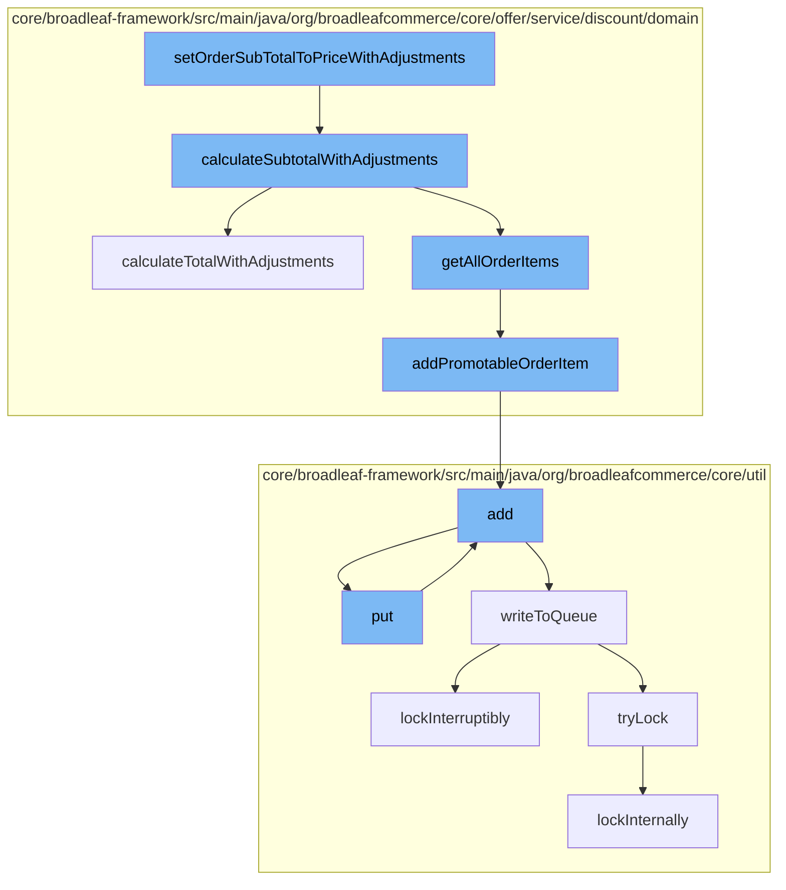

This document will cover the process of calculating and setting the subtotal of an order with adjustments in the BroadleafCommerce-demo repository. The process includes the following steps:

1. Setting the order subtotal to price with adjustments
2. Calculating the subtotal with adjustments
3. Adding promotable order items
4. Adding entries to the distributed queue
5. Writing to the queue
6. Locking the queue



<SwmSnippet path="/core/broadleaf-framework/src/main/java/org/broadleafcommerce/core/offer/service/discount/domain/PromotableOrderImpl.java" line="322">

---

# Setting the Order Subtotal to Price with Adjustments

The `setOrderSubTotalToPriceWithAdjustments` function initiates the process. It calls the `calculateSubtotalWithAdjustments` function to calculate the subtotal of the order with adjustments.

```java
    @Override
    public Money calculateSubtotalWithAdjustments() {
        Money calculatedSubTotal = BroadleafCurrencyUtils.getMoney(order.getCurrency());
        for (PromotableOrderItem orderItem : getAllOrderItems()) {
            calculatedSubTotal = calculatedSubTotal.add(orderItem.calculateTotalWithAdjustments());
        }
        return calculatedSubTotal;
    }
```

---

</SwmSnippet>

<SwmSnippet path="/core/broadleaf-framework/src/main/java/org/broadleafcommerce/core/offer/service/discount/domain/PromotableOrderImpl.java" line="324">

---

# Calculating the Subtotal with Adjustments

The `calculateSubtotalWithAdjustments` function calculates the subtotal of the order with adjustments. It iterates over all order items and adds the total of each item with adjustments to the subtotal.

```java
        Money calculatedSubTotal = BroadleafCurrencyUtils.getMoney(order.getCurrency());
        for (PromotableOrderItem orderItem : getAllOrderItems()) {
            calculatedSubTotal = calculatedSubTotal.add(orderItem.calculateTotalWithAdjustments());
        }
        return calculatedSubTotal;
```

---

</SwmSnippet>

<SwmSnippet path="/core/broadleaf-framework/src/main/java/org/broadleafcommerce/core/offer/service/discount/domain/PromotableOrderImpl.java" line="153">

---

# Adding Promotable Order Items

The `addPromotableOrderItem` function is called within the `getAllOrderItems` function. It adds a promotable order item to the list of discountable order items.

```java
    protected void addPromotableOrderItem(OrderItem orderItem, List<PromotableOrderItem> discountableOrderItems) {
        PromotableOrderItem item = itemFactory.createPromotableOrderItem(orderItem, PromotableOrderImpl.this, includeOrderAndItemAdjustments);
        discountableOrderItems.add(item);
    }
```

---

</SwmSnippet>

<SwmSnippet path="/core/broadleaf-framework/src/main/java/org/broadleafcommerce/core/util/service/ResourcePurgeServiceImpl.java" line="593">

---

# Adding Entries to the Distributed Queue

The `add` function in the `ResourcePurgeServiceImpl` class is called within the `addPromotableOrderItem` function. It adds an entry to the cache if it does not already exist.

```java
        public Long add(Long entry) {
            if (! cache.containsKey(entry)) {
                return cache.put(entry, new Long(System.currentTimeMillis()));
            }
            return null;
        }
```

---

</SwmSnippet>

<SwmSnippet path="/core/broadleaf-framework/src/main/java/org/broadleafcommerce/core/util/queue/ZookeeperDistributedQueue.java" line="503">

---

# Writing to the Queue

The `writeToQueue` function writes entries to the distributed queue. It locks the queue, checks the remaining capacity, and adds entries to the queue.

```java
    protected int writeToQueue(List<? extends T> entries, final long timeout) throws InterruptedException {
        if (entries == null || entries.isEmpty()) {
            return 0;
        }
        
        int entryCount = 0;
        long waitTime = timeout;
        synchronized (QUEUE_MONITOR) {
            while (true) {
                boolean locked = false;
                DistributedLock lock = getQueueAccessLock();
                if (timeout < 0L) {
                    lock.lockInterruptibly();
                    locked = true;
                } else if (timeout > 0L && waitTime > 0L) {
                    long start = System.currentTimeMillis();
                    locked = lock.tryLock(waitTime, TimeUnit.MILLISECONDS);
                    long end = System.currentTimeMillis();
                    waitTime -= (end - start);
                } else {
                    locked = lock.tryLock();
```

---

</SwmSnippet>

<SwmSnippet path="/core/broadleaf-framework/src/main/java/org/broadleafcommerce/core/util/lock/ReentrantDistributedZookeeperLock.java" line="335">

---

# Locking the Queue

The `lockInterruptibly` function is called within the `writeToQueue` function. It locks the queue to prevent other threads from writing to the queue at the same time.

```java
    @Override
    public void lockInterruptibly() throws InterruptedException {
        if (Thread.interrupted()) {
            throw new InterruptedException("Thread was interrupted prior to trying to acquire the lock.");
        }
        
        lockInternally(-1L);
    }
```

---

</SwmSnippet>

&nbsp;

*This is an auto-generated document by Swimm AI 🌊 and has not yet been verified by a human*

<SwmMeta version="3.0.0" repo-id="Z2l0aHViJTNBJTNBQnJvYWRsZWFmQ29tbWVyY2UtZGVtbyUzQSUzQWdpbGFkbmF2b3Q=" repo-name="BroadleafCommerce-demo" doc-type="flows"><sup>Powered by [Swimm](/)</sup></SwmMeta>
