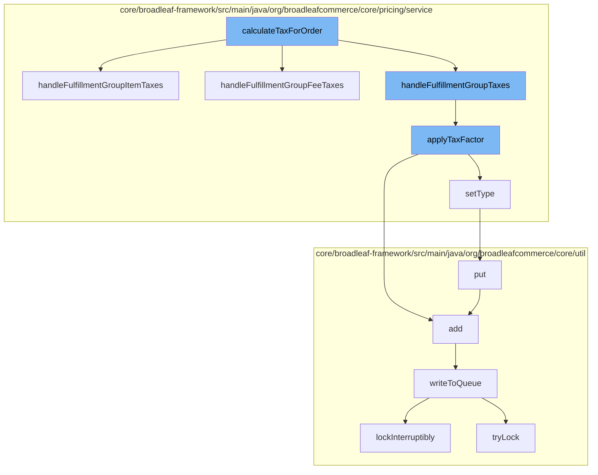

This document will cover the process of calculating and applying tax for an order in the BroadleafCommerce-demo repository. The process involves the following steps:

1. Calculating tax for an order
2. Handling taxes for fulfillment group items
3. Applying tax factor
4. Setting the type of shipping service
5. Adding the calculated tax to a distributed queue



<SwmSnippet path="/core/broadleaf-framework/src/main/java/org/broadleafcommerce/core/pricing/service/tax/provider/SimpleTaxProvider.java" line="99">

---

# Calculating tax for an order

The <SwmToken path="/core/broadleaf-framework/src/main/java/org/broadleafcommerce/core/pricing/service/module/TaxModule.java" pos="35:5:5" line-data="    public Order calculateTaxForOrder(Order order) throws TaxException;">`calculateTaxForOrder`</SwmToken> function initiates the tax calculation process. It calls <SwmToken path="/core/broadleaf-framework/src/main/java/org/broadleafcommerce/core/pricing/service/tax/provider/SimpleTaxProvider.java" pos="99:5:5" line-data="    protected void handleFulfillmentGroupItemTaxes(FulfillmentGroup fulfillmentGroup) {">`handleFulfillmentGroupItemTaxes`</SwmToken>, <SwmToken path="/core/broadleaf-framework/src/main/java/org/broadleafcommerce/core/pricing/service/tax/provider/SimpleTaxProvider.java" pos="91:1:1" line-data="                handleFulfillmentGroupFeeTaxes(fulfillmentGroup);">`handleFulfillmentGroupFeeTaxes`</SwmToken>, and <SwmToken path="/core/broadleaf-framework/src/main/java/org/broadleafcommerce/core/pricing/service/tax/provider/SimpleTaxProvider.java" pos="92:1:1" line-data="                handleFulfillmentGroupTaxes(fulfillmentGroup);">`handleFulfillmentGroupTaxes`</SwmToken> to calculate taxes for different components of the order.

```java
    protected void handleFulfillmentGroupItemTaxes(FulfillmentGroup fulfillmentGroup) {
        for (FulfillmentGroupItem fgItem : fulfillmentGroup.getFulfillmentGroupItems()) {
            if (isItemTaxable(fgItem)) {
                applyTaxFactor(fgItem.getTaxes(), determineItemTaxRate(fulfillmentGroup.getAddress()), fgItem.getTotalItemTaxableAmount());
            }
        }
    }
```

---

</SwmSnippet>

<SwmSnippet path="/core/broadleaf-framework/src/main/java/org/broadleafcommerce/core/pricing/service/tax/provider/SimpleTaxProvider.java" line="99">

---

# Handling taxes for fulfillment group items

<SwmToken path="/core/broadleaf-framework/src/main/java/org/broadleafcommerce/core/pricing/service/tax/provider/SimpleTaxProvider.java" pos="99:5:5" line-data="    protected void handleFulfillmentGroupItemTaxes(FulfillmentGroup fulfillmentGroup) {">`handleFulfillmentGroupItemTaxes`</SwmToken> is responsible for calculating taxes for each item in the fulfillment group. It checks if the item is taxable and then applies the tax factor to the taxable amount of the item.

```java
    protected void handleFulfillmentGroupItemTaxes(FulfillmentGroup fulfillmentGroup) {
        for (FulfillmentGroupItem fgItem : fulfillmentGroup.getFulfillmentGroupItems()) {
            if (isItemTaxable(fgItem)) {
                applyTaxFactor(fgItem.getTaxes(), determineItemTaxRate(fulfillmentGroup.getAddress()), fgItem.getTotalItemTaxableAmount());
            }
        }
    }
```

---

</SwmSnippet>

<SwmSnippet path="/core/broadleaf-framework/src/main/java/org/broadleafcommerce/core/pricing/service/tax/provider/SimpleTaxProvider.java" line="119">

---

# Applying tax factor

<SwmToken path="/core/broadleaf-framework/src/main/java/org/broadleafcommerce/core/pricing/service/tax/provider/SimpleTaxProvider.java" pos="119:5:5" line-data="    protected void applyTaxFactor(List&lt;TaxDetail&gt; taxes, BigDecimal taxFactor, Money taxMultiplier) {">`applyTaxFactor`</SwmToken> applies the calculated tax factor to the taxable amount. If the tax factor is non-zero, it either updates the existing tax record or creates a new one. If the tax factor is zero, it removes the existing tax record.

```java
    protected void applyTaxFactor(List<TaxDetail> taxes, BigDecimal taxFactor, Money taxMultiplier) {
        TaxDetail tax = findExistingTaxDetail(taxes);
        boolean shouldUpdateOrCreateTaxRecord = taxFactor != null && taxFactor.compareTo(BigDecimal.ZERO) != 0;
        boolean shouldRemoveTaxRecord = (taxFactor == null || taxFactor.compareTo(BigDecimal.ZERO) == 0) && tax != null;
        if (shouldUpdateOrCreateTaxRecord) {
            if (tax == null) {
                tax = entityConfig.createEntityInstance(TaxDetail.class.getName(), TaxDetail.class);
                tax.setType(TaxType.COMBINED);
                taxes.add(tax);
            }
            tax.setRate(taxFactor);
            tax.setAmount(taxMultiplier.multiply(taxFactor));
        } else if (shouldRemoveTaxRecord) {
            taxes.remove(tax);
        }
    }
```

---

</SwmSnippet>

<SwmSnippet path="/core/broadleaf-framework/src/main/java/org/broadleafcommerce/core/pricing/service/workflow/type/ShippingServiceType.java" line="1">

---

# Setting the type of shipping service

<SwmToken path="/core/broadleaf-framework/src/main/java/org/broadleafcommerce/core/pricing/service/tax/provider/SimpleTaxProvider.java" pos="126:3:3" line-data="                tax.setType(TaxType.COMBINED);">`setType`</SwmToken> sets the type of the shipping service. This is important as different types of shipping services may have different tax rates.

```java
/*-
 * #%L
 * BroadleafCommerce Framework
 * %%
 * Copyright (C) 2009 - 2024 Broadleaf Commerce
 * %%
 * Licensed under the Broadleaf Fair Use License Agreement, Version 1.0
 * (the "Fair Use License" located  at http://license.broadleafcommerce.org/fair_use_license-1.0.txt)
 * unless the restrictions on use therein are violated and require payment to Broadleaf in which case
 * the Broadleaf End User License Agreement (EULA), Version 1.1
```

---

</SwmSnippet>

<SwmSnippet path="/core/broadleaf-framework/src/main/java/org/broadleafcommerce/core/util/queue/ZookeeperDistributedQueue.java" line="393">

---

# Adding the calculated tax to a distributed queue

The <SwmToken path="/core/broadleaf-framework/src/main/java/org/broadleafcommerce/core/util/queue/ZookeeperDistributedQueue.java" pos="394:5:5" line-data="    public void put(T e) throws InterruptedException {">`put`</SwmToken> function adds the calculated tax to a distributed queue. This queue can be used to process the tax information asynchronously.

```java
    @Override
    public void put(T e) throws InterruptedException {
        final ArrayList<T> elementsToAdd = new ArrayList<>();
        elementsToAdd.add(e);
        writeToQueue(elementsToAdd, -1L);
    }
```

---

</SwmSnippet>

&nbsp;

*This is an auto-generated document by Swimm AI 🌊 and has not yet been verified by a human*

<SwmMeta version="3.0.0" repo-id="Z2l0aHViJTNBJTNBQnJvYWRsZWFmQ29tbWVyY2UtZGVtbyUzQSUzQWdpbGFkbmF2b3Q=" repo-name="BroadleafCommerce-demo"><sup>Powered by [Swimm](https://app.swimm.io/)</sup></SwmMeta>
