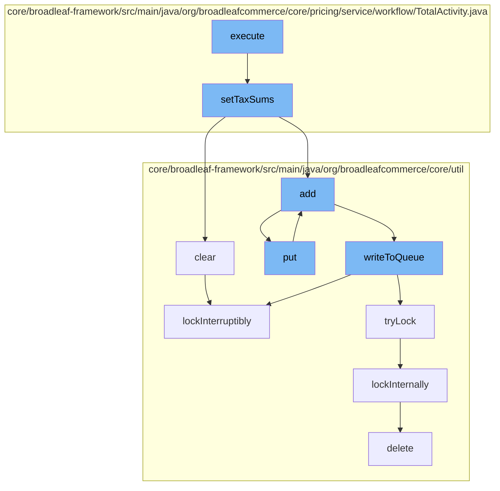

This document will cover the process of calculating and managing the total tax for an order in the BroadleafCommerce-demo project. The process includes:

1. Executing the total activity
2. Setting tax sums for the order
3. Clearing the distributed queue
4. Adding the order to the resource purge service
5. Writing the order to the distributed queue
6. Locking the distributed queue
7. Deleting the code type.



<SwmSnippet path="/core/broadleaf-framework/src/main/java/org/broadleafcommerce/core/pricing/service/workflow/TotalActivity.java" line="1">

---

# Executing the total activity

The `execute` function in `TotalActivity.java` is the entry point for this flow. It is responsible for initiating the process of calculating and managing the total tax for an order.

```java
/*-
 * #%L
 * BroadleafCommerce Framework
 * %%
 * Copyright (C) 2009 - 2024 Broadleaf Commerce
 * %%
 * Licensed under the Broadleaf Fair Use License Agreement, Version 1.0
 * (the "Fair Use License" located  at http://license.broadleafcommerce.org/fair_use_license-1.0.txt)
 * unless the restrictions on use therein are violated and require payment to Broadleaf in which case
 * the Broadleaf End User License Agreement (EULA), Version 1.1
 * (the "Commercial License" located at http://license.broadleafcommerce.org/commercial_license-1.1.txt)
 * shall apply.
 * 
 * Alternatively, the Commercial License may be replaced with a mutually agreed upon license (the "Custom License")
 * between you and Broadleaf Commerce. You may not use this file except in compliance with the applicable license.
 * #L%
 */
package org.broadleafcommerce.core.pricing.service.workflow;

import org.broadleafcommerce.common.currency.util.BroadleafCurrencyUtils;
import org.broadleafcommerce.common.money.Money;
```

---

</SwmSnippet>

<SwmSnippet path="/core/broadleaf-framework/src/main/java/org/broadleafcommerce/core/pricing/service/workflow/TotalActivity.java" line="87">

---

# Setting tax sums for the order

The `setTaxSums` function is responsible for calculating the total tax for each item in the order. It iterates over each fulfillment group in the order, and for each group, it calculates the total tax for the items and fees in the group.

```java
    protected void setTaxSums(Order order) {
        if (order.getTaxOverride()) {
            Money zeroMoney = BroadleafCurrencyUtils.getMoney(BigDecimal.ZERO, order.getCurrency());

            for (FulfillmentGroup fg : order.getFulfillmentGroups()) {
                if (fg.getTaxes() != null) {
                    fg.getTaxes().clear();
                }
                fg.setTotalTax(zeroMoney);
                
                for (FulfillmentGroupItem fgi : fg.getFulfillmentGroupItems()) {
                    if (fgi.getTaxes() != null) {
                        fgi.getTaxes().clear();
                    }
                    fgi.setTotalTax(zeroMoney);
                }
                
                for (FulfillmentGroupFee fee : fg.getFulfillmentGroupFees()) {
                    if (fee.getTaxes() != null) {
                        fee.getTaxes().clear();
                    }
```

---

</SwmSnippet>

<SwmSnippet path="/core/broadleaf-framework/src/main/java/org/broadleafcommerce/core/util/queue/ZookeeperDistributedQueue.java" line="331">

---

# Clearing the distributed queue

The `clear` function is called to clear the distributed queue. This is done to ensure that the queue is empty before the new order is added to it.

```java
    @Override
    public void clear() {
        DistributedLock lock = getQueueAccessLock();
        try {
            lock.lockInterruptibly();
            try {
                executeOperation(new GenericOperation<Void>() {
                    @Override
                    public Void execute() throws Exception {
                        List<String> entryNames = getZookeeperClient().getChildren(getQueueEntryFolder(), null);
                        if (entryNames != null) {
                            for (String entry : entryNames) {
                                getZookeeperClient().delete(getQueueEntryFolder() + '/' + entry, 0);
                            }
                        }
                        return null;
                    }
                });
                
            } finally {
                lock.unlock();
```

---

</SwmSnippet>

<SwmSnippet path="/core/broadleaf-framework/src/main/java/org/broadleafcommerce/core/util/service/ResourcePurgeServiceImpl.java" line="1">

---

# Adding the order to the resource purge service

The `add` function in `ResourcePurgeServiceImpl.java` is called to add the order to the resource purge service. This is done to ensure that the resources associated with the order are properly managed and cleaned up when no longer needed.

```java
/*-
 * #%L
 * BroadleafCommerce Framework
 * %%
 * Copyright (C) 2009 - 2024 Broadleaf Commerce
 * %%
 * Licensed under the Broadleaf Fair Use License Agreement, Version 1.0
 * (the "Fair Use License" located  at http://license.broadleafcommerce.org/fair_use_license-1.0.txt)
 * unless the restrictions on use therein are violated and require payment to Broadleaf in which case
 * the Broadleaf End User License Agreement (EULA), Version 1.1
 * (the "Commercial License" located at http://license.broadleafcommerce.org/commercial_license-1.1.txt)
 * shall apply.
 * 
 * Alternatively, the Commercial License may be replaced with a mutually agreed upon license (the "Custom License")
 * between you and Broadleaf Commerce. You may not use this file except in compliance with the applicable license.
 * #L%
 */
package org.broadleafcommerce.core.util.service;

import java.sql.Connection;
import java.sql.SQLException;
```

---

</SwmSnippet>

<SwmSnippet path="/core/broadleaf-framework/src/main/java/org/broadleafcommerce/core/util/queue/ZookeeperDistributedQueue.java" line="503">

---

# Writing the order to the distributed queue

The `writeToQueue` function is called to write the order to the distributed queue. This is done to ensure that the order is properly stored and can be retrieved later.

```java
    protected int writeToQueue(List<? extends T> entries, final long timeout) throws InterruptedException {
        if (entries == null || entries.isEmpty()) {
            return 0;
        }
        
        int entryCount = 0;
        long waitTime = timeout;
        synchronized (QUEUE_MONITOR) {
            while (true) {
                boolean locked = false;
                DistributedLock lock = getQueueAccessLock();
                if (timeout < 0L) {
                    lock.lockInterruptibly();
                    locked = true;
                } else if (timeout > 0L && waitTime > 0L) {
                    long start = System.currentTimeMillis();
                    locked = lock.tryLock(waitTime, TimeUnit.MILLISECONDS);
                    long end = System.currentTimeMillis();
                    waitTime -= (end - start);
                } else {
                    locked = lock.tryLock();
```

---

</SwmSnippet>

<SwmSnippet path="/core/broadleaf-framework/src/main/java/org/broadleafcommerce/core/util/lock/ReentrantDistributedZookeeperLock.java" line="335">

---

# Locking the distributed queue

The `lockInterruptibly` function is called to lock the distributed queue. This is done to ensure that the queue is not modified by other processes while the order is being written to it.

```java
    @Override
    public void lockInterruptibly() throws InterruptedException {
        if (Thread.interrupted()) {
            throw new InterruptedException("Thread was interrupted prior to trying to acquire the lock.");
        }
        
        lockInternally(-1L);
    }
```

---

</SwmSnippet>

<SwmSnippet path="/core/broadleaf-framework/src/main/java/org/broadleafcommerce/core/util/dao/CodeTypeDaoImpl.java" line="51">

---

# Deleting the code type

The `delete` function in `CodeTypeDaoImpl.java` is called to delete the code type. This is done as a cleanup step after the order has been processed.

```java
    public void delete(CodeType codeType) {
        if (!em.contains(codeType)) {
            codeType = (CodeType) em.find(CodeTypeImpl.class, codeType.getId());
        }
        em.remove(codeType);
    }
```

---

</SwmSnippet>

&nbsp;

*This is an auto-generated document by Swimm AI 🌊 and has not yet been verified by a human*

<SwmMeta version="3.0.0" repo-id="Z2l0aHViJTNBJTNBQnJvYWRsZWFmQ29tbWVyY2UtZGVtbyUzQSUzQWdpbGFkbmF2b3Q=" repo-name="BroadleafCommerce-demo" doc-type="flows"><sup>Powered by [Swimm](/)</sup></SwmMeta>
