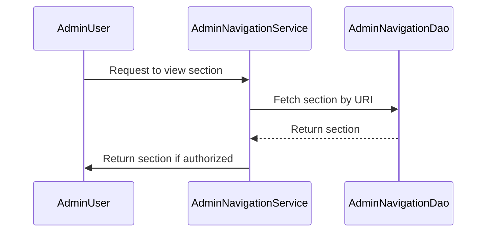

Admin Navigation in Broadleaf Commerce refers to the system that manages the navigation structure within the admin panel. It is primarily handled by the `AdminNavigationService` interface and its implementation `AdminNavigationServiceImpl`. This service is responsible for building the admin menu, authorizing user access to different sections and modules, and managing admin sections. It provides methods to save, remove, and find admin sections, as well as check user permissions. The service is used across various components of the admin panel, indicating its central role in managing admin navigation.

<SwmSnippet path="/admin/broadleaf-open-admin-platform/src/main/java/org/broadleafcommerce/openadmin/server/security/service/navigation/AdminNavigationService.java" line="29">

---

# AdminNavigationService Interface

The `AdminNavigationService` interface provides the methods that are used for admin navigation. These include methods to build the admin menu, check user authorization for sections and modules, find sections by URI or class, and save or remove sections.

```java
public interface AdminNavigationService {

    public AdminMenu buildMenu(AdminUser adminUser);

    public boolean isUserAuthorizedToViewSection(AdminUser adminUser, AdminSection section);

    public boolean isUserAuthorizedToViewModule(AdminUser adminUser, AdminModule module);

    public AdminSection findAdminSectionByURI(String uri);

    public AdminSection findAdminSectionBySectionKey(String sectionKey);

    public AdminSection findBaseAdminSectionByClass(String clazz);

    /**
     * In some cases, a single class is served by more than one section.
     * 
     * @param className
     * @param sectionId
     * @return
     */
```

---

</SwmSnippet>

<SwmSnippet path="/admin/broadleaf-open-admin-platform/src/main/java/org/broadleafcommerce/openadmin/server/security/service/navigation/AdminNavigationServiceImpl.java" line="59">

---

# AdminNavigationServiceImpl Class

The `AdminNavigationServiceImpl` class is the implementation of the `AdminNavigationService` interface. It provides the actual functionality for the methods defined in the interface. It uses the `AdminNavigationDao` to interact with the database and retrieve the necessary data for admin navigation.

```java
@Service("blAdminNavigationService")
public class AdminNavigationServiceImpl implements AdminNavigationService {

    private static final Log LOG = LogFactory.getLog(AdminNavigationServiceImpl.class);
    private static final String PATTERN = "_";

    private static SectionComparator SECTION_COMPARATOR = new SectionComparator();

    private static class SectionComparator implements Comparator<AdminSection> {

        @Override
        public int compare(AdminSection section, AdminSection section2) {
            if (section.getDisplayOrder() != null) {
                if (section2.getDisplayOrder() != null) {
                    return section.getDisplayOrder().compareTo(section2.getDisplayOrder());
                }
                else
                    return -1;
            } else if (section2.getDisplayOrder() != null) {
                return 1;
            }
```

---

</SwmSnippet>

<SwmSnippet path="/admin/broadleaf-open-admin-platform/src/main/java/org/broadleafcommerce/openadmin/web/controller/AdminAbstractController.java" line="105">

---

# Using AdminNavigationService

`AdminNavigationService` is used in various parts of the codebase. For instance, in `AdminAbstractController`, it is injected as a resource and used to facilitate navigation in the admin panel.

```java
    @Resource(name = "blAdminNavigationService")
    protected AdminNavigationService adminNavigationService;
```

---

</SwmSnippet>

<SwmSnippet path="/admin/broadleaf-open-admin-platform/src/main/java/org/broadleafcommerce/openadmin/server/security/service/navigation/AdminNavigationServiceImpl.java" line="106">

---

# Building the Admin Menu

The `buildMenu` method is used to construct the admin menu. It retrieves all admin modules, populates the admin menu with authorized sections, and returns the constructed menu.

```java
    @Override
    public AdminMenu buildMenu(AdminUser adminUser) {
        AdminMenu adminMenu = new AdminMenu();
        List<AdminModule> modules = adminNavigationDao.readAllAdminModules();
        populateAdminMenu(adminUser, adminMenu, modules);
        return adminMenu;
    }
```

---

</SwmSnippet>

<SwmSnippet path="/admin/broadleaf-open-admin-platform/src/main/java/org/broadleafcommerce/openadmin/server/security/service/navigation/AdminNavigationServiceImpl.java" line="114">

---

# Checking User Authorization

The `isUserAuthorizedToViewModule` and `isUserAuthorizedToViewSection` methods are used to check if a user is authorized to view a specific module or section. This is crucial for maintaining access control in the admin panel.

```java
    @Override
    public boolean isUserAuthorizedToViewModule(AdminUser adminUser, AdminModule module) {
        List<AdminSection> moduleSections = module.getSections();
        if (moduleSections != null && !moduleSections.isEmpty()) {
            for (AdminSection section : moduleSections) {
                if (isUserAuthorizedToViewSection(adminUser, section)) {
                    return true;
                }
            }
        }

        return false;
    }
```

---

</SwmSnippet>

# Admin Navigation Functions

The Admin Navigation functions are responsible for managing the admin interface's navigation, sections, and permissions.

<SwmSnippet path="/admin/broadleaf-open-admin-platform/src/main/java/org/broadleafcommerce/openadmin/server/security/service/navigation/AdminNavigationServiceImpl.java" line="106">

---

## buildMenu

The `buildMenu` function is used to construct the admin navigation menu. It fetches all admin modules and populates the admin menu with authorized sections.

```java
    @Override
    public AdminMenu buildMenu(AdminUser adminUser) {
        AdminMenu adminMenu = new AdminMenu();
        List<AdminModule> modules = adminNavigationDao.readAllAdminModules();
        populateAdminMenu(adminUser, adminMenu, modules);
        return adminMenu;
    }
```

---

</SwmSnippet>

<SwmSnippet path="/admin/broadleaf-open-admin-platform/src/main/java/org/broadleafcommerce/openadmin/server/security/service/navigation/AdminNavigationServiceImpl.java" line="198">

---

## isUserAuthorizedToViewSection

The `isUserAuthorizedToViewSection` function checks if a user has the necessary permissions to view a specific admin section. It verifies the user's roles and permissions against the authorized permissions of the section.

```java
    @Override
    public boolean isUserAuthorizedToViewSection(AdminUser adminUser, AdminSection section) {
        List<AdminPermission> authorizedPermissions = section.getPermissions();

        Set<String> authorizedPermissionNames = null;
        if (authorizedPermissions != null) {
            authorizedPermissionNames = new HashSet<>((authorizedPermissions.size() * 2));
            for (AdminPermission authorizedPermission : authorizedPermissions) {
                authorizedPermissionNames.add(authorizedPermission.getName());
                authorizedPermissionNames.add(parseForAllPermission(authorizedPermission.getName()));
            }
        }

        boolean response = false;
        if (!CollectionUtils.isEmpty(adminUser.getAllRoles())) {
            for (AdminRole role : adminUser.getAllRoles()) {
                for (AdminPermission permission : role.getAllPermissions()){
                    if (checkPermissions(authorizedPermissionNames, permission.getName())) {
                        response = true;
                    }
                }
```

---

</SwmSnippet>

<SwmSnippet path="/admin/broadleaf-open-admin-platform/src/main/java/org/broadleafcommerce/openadmin/server/security/service/navigation/AdminNavigationServiceImpl.java" line="114">

---

## isUserAuthorizedToViewModule

The `isUserAuthorizedToViewModule` function checks if a user has the necessary permissions to view a specific admin module. It verifies the user's permissions against the permissions of the module's sections.

```java
    @Override
    public boolean isUserAuthorizedToViewModule(AdminUser adminUser, AdminModule module) {
        List<AdminSection> moduleSections = module.getSections();
        if (moduleSections != null && !moduleSections.isEmpty()) {
            for (AdminSection section : moduleSections) {
                if (isUserAuthorizedToViewSection(adminUser, section)) {
                    return true;
                }
            }
        }

        return false;
    }
```

---

</SwmSnippet>

<SwmSnippet path="/admin/broadleaf-open-admin-platform/src/main/java/org/broadleafcommerce/openadmin/server/security/service/navigation/AdminNavigationServiceImpl.java" line="128">

---

## findAdminSectionByURI

The `findAdminSectionByURI` function retrieves an admin section based on its URI. It uses the `readAdminSectionByURI` function from the `AdminNavigationDao` to fetch the section from the database.

```java
    @Override
    public AdminSection findAdminSectionByURI(String uri) {
        return adminNavigationDao.readAdminSectionByURI(uri);
    }
    
```

---

</SwmSnippet>

<SwmSnippet path="/admin/broadleaf-open-admin-platform/src/main/java/org/broadleafcommerce/openadmin/server/security/service/navigation/AdminNavigationServiceImpl.java" line="148">

---

## findAdminSectionBySectionKey

The `findAdminSectionBySectionKey` function retrieves an admin section based on its section key. It uses the `readAdminSectionBySectionKey` function from the `AdminNavigationDao` to fetch the section from the database.

```java
    @Override
    public AdminSection findAdminSectionBySectionKey(String sectionKey) {
        return adminNavigationDao.readAdminSectionBySectionKey(sectionKey);
    }

```

---

</SwmSnippet>

<SwmSnippet path="/admin/broadleaf-open-admin-platform/src/main/java/org/broadleafcommerce/openadmin/server/security/service/navigation/AdminNavigationServiceImpl.java" line="153">

---

## findBaseAdminSectionByClass

The `findBaseAdminSectionByClass` function retrieves the base admin section for a given class. It uses the `readAdminSectionForClassName` function from the `AdminNavigationDao` to fetch the sections associated with the class, and then selects the base section from these.

```java
    @Override
    public AdminSection findBaseAdminSectionByClass(String clazz) {
        List<AdminSection> sections = adminNavigationDao.readAdminSectionForClassName(clazz);
        if (org.springframework.util.CollectionUtils.isEmpty(sections)) {
            clazz = guessClassFromInterfaces(clazz);
            if (clazz != null) {
                sections = adminNavigationDao.readAdminSectionForClassName(clazz);
            }
        }
        
        if (sections == null) {
            return null;
        }
        
        for (AdminSection section : sections) {
            //When identifying the "base" section, multiple can be returned.  "Type" sections (e.g. product:addon) will have a ":".
            //  Since we are looking for the base section, the "type" sections should be ignored
            if(!section.getUrl().contains(":")){
                return section;
            }
        }
```

---

</SwmSnippet>

<SwmSnippet path="/admin/broadleaf-open-admin-platform/src/main/java/org/broadleafcommerce/openadmin/server/security/service/navigation/AdminNavigationServiceImpl.java" line="134">

---

## findAdminSectionByClassAndSectionId

The `findAdminSectionByClassAndSectionId` function retrieves an admin section based on its class and section ID. It uses the `readAdminSectionByClassAndSectionId` function from the `AdminNavigationDao` to fetch the section from the database.

```java
    public AdminSection findAdminSectionByClassAndSectionId(String className, String sectionId) {
        try {
            return findAdminSectionByClassAndSectionId(Class.forName(className), sectionId);
        } catch (ClassNotFoundException e) {
            LOG.warn("Invalid classname received. This likely points to a configuration error.");
            return null;
        }
    }
```

---

</SwmSnippet>

<SwmSnippet path="/admin/broadleaf-open-admin-platform/src/main/java/org/broadleafcommerce/openadmin/server/security/service/navigation/AdminNavigationServiceImpl.java" line="248">

---

## findAllAdminSections

The `findAllAdminSections` function retrieves all admin sections in the system. It uses the `readAllAdminSections` function from the `AdminNavigationDao` to fetch the sections from the database, and then sorts them by their display order.

```java
    @Override
    public List<AdminSection> findAllAdminSections() {
        List<AdminSection> sections = adminNavigationDao.readAllAdminSections();
        Collections.sort(sections, SECTION_COMPARATOR);
        return sections;
    }
```

---

</SwmSnippet>

<SwmSnippet path="/admin/broadleaf-open-admin-platform/src/main/java/org/broadleafcommerce/openadmin/server/security/service/navigation/AdminNavigationServiceImpl.java" line="96">

---

## save

The `save` function is used to save an admin section. It uses the `save` function from the `AdminNavigationDao` to save the section to the database.

```java
    @Transactional("blTransactionManager")
    public AdminSection save(AdminSection adminSection) {
        return adminNavigationDao.save(adminSection);
    }
```

---

</SwmSnippet>

<SwmSnippet path="/admin/broadleaf-open-admin-platform/src/main/java/org/broadleafcommerce/openadmin/server/security/service/navigation/AdminNavigationServiceImpl.java" line="101">

---

## remove

The `remove` function is used to remove an admin section. It uses the `remove` function from the `AdminNavigationDao` to remove the section from the database.

```java
    @Override
    public void remove(AdminSection adminSection) {
        adminNavigationDao.remove(adminSection);
    }
```

---

</SwmSnippet>



&nbsp;

*This is an auto-generated document by Swimm AI 🌊 and has not yet been verified by a human*

<SwmMeta version="3.0.0" repo-id="Z2l0aHViJTNBJTNBQnJvYWRsZWFmQ29tbWVyY2UtZGVtbyUzQSUzQWdpbGFkbmF2b3Q=" repo-name="BroadleafCommerce-demo" doc-type="overview"><sup>Powered by [Swimm](/)</sup></SwmMeta>
