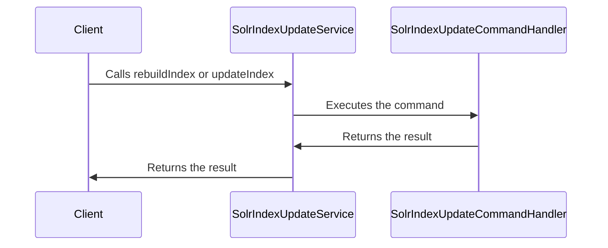

Solr Index Update in BroadleafCommerce-demo refers to the process of updating the Solr indexes or collections. This is handled by the `SolrIndexUpdateService` interface, which provides methods for rebuilding the index, updating the index with a list of documents, and building a `SolrInputDocument` from an `Indexable` object. The `CatalogSolrIndexUpdateService` extends `SolrIndexUpdateService` and provides additional methods for rebuilding the index for a specific catalog or site. The actual implementation of these services is provided by classes like `AbstractSolrIndexUpdateServiceImpl` and `CatalogSolrIndexUpdateServiceImpl`. The process of updating the Solr index is crucial for maintaining the accuracy and efficiency of search operations in the application.

<SwmSnippet path="/core/broadleaf-framework/src/main/java/org/broadleafcommerce/core/search/service/solr/indexer/SolrIndexUpdateService.java" line="34">

---

## SolrIndexUpdateService Interface

The `SolrIndexUpdateService` interface is the main entry point for issuing commands to update Solr indexes. It provides methods for rebuilding the entire index (`rebuildIndex()`), updating specific documents within the index (`updateIndex()`), and building a `SolrInputDocument` from an `Indexable` object (`buildDocument()`).

```java
public interface SolrIndexUpdateService {
    
    /**
     * Default behavior is to truncate the background collection (offline index), populate it with documents, 
     * commit, and then swap (re-alias) so that it becomes the foreground collection and the foreground collection becomes the background.
     * 
     * @throws ServiceException
     */
    public void rebuildIndex() throws ServiceException;
    
    /**
     * This is for relatively small, autonomous, incremental updates to the main (customer-facing) foreground Solr collection / index.  
     * 
     * Writes the documents to the foreground collection / index.  Then issues a commit.
     * 
     * This should not be used for incremental indexing in the context of a larger indexing scope or operation.
     * 
     * @param documents
     * @throws ServiceException
     */
    public void updateIndex(List<SolrInputDocument> documents) throws ServiceException;
```

---

</SwmSnippet>

<SwmSnippet path="/core/broadleaf-framework/src/main/java/org/broadleafcommerce/core/search/service/solr/indexer/CatalogSolrIndexUpdateService.java" line="25">

---

## CatalogSolrIndexUpdateService Interface

The `CatalogSolrIndexUpdateService` interface extends `SolrIndexUpdateService` and provides additional methods for rebuilding the index for a specific catalog or site.

```java
public interface CatalogSolrIndexUpdateService extends SolrIndexUpdateService {
    
    public void rebuildIndex(Catalog catalog) throws ServiceException;
    
    public void rebuildIndex(Site site) throws ServiceException;

    public void rebuildIndex() throws ServiceException;
    
    public void performCachedOperation(SolrIndexCachedOperation.CacheOperation cacheOperation) throws ServiceException;
}
```

---

</SwmSnippet>

<SwmSnippet path="/core/broadleaf-framework/src/main/java/org/broadleafcommerce/core/search/service/solr/indexer/SolrIndexUpdateCommandHandler.java" line="35">

---

## SolrIndexUpdateCommandHandler Interface

The `SolrIndexUpdateCommandHandler` interface provides methods for executing Solr update commands and building a `SolrInputDocument` from an `Indexable` object. It is used within the `AbstractSolrIndexUpdateServiceImpl` class to handle the execution of Solr update commands.

```java
public interface SolrIndexUpdateCommandHandler {

    /**
     * Entry point from which this component can delegate action based on the type of {@link SolrUpdateCommand}.
     * 
     * This should never be called directly.  Rather it will be called from inside the {@link AbstractSolrIndexUpdateServiceImpl}.
     * 
     * @param command
     * @throws ServiceException
     */
    public <C extends SolrUpdateCommand> void executeCommand(C command) throws ServiceException;
    
    /**
     * Command group or identifier for which this component can respond.  E.g. "catalog".  Components that use the same command group 
     * operate on the same Solr collections / aliases (indexes).
     * 
     * Multiple invocations of this method must return the same result.
     * 
     * @return
     */
    public String getCommandGroup();
```

---

</SwmSnippet>

<SwmSnippet path="/core/broadleaf-framework/src/main/java/org/broadleafcommerce/core/search/service/solr/indexer/AbstractSolrIndexUpdateCommandHandlerImpl.java" line="38">

---

## AbstractSolrIndexUpdateCommandHandlerImpl Class

The `AbstractSolrIndexUpdateCommandHandlerImpl` class provides a basic implementation of the `SolrIndexUpdateCommandHandler` interface. It provides methods for executing Solr update commands and committing changes to the Solr index.

```java
public abstract class AbstractSolrIndexUpdateCommandHandlerImpl implements SolrIndexUpdateCommandHandler {
    
    private static final Log LOG = LogFactory.getLog(AbstractSolrIndexUpdateCommandHandlerImpl.class);
    
    private final String commandGroup;
    
    public AbstractSolrIndexUpdateCommandHandlerImpl(String commandGroup) {
        Assert.notNull(commandGroup, "Command group cannot be null.");
        this.commandGroup = commandGroup.trim();
        Assert.hasText(this.commandGroup, "Command group must not be empty and should not contain white spaces.");
    }
    
    @Override
    public String getCommandGroup() {
        return commandGroup;
    }

    /**
     * By default, this will update the foreground collection.  Deletes, if available, will be applied first.  Then, updates. This should be considered an autonomous method.
     * Do not use this to make incremental updates within the scope of a larger update process because this will apply commits, by default.
     * 
```

---

</SwmSnippet>

# Solr Index Update Functions

This section will explain the main functions involved in Solr Index Update in Broadleaf Commerce.

<SwmSnippet path="/core/broadleaf-framework/src/main/java/org/broadleafcommerce/core/search/service/solr/indexer/AbstractSolrIndexUpdateServiceImpl.java" line="248">

---

## rebuildIndex

The `rebuildIndex` function is used to schedule a full reindex command. This is typically used when the entire index needs to be rebuilt, such as after a large data import or a significant change in the indexing configuration.

```java
    @Override
    public void rebuildIndex() throws ServiceException {
        scheduleCommand(FullReindexCommand.DEFAULT_INSTANCE);
    }
```

---

</SwmSnippet>

<SwmSnippet path="/core/broadleaf-framework/src/main/java/org/broadleafcommerce/core/search/service/solr/indexer/AbstractSolrIndexUpdateServiceImpl.java" line="253">

---

## updateIndex

The `updateIndex` function is used to schedule an incremental update command. This is typically used when a small number of documents need to be added, updated, or deleted in the index. The function takes a list of SolrInputDocuments to be added and a list of delete queries to be executed.

```java
    @Override
    public void updateIndex(List<SolrInputDocument> documents) {
        updateIndex(documents, null);
    }

    @Override
    public void updateIndex(List<SolrInputDocument> documents, List<String> deleteQueries) {
        IncrementalUpdateCommand cmd = new IncrementalUpdateCommand(documents, deleteQueries);
        scheduleCommand(cmd);
    }
```

---

</SwmSnippet>

<SwmSnippet path="/core/broadleaf-framework/src/main/java/org/broadleafcommerce/core/search/service/solr/indexer/AbstractSolrIndexUpdateServiceImpl.java" line="264">

---

## buildDocument

The `buildDocument` function is used to convert an Indexable object into a SolrInputDocument. This function is typically used when a new document needs to be added to the index or an existing document needs to be updated.

```java
    @Override
    public SolrInputDocument buildDocument(Indexable indexable) {
        return commandHandler.buildDocument(indexable);
    }
```

---

</SwmSnippet>



&nbsp;

*This is an auto-generated document by Swimm AI 🌊 and has not yet been verified by a human*

<SwmMeta version="3.0.0" repo-id="Z2l0aHViJTNBJTNBQnJvYWRsZWFmQ29tbWVyY2UtZGVtbyUzQSUzQWdpbGFkbmF2b3Q=" repo-name="BroadleafCommerce-demo" doc-type="overview"><sup>Powered by [Swimm](/)</sup></SwmMeta>
