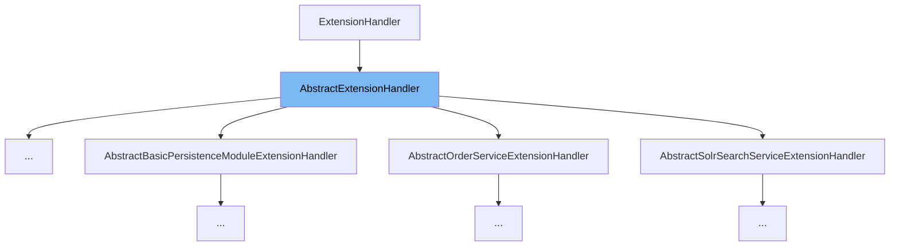

This document will cover the `AbstractExtensionHandler` class. We'll cover:

1. What is `AbstractExtensionHandler`.
2. Variables and functions in `AbstractExtensionHandler`.
3. An example of how to use `AbstractExtensionHandler`.



# What is AbstractExtensionHandler

`AbstractExtensionHandler` is a base class that provides basic properties for extension handlers, including priority and enabled status. The priority determines the execution order of handlers, and the enabled status, if false, informs the manager to skip this handler.

<SwmSnippet path="/common/src/main/java/org/broadleafcommerce/common/extension/AbstractExtensionHandler.java" line="31">

---

# Variables and functions

The `priority` variable is used to determine the execution order of this extension handler. The `enabled` variable is a boolean that, if false, informs the manager to skip this handler.

```java
    protected int priority;
    protected boolean enabled = true;
```

---

</SwmSnippet>

<SwmSnippet path="/common/src/main/java/org/broadleafcommerce/common/extension/AbstractExtensionHandler.java" line="39">

---

The `getPriority` function is used to retrieve the priority of this extension handler.

```java
    public int getPriority() {
        return priority;
    }
```

---

</SwmSnippet>

<SwmSnippet path="/common/src/main/java/org/broadleafcommerce/common/extension/AbstractExtensionHandler.java" line="43">

---

The `setPriority` function is used to set the priority of this extension handler.

```java
    public void setPriority(int priority) {
        this.priority = priority;
    }
```

---

</SwmSnippet>

<SwmSnippet path="/common/src/main/java/org/broadleafcommerce/common/extension/AbstractExtensionHandler.java" line="48">

---

The `isEnabled` function is used to check if this extension handler is enabled.

```java
    public boolean isEnabled() {
        return enabled;
    }
```

---

</SwmSnippet>

<SwmSnippet path="/common/src/main/java/org/broadleafcommerce/common/extension/AbstractExtensionHandler.java" line="52">

---

The `setEnabled` function is used to set the enabled status of this extension handler.

```java
    public void setEnabled(boolean enabled) {
        this.enabled = enabled;
    }
```

---

</SwmSnippet>

<SwmSnippet path="/admin/broadleaf-admin-module/src/main/java/org/broadleafcommerce/admin/server/service/extension/AbstractProductCustomPersistenceHandlerExtensionHandler.java" line="29">

---

# Usage example

`AbstractProductCustomPersistenceHandlerExtensionHandler` is an example of how `AbstractExtensionHandler` is used. It extends `AbstractExtensionHandler` and implements its own functionality.

```java

/**
 * Abstract Extension handler for {@link ProductCustomPersistenceHandlerExtensionHandler}
 *
 * @author Jon Fleschler (jfleschler
```

---

</SwmSnippet>

&nbsp;

*This is an auto-generated document by Swimm AI 🌊 and has not yet been verified by a human*

<SwmMeta version="3.0.0" repo-id="Z2l0aHViJTNBJTNBQnJvYWRsZWFmQ29tbWVyY2UtZGVtbyUzQSUzQWdpbGFkbmF2b3Q=" repo-name="BroadleafCommerce-demo" doc-type="class"><sup>Powered by [Swimm](/)</sup></SwmMeta>
