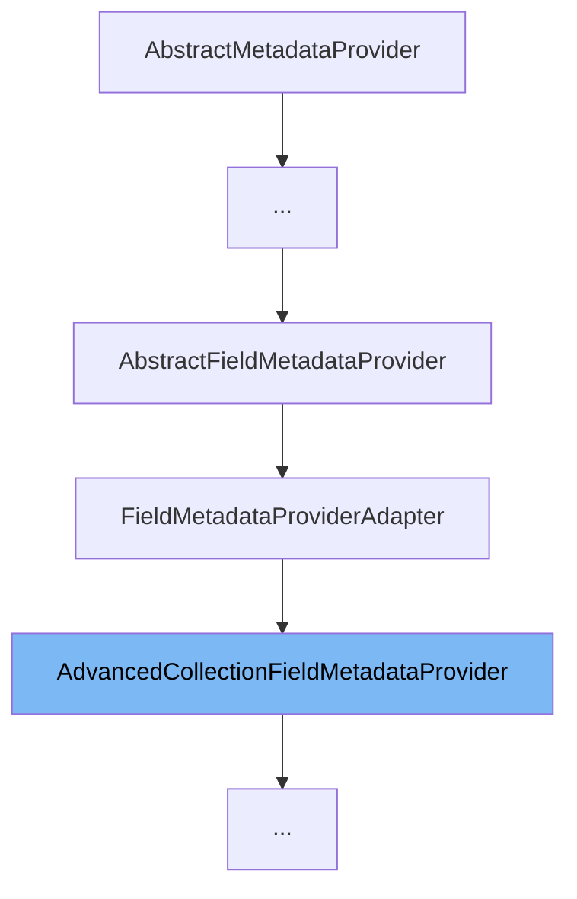

This document will cover the AdvancedCollectionFieldMetadataProvider class. We'll cover:

1. What the AdvancedCollectionFieldMetadataProvider class is.
2. The variables and functions of the AdvancedCollectionFieldMetadataProvider class.
3. An example of how to use the AdvancedCollectionFieldMetadataProvider class.



# What is AdvancedCollectionFieldMetadataProvider

The AdvancedCollectionFieldMetadataProvider class is a part of the Broadleaf Commerce framework, specifically within the Open Admin Platform. It extends the FieldMetadataProviderAdapter class and is responsible for providing metadata for advanced collection fields. This metadata is used to facilitate the management of complex data structures within the admin interface of the framework.

<SwmSnippet path="/admin/broadleaf-open-admin-platform/src/main/java/org/broadleafcommerce/openadmin/server/dao/provider/metadata/AdvancedCollectionFieldMetadataProvider.java" line="43">

---

# Variables and functions

The static variable `FOREIGN_KEY_ADDITIONAL_METADATA_KEY` is used as a key to store additional metadata related to foreign keys in a map.

```java
    public static String FOREIGN_KEY_ADDITIONAL_METADATA_KEY = "foreign_key";
```

---

</SwmSnippet>

<SwmSnippet path="/admin/broadleaf-open-admin-platform/src/main/java/org/broadleafcommerce/openadmin/server/dao/provider/metadata/AdvancedCollectionFieldMetadataProvider.java" line="45">

---

The `defaultMetadataProvider` variable is a reference to the DefaultFieldMetadataProvider bean. It is used to delegate the provision of default field metadata.

```java
    @Resource(name = "blDefaultFieldMetadataProvider")
    protected DefaultFieldMetadataProvider defaultMetadataProvider;
```

---

</SwmSnippet>

<SwmSnippet path="/admin/broadleaf-open-admin-platform/src/main/java/org/broadleafcommerce/openadmin/server/dao/provider/metadata/AdvancedCollectionFieldMetadataProvider.java" line="48">

---

# Function: canHandleFieldForTypeMetadata

The `canHandleFieldForTypeMetadata` function checks if the requested field has either an AdminPresentationMap or AdminPresentationCollection annotation. If either of these annotations is present, the function returns true, indicating that this provider can handle the metadata for the field.

```java
    protected boolean canHandleFieldForTypeMetadata(AddMetadataFromFieldTypeRequest addMetadataFromFieldTypeRequest, Map<String, FieldMetadata> metadata) {
        AdminPresentationMap map = addMetadataFromFieldTypeRequest.getRequestedField().getAnnotation(AdminPresentationMap.class);
        AdminPresentationCollection collection = addMetadataFromFieldTypeRequest.getRequestedField().getAnnotation(AdminPresentationCollection.class);
        return map != null || collection != null;
    }
```

---

</SwmSnippet>

<SwmSnippet path="/admin/broadleaf-open-admin-platform/src/main/java/org/broadleafcommerce/openadmin/server/dao/provider/metadata/AdvancedCollectionFieldMetadataProvider.java" line="54">

---

# Function: addMetadataFromFieldType

The `addMetadataFromFieldType` function is responsible for adding metadata from the field type. It first checks if it can handle the field metadata, if not, it returns a NOT_HANDLED response. If it can handle the field, it retrieves or sets various metadata properties such as the collection ceiling entity, inherited from type, and available to types. It also handles scenarios where the collection metadata is also a foreign key.

```java
    @Override
    public MetadataProviderResponse addMetadataFromFieldType(AddMetadataFromFieldTypeRequest addMetadataFromFieldTypeRequest, Map<String, FieldMetadata> metadata) {
        if (!canHandleFieldForTypeMetadata(addMetadataFromFieldTypeRequest, metadata)) {
            return MetadataProviderResponse.NOT_HANDLED;
        }
        CollectionMetadata fieldMetadata = (CollectionMetadata) addMetadataFromFieldTypeRequest.getPresentationAttribute();
        if (StringUtils.isEmpty(fieldMetadata.getCollectionCeilingEntity())) {
            ParameterizedType listType = (ParameterizedType) addMetadataFromFieldTypeRequest.getRequestedField().getGenericType();
            Class<?> listClass = (Class<?>) listType.getActualTypeArguments()[0];
            fieldMetadata.setCollectionCeilingEntity(listClass.getName());
        }
        if (addMetadataFromFieldTypeRequest.getTargetClass() != null) {
            if (StringUtils.isEmpty(fieldMetadata.getInheritedFromType())) {
                fieldMetadata.setInheritedFromType(addMetadataFromFieldTypeRequest.getTargetClass().getName());
            }
            if (ArrayUtils.isEmpty(fieldMetadata.getAvailableToTypes())) {
                fieldMetadata.setAvailableToTypes(new String[]{addMetadataFromFieldTypeRequest.getTargetClass().getName()});
            }
        }
        
        // Handle scenarios where the collection metadata is also a foreign key. The {@link BasicFieldMetadata} that has all
```

---

</SwmSnippet>

# Usage example

The AdvancedCollectionFieldMetadataProvider class is extended by other metadata provider classes such as CollectionFieldMetadataProvider, MapFieldMetadataProvider, and AdornedTargetCollectionFieldMetadataProvider. These classes use the functionality provided by AdvancedCollectionFieldMetadataProvider to handle their specific metadata provision needs.

&nbsp;

*This is an auto-generated document by Swimm AI 🌊 and has not yet been verified by a human*

<SwmMeta version="3.0.0" repo-id="Z2l0aHViJTNBJTNBQnJvYWRsZWFmQ29tbWVyY2UtZGVtbyUzQSUzQWdpbGFkbmF2b3Q=" repo-name="BroadleafCommerce-demo" doc-type="class"><sup>Powered by [Swimm](/)</sup></SwmMeta>
