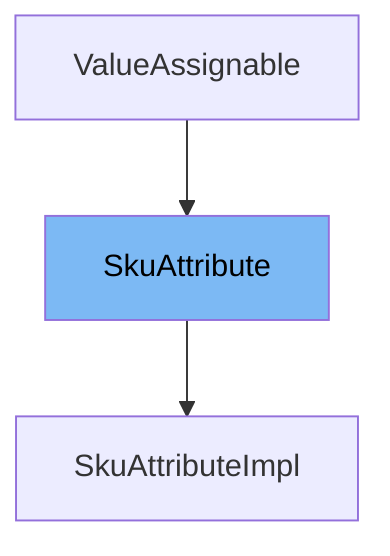

This document will cover the `SkuAttribute` class in the BroadleafCommerce-demo repository. We'll cover:

1. What is `SkuAttribute`.
2. The variables and functions defined in `SkuAttribute`.
3. An example of how to use `SkuAttribute` in `SkuAttributeImpl`.



# What is SkuAttribute

`SkuAttribute` is an interface used to hold data about a SKU's Attributes. A SKU Attribute is a designator on a SKU that differentiates it from other similar SKUs (for example: Blue attribute for a hat). If you want to make significant changes to how the class is persisted, you should implement this class. If you just want to add additional fields then you should extend `SkuAttributeImpl`.

<SwmSnippet path="/core/broadleaf-framework/src/main/java/org/broadleafcommerce/core/catalog/domain/SkuAttribute.java" line="44">

---

# Variables and functions

The function `getId` is used to get the id of the `SkuAttribute`.

```java
    public Long getId();
```

---

</SwmSnippet>

<SwmSnippet path="/core/broadleaf-framework/src/main/java/org/broadleafcommerce/core/catalog/domain/SkuAttribute.java" line="51">

---

The function `setId` is used to set the id of the `SkuAttribute`.

```java
    public void setId(Long id);
```

---

</SwmSnippet>

<SwmSnippet path="/core/broadleaf-framework/src/main/java/org/broadleafcommerce/core/catalog/domain/SkuAttribute.java" line="58">

---

The function `getSku` is used to get the SKU of the `SkuAttribute`.

```java
    public Sku getSku();
```

---

</SwmSnippet>

<SwmSnippet path="/core/broadleaf-framework/src/main/java/org/broadleafcommerce/core/catalog/domain/SkuAttribute.java" line="65">

---

The function `setSku` is used to set the SKU of the `SkuAttribute`.

```java
    public void setSku(Sku sku);
```

---

</SwmSnippet>

<SwmSnippet path="/core/broadleaf-framework/src/main/java/org/broadleafcommerce/core/catalog/domain/SkuAttribute.java" line="72">

---

The function `getName` is used to get the name of the `SkuAttribute`.

```java
    public String getName();
```

---

</SwmSnippet>

<SwmSnippet path="/core/broadleaf-framework/src/main/java/org/broadleafcommerce/core/catalog/domain/SkuAttribute.java" line="79">

---

The function `setName` is used to set the name of the `SkuAttribute`.

```java
    public void setName(String name);
```

---

</SwmSnippet>

<SwmSnippet path="/core/broadleaf-framework/src/main/java/org/broadleafcommerce/core/catalog/domain/SkuAttributeImpl.java" line="68">

---

# Usage example

`SkuAttributeImpl` is an example of how to use `SkuAttribute`. It implements the `SkuAttribute` interface and defines the methods declared in the interface.

```java
})
public class SkuAttributeImpl implements SkuAttribute {

    /** The Constant serialVersionUID. */
    private static final long serialVersionUID = 1L;

    /** The id. */
    @Id
    @GeneratedValue(generator= "SkuAttributeId")
    @GenericGenerator(
        name="SkuAttributeId",
        strategy="org.broadleafcommerce.common.persistence.IdOverrideTableGenerator",
```

---

</SwmSnippet>

&nbsp;

*This is an auto-generated document by Swimm AI 🌊 and has not yet been verified by a human*

<SwmMeta version="3.0.0" repo-id="Z2l0aHViJTNBJTNBQnJvYWRsZWFmQ29tbWVyY2UtZGVtbyUzQSUzQWdpbGFkbmF2b3Q=" repo-name="BroadleafCommerce-demo" doc-type="class"><sup>Powered by [Swimm](/)</sup></SwmMeta>
