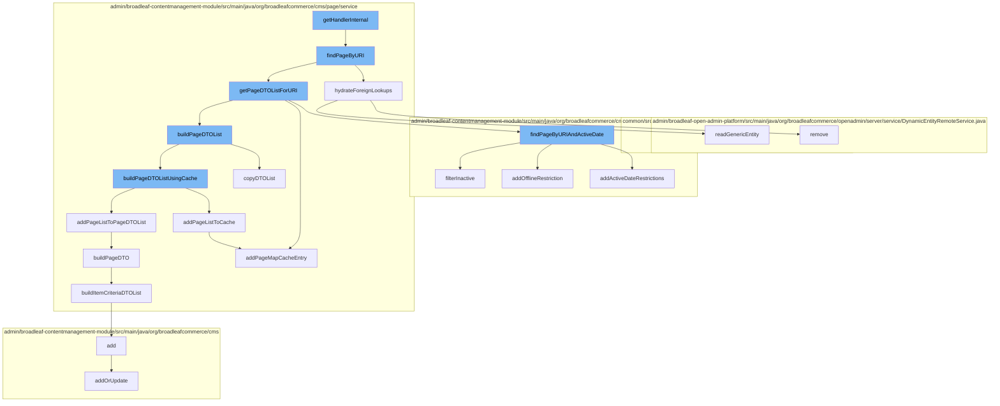

This document will cover the process of handling page requests in the BroadleafCommerce-demo project. We'll cover:

 1. Retrieving the page based on the URI
 2. Hydrating foreign lookups for the page
 3. Finding the page by URI and active date
 4. Copying the list of PageDTOs
 5. Adding the page list to cache
 6. Building the PageDTO
 7. Building the list of ItemCriteriaDTOs
 8. Adding or updating the page template
 9. Adding the page map cache entry
10. Adding active date restrictions to the page query
11. Removing the entity from the dynamic entity service.



<SwmSnippet path="/admin/broadleaf-contentmanagement-module/src/main/java/org/broadleafcommerce/cms/page/service/PageServiceImpl.java" line="136">

---

# Retrieving the page based on the URI

The `findPageByURI` function is used to retrieve the page based on the provided URI. It first checks if a null page is cached for the given locale, URI, and secure flag. If not, it retrieves the list of PageDTOs for the URI and evaluates the page rules. If a page is found, it hydrates its foreign lookups.

```java
    /*
     * Retrieve the page if one is available for the passed in uri.
     */
    @Override
    public PageDTO findPageByURI(Locale locale, String uri, Map<String,Object> ruleDTOs, boolean secure) {
        PageDTO dto;

        if (!isNullPageCached(locale, uri, secure)) {
            final List<PageDTO> returnList = getPageDTOListForURI(locale, uri, secure);
            dto = evaluatePageRules(returnList, locale, ruleDTOs);

            if (dto.getId() != null) {
                final Page page = findPageById(dto.getId());
                final ExtensionResultHolder<PageDTO> newDTO = new ExtensionResultHolder<>();

                // Allow an extension point to override the page to render.
                extensionManager.getProxy().overridePageDto(newDTO, dto, page);
                if (newDTO.getResult() != null) {
                    dto = newDTO.getResult();
                }
            }
```

---

</SwmSnippet>

<SwmSnippet path="/admin/broadleaf-contentmanagement-module/src/main/java/org/broadleafcommerce/cms/page/service/PageServiceUtility.java" line="187">

---

# Hydrating foreign lookups for the page

The `hydrateForeignLookups` function is used to populate the foreign lookups for the page. It iterates over the page fields and if a field value starts with FOREIGN_LOOKUP, it adds the field to the foreign page fields. If there are any foreign page fields, it creates a clone of the page and replaces the field values with the corresponding entities from the database.

```java
    public PageDTO hydrateForeignLookups(PageDTO page) {
        for (Entry<String, Object> entry : page.getPageFields().entrySet()) {
            if (entry.getValue() instanceof String && ((String) entry.getValue()).startsWith(FOREIGN_LOOKUP)) {
                page.getForeignPageFields().put(entry.getKey(), entry.getValue());
            }
        }

        if (page.getForeignPageFields().size() > 0) {
            PageDTO clone = new PageDTO();
            clone.copy(page);

            for (Entry<String, Object> entry : page.getForeignPageFields().entrySet()) {
                String clazz = ((String) entry.getValue()).split("\\|")[1];
                String id = ((String) entry.getValue()).split("\\|")[2];
                Object newValue = null;
                if (StringUtils.isNotBlank(clazz) && StringUtils.isNotBlank(id) && !"null".equals(id)) {
                    newValue = genericDao.readGenericEntity(genericDao.getImplClass(clazz), id);
                }
                if (newValue != null) {
                    clone.getPageFields().put(entry.getKey(), newValue);
                } else {
```

---

</SwmSnippet>

<SwmSnippet path="/admin/broadleaf-contentmanagement-module/src/main/java/org/broadleafcommerce/cms/page/dao/PageDaoImpl.java" line="174">

---

# Finding the page by URI and active date

The `findPageByURIAndActiveDate` function is used to retrieve the page based on the URI and active date. It builds a query with restrictions for the URI, offline status, and active date range. It then executes the query and filters out inactive pages.

```java
    @Override
    public List<Page> findPageByURIAndActiveDate(final String uri, final Date activeDate) {
        final CriteriaBuilder builder = em.getCriteriaBuilder();
        final CriteriaQuery<Page> criteriaQuery = builder.createQuery(Page.class);
        final Root pageRoot = criteriaQuery.from(PageImpl.class);
        criteriaQuery.select(pageRoot);

        final List<Predicate> restrictions = new ArrayList<>();
        restrictions.add(builder.equal(pageRoot.get("fullUrl"), uri));

        final Date nextDay = DateUtils.addDays(activeDate, 1);

        addOfflineRestriction(builder, pageRoot, restrictions);
        addActiveDateRestrictions(builder, pageRoot, restrictions, nextDay, activeDate);
        
        criteriaQuery.where(restrictions.toArray(new Predicate[restrictions.size()]));

        List<Page> pages = getResultForQueryAndCache(criteriaQuery);
        
        return filterInactive(pages);
    }
```

---

</SwmSnippet>

<SwmSnippet path="/admin/broadleaf-contentmanagement-module/src/main/java/org/broadleafcommerce/cms/page/service/PageServiceImpl.java" line="398">

---

# Copying the list of PageDTOs

The `copyDTOList` function is used to create a copy of the list of PageDTOs. This is done to prevent modifications to the cached list when the returned list is modified.

```java
    /*
     * Because everything is passed by reference in java, and we don't want the cached list to be modified when the
     * returned list is.
     */
    protected List<PageDTO> copyDTOList(List<PageDTO> dtoList) {
        List<PageDTO> dtoListCopy = new ArrayList<>();

        for (PageDTO dto : dtoList) {
            PageDTO dtoCopy = new PageDTO();
            dtoCopy.copy(dto);
            dtoListCopy.add(dtoCopy);
        }

        return dtoListCopy;
    }
```

---

</SwmSnippet>

<SwmSnippet path="/admin/broadleaf-contentmanagement-module/src/main/java/org/broadleafcommerce/cms/page/service/PageServiceImpl.java" line="297">

---

# Adding the page list to cache

The `addPageListToCache` function is used to add the list of pages to the cache. It builds a key using the identifier, locale, and secure flag and adds the page list to the cache using this key. It also adds a page map cache entry for the identifier.

```java
    protected void addPageListToCache(List<PageDTO> pageList, String identifier, Locale locale, boolean secure) {
        String key = buildKey(identifier, locale, secure);
        getPageCache().put(key, pageList);
        addPageMapCacheEntry(identifier, key);
    }
```

---

</SwmSnippet>

<SwmSnippet path="/admin/broadleaf-contentmanagement-module/src/main/java/org/broadleafcommerce/cms/page/service/PageServiceUtility.java" line="75">

---

# Building the PageDTO

The `buildPageDTO` function is used to create a PageDTO from a Page. It copies the basic properties from the Page to the PageDTO, adds the page fields to the PageDTO, builds the rule expression, and builds the list of ItemCriteriaDTOs if there are any qualifying item criteria.

```java
    public PageDTO buildPageDTO(Page page, boolean secure) {
        PageDTO pageDTO = new PageDTO();
        pageDTO.setId(page.getId());
        pageDTO.setDescription(page.getDescription());
        pageDTO.setUrl(page.getFullUrl());
        pageDTO.setPriority(page.getPriority());

        if (page.getPageTemplate() != null) {
            pageDTO.setTemplatePath(page.getPageTemplate().getTemplatePath());
            if (page.getPageTemplate().getLocale() != null) {
                pageDTO.setLocaleCode(page.getPageTemplate().getLocale().getLocaleCode());
            }
        }

        for (String fieldKey : page.getPageFields().keySet()) {
            addPageFieldToDTO(page, secure, pageDTO, fieldKey);
        }

        pageDTO.setRuleExpression(buildRuleExpression(page));

        if (page.getQualifyingItemCriteria() != null && page.getQualifyingItemCriteria().size() > 0) {
```

---

</SwmSnippet>

<SwmSnippet path="/admin/broadleaf-contentmanagement-module/src/main/java/org/broadleafcommerce/cms/page/service/PageServiceUtility.java" line="176">

---

# Building the list of ItemCriteriaDTOs

The `buildItemCriteriaDTOList` function is used to create a list of ItemCriteriaDTOs from the qualifying item criteria of a Page. It iterates over the qualifying item criteria of the page and creates an ItemCriteriaDTO for each one.

```java
    protected List<ItemCriteriaDTO> buildItemCriteriaDTOList(Page page) {
        List<ItemCriteriaDTO> itemCriteriaDTOList = new ArrayList<ItemCriteriaDTO>();
        for (PageItemCriteria criteria : page.getQualifyingItemCriteria()) {
            ItemCriteriaDTO criteriaDTO = new ItemCriteriaDTO();
            criteriaDTO.setMatchRule(criteria.getMatchRule());
            criteriaDTO.setQty(criteria.getQuantity());
            itemCriteriaDTOList.add(criteriaDTO);
        }
        return itemCriteriaDTOList;
    }
```

---

</SwmSnippet>

<SwmSnippet path="/admin/broadleaf-contentmanagement-module/src/main/java/org/broadleafcommerce/cms/admin/server/handler/PageTemplateCustomPersistenceHandler.java" line="294">

---

# Adding or updating the page template

The `addOrUpdate` function is used to add or update the page template. It validates the dynamic fields of the page template and updates the page fields based on the properties of the persistence package entity. It also removes any page fields that are not present in the persistence package entity.

```java
    @Override
    public Entity add(PersistencePackage persistencePackage, DynamicEntityDao dynamicEntityDao, RecordHelper helper) throws ServiceException {
        return addOrUpdate(persistencePackage, dynamicEntityDao, helper);
    }

    protected Entity addOrUpdate(PersistencePackage persistencePackage, DynamicEntityDao dynamicEntityDao, RecordHelper helper) throws ServiceException {
        String ceilingEntityFullyQualifiedClassname = persistencePackage.getCeilingEntityFullyQualifiedClassname();
        try {
            String pageId = persistencePackage.getCustomCriteria()[1];

            if (StringUtils.isBlank(pageId)) {
                return persistencePackage.getEntity();
            }

            Page page = pageService.findPageById(Long.valueOf(pageId));

            Property[] properties = dynamicFieldUtil.buildDynamicPropertyList(getFieldGroups(page, null), PageTemplate.class);
            Map<String, FieldMetadata> md = new HashMap<String, FieldMetadata>();
            for (Property property : properties) {
                md.put(property.getName(), property.getMetadata());
            }
```

---

</SwmSnippet>

<SwmSnippet path="/admin/broadleaf-contentmanagement-module/src/main/java/org/broadleafcommerce/cms/page/service/PageServiceImpl.java" line="303">

---

# Adding the page map cache entry

The `addPageMapCacheEntry` function is used to add a page map cache entry for the given identifier. It builds a key using the identifier and the site ID and adds the key to the page map cache.

```java
    @SuppressWarnings("unchecked")
    protected void addPageMapCacheEntry(String identifier, String key) {
        BroadleafRequestContext context = BroadleafRequestContext.getBroadleafRequestContext();
        Site site = context.getNonPersistentSite();
        Long siteId = (site != null) ? site.getId() : null;

        String mapKey = getPageMapCacheKey(identifier, siteId);

        if (mapKey != null) {
            Object e = getPageMapCache().get(mapKey);

            if (e == null) {
                List<String> keys = new ArrayList<>();
                keys.add(key);
                getPageMapCache().put(mapKey, keys);
            } else {
                ((List<String>) e).add(mapKey);
            }
        }
    }
```

---

</SwmSnippet>

<SwmSnippet path="/admin/broadleaf-contentmanagement-module/src/main/java/org/broadleafcommerce/cms/page/dao/PageDaoImpl.java" line="147">

---

# Adding active date restrictions to the page query

The `addActiveDateRestrictions` function is used to add active date restrictions to the page query. It adds restrictions for the active start date and active end date to the query.

```java
    protected void addActiveDateRestrictions(final CriteriaBuilder builder, final Root pageRoot, final List<Predicate> restrictions, Date afterStartDate, Date beforeEndDate) {
        restrictions.add(builder.or(
                builder.isNull(pageRoot.get("activeStartDate")),
                builder.lessThanOrEqualTo(pageRoot.get("activeStartDate").as(Date.class), afterStartDate)));
        restrictions.add(builder.or(
                builder.isNull(pageRoot.get("activeEndDate")),
                builder.greaterThanOrEqualTo(pageRoot.get("activeEndDate").as(Date.class), beforeEndDate)));
    }
```

---

</SwmSnippet>

<SwmSnippet path="/admin/broadleaf-open-admin-platform/src/main/java/org/broadleafcommerce/openadmin/server/service/DynamicEntityRemoteService.java" line="249">

---

# Removing the entity from the dynamic entity service

The `remove` function is used to remove the entity from the dynamic entity service. It performs the removal operation in a transaction.

```java
    @Override
    public PersistenceResponse remove(final PersistencePackage persistencePackage) throws ServiceException {
        final PersistenceResponse[] response = new PersistenceResponse[1];
        try {
            PlatformTransactionManager transactionManager = identifyTransactionManager(persistencePackage);
            transUtil.runTransactionalOperation(new StreamCapableTransactionalOperationAdapter() {
                @Override
                public void execute() throws Throwable {
                    response[0] = nonTransactionalRemove(persistencePackage);
                }

                @Override
                public boolean shouldRetryOnTransactionLockAcquisitionFailure() {
                    return super.shouldRetryOnTransactionLockAcquisitionFailure();
                }
            }, RuntimeException.class, transactionManager);
        } catch (RuntimeException e) {
            if (e.getCause() instanceof ServiceException) {
                throw (ServiceException) e.getCause();
            }
            throw e;
```

---

</SwmSnippet>

&nbsp;

*This is an auto-generated document by Swimm AI 🌊 and has not yet been verified by a human*

<SwmMeta version="3.0.0" repo-id="Z2l0aHViJTNBJTNBQnJvYWRsZWFmQ29tbWVyY2UtZGVtbyUzQSUzQWdpbGFkbmF2b3Q=" repo-name="BroadleafCommerce-demo" doc-type="flows"><sup>Powered by [Swimm](/)</sup></SwmMeta>
