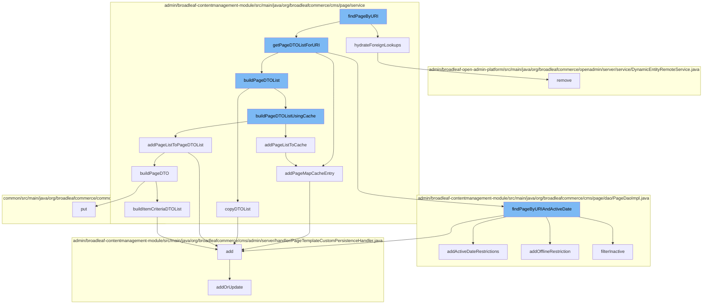

This document will cover the process of finding a page by URI in the BroadleafCommerce-demo repository. The process includes the following steps:

1. Invoking the `findPageByURI` function
2. Hydrating foreign lookups
3. Getting a list of Page Data Transfer Objects (DTOs) for the URI
4. Building a list of Page DTOs
5. Adding the list of Page DTOs to cache
6. Building a list of Item Criteria DTOs
7. Adding a page map cache entry



<SwmSnippet path="/admin/broadleaf-contentmanagement-module/src/main/java/org/broadleafcommerce/cms/page/service/PageServiceImpl.java" line="1">

---

# Invoking the `findPageByURI` function

The `findPageByURI` function is the entry point for this process. It takes a URI as input and initiates the process of finding the corresponding page.

```java
/*-
 * #%L
 * BroadleafCommerce CMS Module
 * %%
 * Copyright (C) 2009 - 2024 Broadleaf Commerce
 * %%
 * Licensed under the Broadleaf Fair Use License Agreement, Version 1.0
 * (the "Fair Use License" located  at http://license.broadleafcommerce.org/fair_use_license-1.0.txt)
 * unless the restrictions on use therein are violated and require payment to Broadleaf in which case
 * the Broadleaf End User License Agreement (EULA), Version 1.1
```

---

</SwmSnippet>

<SwmSnippet path="/admin/broadleaf-contentmanagement-module/src/main/java/org/broadleafcommerce/cms/page/service/PageServiceUtility.java" line="187">

---

# Hydrating foreign lookups

The `hydrateForeignLookups` function is called to populate the `foreignPageFields` map in the `PageDTO` object. This map contains the foreign key relationships of the page.

```java
    public PageDTO hydrateForeignLookups(PageDTO page) {
        for (Entry<String, Object> entry : page.getPageFields().entrySet()) {
            if (entry.getValue() instanceof String && ((String) entry.getValue()).startsWith(FOREIGN_LOOKUP)) {
                page.getForeignPageFields().put(entry.getKey(), entry.getValue());
            }
        }

        if (page.getForeignPageFields().size() > 0) {
            PageDTO clone = new PageDTO();
            clone.copy(page);

            for (Entry<String, Object> entry : page.getForeignPageFields().entrySet()) {
                String clazz = ((String) entry.getValue()).split("\\|")[1];
                String id = ((String) entry.getValue()).split("\\|")[2];
                Object newValue = null;
                if (StringUtils.isNotBlank(clazz) && StringUtils.isNotBlank(id) && !"null".equals(id)) {
                    newValue = genericDao.readGenericEntity(genericDao.getImplClass(clazz), id);
                }
                if (newValue != null) {
                    clone.getPageFields().put(entry.getKey(), newValue);
                } else {
```

---

</SwmSnippet>

<SwmSnippet path="/admin/broadleaf-contentmanagement-module/src/main/java/org/broadleafcommerce/cms/page/service/PageServiceImpl.java" line="20">

---

# Getting a list of Page DTOs for the URI

The `getPageDTOListForURI` function is called to retrieve a list of `PageDTO` objects that match the given URI.

```java
import org.apache.commons.beanutils.BeanComparator;
import org.apache.commons.logging.Log;
import org.apache.commons.logging.LogFactory;
import org.broadleafcommerce.cms.file.service.StaticAssetService;
import org.broadleafcommerce.cms.page.dao.PageDao;
import org.broadleafcommerce.cms.page.domain.Page;
import org.broadleafcommerce.cms.page.domain.PageField;
import org.broadleafcommerce.cms.page.domain.PageTemplate;
import org.broadleafcommerce.common.cache.CacheStatType;
import org.broadleafcommerce.common.cache.StatisticsService;
import org.broadleafcommerce.common.extension.ExtensionResultHolder;
```

---

</SwmSnippet>

<SwmSnippet path="/admin/broadleaf-contentmanagement-module/src/main/java/org/broadleafcommerce/cms/page/service/PageServiceImpl.java" line="398">

---

# Building a list of Page DTOs

The `buildPageDTOList` function is called to create a list of `PageDTO` objects. This list is then used to populate the page cache.

```java
    /*
     * Because everything is passed by reference in java, and we don't want the cached list to be modified when the
     * returned list is.
     */
    protected List<PageDTO> copyDTOList(List<PageDTO> dtoList) {
        List<PageDTO> dtoListCopy = new ArrayList<>();

        for (PageDTO dto : dtoList) {
            PageDTO dtoCopy = new PageDTO();
            dtoCopy.copy(dto);
            dtoListCopy.add(dtoCopy);
        }

        return dtoListCopy;
    }
```

---

</SwmSnippet>

<SwmSnippet path="/admin/broadleaf-contentmanagement-module/src/main/java/org/broadleafcommerce/cms/page/service/PageServiceImpl.java" line="297">

---

# Adding the list of Page DTOs to cache

The `addPageListToCache` function is called to add the list of `PageDTO` objects to the page cache. This cache is used to quickly retrieve pages by their URI.

```java
    protected void addPageListToCache(List<PageDTO> pageList, String identifier, Locale locale, boolean secure) {
        String key = buildKey(identifier, locale, secure);
        getPageCache().put(key, pageList);
        addPageMapCacheEntry(identifier, key);
    }

    @SuppressWarnings("unchecked")
    protected void addPageMapCacheEntry(String identifier, String key) {
        BroadleafRequestContext context = BroadleafRequestContext.getBroadleafRequestContext();
        Site site = context.getNonPersistentSite();
        Long siteId = (site != null) ? site.getId() : null;

        String mapKey = getPageMapCacheKey(identifier, siteId);

        if (mapKey != null) {
            Object e = getPageMapCache().get(mapKey);

            if (e == null) {
                List<String> keys = new ArrayList<>();
                keys.add(key);
                getPageMapCache().put(mapKey, keys);
```

---

</SwmSnippet>

<SwmSnippet path="/admin/broadleaf-contentmanagement-module/src/main/java/org/broadleafcommerce/cms/page/service/PageServiceUtility.java" line="176">

---

# Building a list of Item Criteria DTOs

The `buildItemCriteriaDTOList` function is called to create a list of `ItemCriteriaDTO` objects. These objects represent the criteria that a page must meet to be included in the list of pages for a given URI.

```java
    protected List<ItemCriteriaDTO> buildItemCriteriaDTOList(Page page) {
        List<ItemCriteriaDTO> itemCriteriaDTOList = new ArrayList<ItemCriteriaDTO>();
        for (PageItemCriteria criteria : page.getQualifyingItemCriteria()) {
            ItemCriteriaDTO criteriaDTO = new ItemCriteriaDTO();
            criteriaDTO.setMatchRule(criteria.getMatchRule());
            criteriaDTO.setQty(criteria.getQuantity());
            itemCriteriaDTOList.add(criteriaDTO);
        }
        return itemCriteriaDTOList;
    }
```

---

</SwmSnippet>

<SwmSnippet path="/admin/broadleaf-contentmanagement-module/src/main/java/org/broadleafcommerce/cms/page/service/PageServiceImpl.java" line="303">

---

# Adding a page map cache entry

The `addPageMapCacheEntry` function is called to add an entry to the page map cache. This cache is used to quickly retrieve the keys of the pages that match a given URI.

```java
    @SuppressWarnings("unchecked")
    protected void addPageMapCacheEntry(String identifier, String key) {
        BroadleafRequestContext context = BroadleafRequestContext.getBroadleafRequestContext();
        Site site = context.getNonPersistentSite();
        Long siteId = (site != null) ? site.getId() : null;

        String mapKey = getPageMapCacheKey(identifier, siteId);

        if (mapKey != null) {
            Object e = getPageMapCache().get(mapKey);

            if (e == null) {
                List<String> keys = new ArrayList<>();
                keys.add(key);
                getPageMapCache().put(mapKey, keys);
            } else {
                ((List<String>) e).add(mapKey);
            }
        }
    }
```

---

</SwmSnippet>

&nbsp;

*This is an auto-generated document by Swimm AI 🌊 and has not yet been verified by a human*

<SwmMeta version="3.0.0" repo-id="Z2l0aHViJTNBJTNBQnJvYWRsZWFmQ29tbWVyY2UtZGVtbyUzQSUzQWdpbGFkbmF2b3Q=" repo-name="BroadleafCommerce-demo" doc-type="flows"><sup>Powered by [Swimm](/)</sup></SwmMeta>
