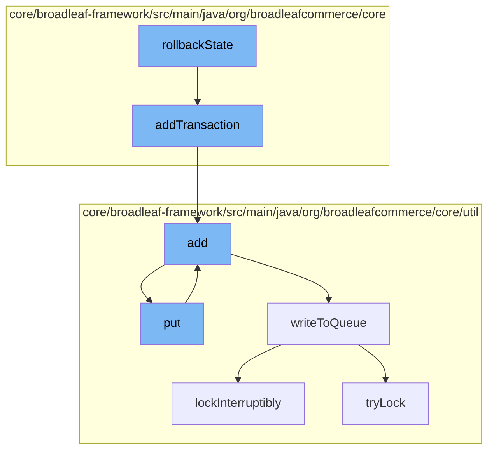

This document will cover the process of handling payment rollback in the Broadleaf Commerce framework. The process includes the following steps:

1. Initiating the rollback state
2. Adding a transaction
3. Adding the transaction to the resource purge service
4. Putting the transaction into the distributed queue
5. Writing the transaction to the queue
6. Locking the queue to prevent concurrent modifications.



<SwmSnippet path="/core/broadleaf-framework/src/main/java/org/broadleafcommerce/core/checkout/service/workflow/ConfirmPaymentsRollbackHandler.java" line="1">

---

# Initiating the rollback state

The `rollbackState` function in `ConfirmPaymentsRollbackHandler.java` is the starting point of the payment rollback process. It's responsible for initiating the rollback of a payment transaction.

```java
/*-
 * #%L
 * BroadleafCommerce Framework
 * %%
 * Copyright (C) 2009 - 2024 Broadleaf Commerce
 * %%
 * Licensed under the Broadleaf Fair Use License Agreement, Version 1.0
 * (the "Fair Use License" located  at http://license.broadleafcommerce.org/fair_use_license-1.0.txt)
 * unless the restrictions on use therein are violated and require payment to Broadleaf in which case
 * the Broadleaf End User License Agreement (EULA), Version 1.1
```

---

</SwmSnippet>

<SwmSnippet path="/core/broadleaf-framework/src/main/java/org/broadleafcommerce/core/payment/domain/OrderPaymentImpl.java" line="249">

---

# Adding a transaction

The `addTransaction` function is called to add a payment transaction to the order. This is the first step in the rollback process.

```java
    @Override
    public void addTransaction(PaymentTransaction transaction) {
        getTransactions().add(transaction);
    }
```

---

</SwmSnippet>

<SwmSnippet path="/core/broadleaf-framework/src/main/java/org/broadleafcommerce/core/util/service/ResourcePurgeServiceImpl.java" line="593">

---

# Adding the transaction to the resource purge service

The `add` function in `ResourcePurgeServiceImpl.java` is called to add the transaction to the resource purge service. This service is responsible for cleaning up resources after they are no longer needed.

```java
        public Long add(Long entry) {
            if (! cache.containsKey(entry)) {
                return cache.put(entry, new Long(System.currentTimeMillis()));
            }
            return null;
        }
```

---

</SwmSnippet>

<SwmSnippet path="/core/broadleaf-framework/src/main/java/org/broadleafcommerce/core/util/queue/ZookeeperDistributedQueue.java" line="393">

---

# Putting the transaction into the distributed queue

The `put` function in `ZookeeperDistributedQueue.java` is called to put the transaction into the distributed queue. This queue is used to manage transactions across multiple nodes in a distributed system.

```java
    @Override
    public void put(T e) throws InterruptedException {
        final ArrayList<T> elementsToAdd = new ArrayList<>();
        elementsToAdd.add(e);
        writeToQueue(elementsToAdd, -1L);
    }
```

---

</SwmSnippet>

<SwmSnippet path="/core/broadleaf-framework/src/main/java/org/broadleafcommerce/core/util/queue/ZookeeperDistributedQueue.java" line="503">

---

# Writing the transaction to the queue

The `writeToQueue` function in `ZookeeperDistributedQueue.java` is called to write the transaction to the queue. This is the final step in the process of adding a transaction to the rollback process.

```java
    protected int writeToQueue(List<? extends T> entries, final long timeout) throws InterruptedException {
        if (entries == null || entries.isEmpty()) {
            return 0;
        }
        
        int entryCount = 0;
        long waitTime = timeout;
        synchronized (QUEUE_MONITOR) {
            while (true) {
                boolean locked = false;
                DistributedLock lock = getQueueAccessLock();
                if (timeout < 0L) {
                    lock.lockInterruptibly();
                    locked = true;
                } else if (timeout > 0L && waitTime > 0L) {
                    long start = System.currentTimeMillis();
                    locked = lock.tryLock(waitTime, TimeUnit.MILLISECONDS);
                    long end = System.currentTimeMillis();
                    waitTime -= (end - start);
                } else {
                    locked = lock.tryLock();
```

---

</SwmSnippet>

<SwmSnippet path="/core/broadleaf-framework/src/main/java/org/broadleafcommerce/core/util/lock/ReentrantDistributedZookeeperLock.java" line="335">

---

# Locking the queue to prevent concurrent modifications

The `lockInterruptibly` function in `ReentrantDistributedZookeeperLock.java` is called to lock the queue and prevent concurrent modifications. This ensures that the transaction is safely added to the queue without any interference from other processes.

```java
    @Override
    public void lockInterruptibly() throws InterruptedException {
        if (Thread.interrupted()) {
            throw new InterruptedException("Thread was interrupted prior to trying to acquire the lock.");
        }
        
        lockInternally(-1L);
    }
```

---

</SwmSnippet>

&nbsp;

*This is an auto-generated document by Swimm AI 🌊 and has not yet been verified by a human*

<SwmMeta version="3.0.0" repo-id="Z2l0aHViJTNBJTNBQnJvYWRsZWFmQ29tbWVyY2UtZGVtbyUzQSUzQWdpbGFkbmF2b3Q=" repo-name="BroadleafCommerce-demo" doc-type="flows"><sup>Powered by [Swimm](/)</sup></SwmMeta>
