This document will cover the process of validating and confirming payments in the BroadleafCommerce-demo repository. The process includes the following steps:

1. Executing the main function
2. Handling unsuccessful transactions
3. Determining the order payment status
4. Determining if the payment is pending, authorized, or fully captured
5. Checking if the payment contains successful transactions.

```mermaid
graph TD;
subgraph core/broadleaf-framework/src/main/java/org/broadleafcommerce/core
  execute:::mainFlowStyle --> handleUnsuccessfulTransactions
end
subgraph core/broadleaf-framework/src/main/java/org/broadleafcommerce/core/payment
  execute:::mainFlowStyle --> getTransactionsForType
end
subgraph core/broadleaf-framework/src/main/java/org/broadleafcommerce/core/payment
  execute:::mainFlowStyle --> addTransaction
end
subgraph core/broadleaf-framework/src/main/java/org/broadleafcommerce/core/payment
  execute:::mainFlowStyle --> determineOrderPaymentStatus
end
subgraph core/broadleaf-framework/src/main/java/org/broadleafcommerce/core
  handleUnsuccessfulTransactions --> contains
end
subgraph core/broadleaf-framework/src/main/java/org/broadleafcommerce/core/payment
  getTransactionsForType --> equals
end
subgraph core/broadleaf-framework/src/main/java/org/broadleafcommerce/core/payment
  determineOrderPaymentStatus:::mainFlowStyle --> determinePending
end
subgraph core/broadleaf-framework/src/main/java/org/broadleafcommerce/core/payment
  determineOrderPaymentStatus:::mainFlowStyle --> determineAuthorized
end
subgraph core/broadleaf-framework/src/main/java/org/broadleafcommerce/core/payment
  determineOrderPaymentStatus:::mainFlowStyle --> determineFullyCaptured
end
subgraph core/broadleaf-framework/src/main/java/org/broadleafcommerce/core/payment
  determineOrderPaymentStatus:::mainFlowStyle --> determinePartiallyComplete
end
subgraph core/broadleaf-framework/src/main/java/org/broadleafcommerce/core/payment
  determinePending --> determineAuthorized
end
subgraph core/broadleaf-framework/src/main/java/org/broadleafcommerce/core/payment
  determinePending --> containsSuccessfulType
end
subgraph core/broadleaf-framework/src/main/java/org/broadleafcommerce/core/payment
  determineAuthorized --> determineFullyCaptured
end
subgraph core/broadleaf-framework/src/main/java/org/broadleafcommerce/core/payment
  determineAuthorized --> containsSuccessfulType
end
subgraph core/broadleaf-framework/src/main/java/org/broadleafcommerce/core/payment
  determineFullyCaptured --> containsSuccessfulType
end
subgraph core/broadleaf-framework/src/main/java/org/broadleafcommerce/core/payment
  determinePartiallyComplete:::mainFlowStyle --> containsSuccessfulType
end
subgraph core/broadleaf-framework/src/main/java/org/broadleafcommerce/core/payment
  determinePartiallyComplete:::mainFlowStyle --> determineComplete
end
subgraph core/broadleaf-framework/src/main/java/org/broadleafcommerce/core/payment
  containsSuccessfulType --> getTransactionsForType
end
subgraph core/broadleaf-framework/src/main/java/org/broadleafcommerce/core/payment
  determineComplete --> getTransactionsForType
end
subgraph core/broadleaf-framework/src/main/java/org/broadleafcommerce/core
  determineComplete --> addAll
end
subgraph core/broadleaf-framework/src/main/java/org/broadleafcommerce/core/payment
  determineComplete --> getSuccessfulTransactionAmountForType
end

classDef mainFlowStyle color:#000000,fill:#7CB9F4
classDef rootsStyle color:#000000,fill:#00FFF4
classDef Style1 color:#000000,fill:#00FFAA
classDef Style2 color:#000000,fill:#FFFF00
classDef Style3 color:#000000,fill:#AA7CB9

%% Swimm:
%% graph TD;
%% subgraph <SwmPath>[core/broadleaf-framework/src/main/java/org/broadleafcommerce/core//](/core/broadleaf-framework/src/main/java/org/broadleafcommerce/core//)</SwmPath>
%%   execute:::mainFlowStyle --> <SwmToken path="/core/broadleaf-framework/src/main/java/org/broadleafcommerce/core/checkout/service/workflow/ValidateAndConfirmPaymentActivity.java" pos="283:5:5" line-data="    protected void handleUnsuccessfulTransactions(List&lt;ResponseTransactionPair&gt; failedTransactions, ProcessContext&lt;CheckoutSeed&gt; context) throws Exception {">`handleUnsuccessfulTransactions`</SwmToken>
%% end
%% subgraph <SwmPath>[core/broadleaf-framework/src/main/java/org/broadleafcommerce/core/payment//](/core/broadleaf-framework/src/main/java/org/broadleafcommerce/core/payment//)</SwmPath>
%%   execute:::mainFlowStyle --> <SwmToken path="/core/broadleaf-framework/src/main/java/org/broadleafcommerce/core/payment/service/OrderPaymentStatusServiceImpl.java" pos="53:12:12" line-data="        List&lt;PaymentTransaction&gt; txs = payment.getTransactionsForType(type);">`getTransactionsForType`</SwmToken>
%% end
%% subgraph <SwmPath>[core/broadleaf-framework/src/main/java/org/broadleafcommerce/core/payment//](/core/broadleaf-framework/src/main/java/org/broadleafcommerce/core/payment//)</SwmPath>
%%   execute:::mainFlowStyle --> <SwmToken path="/core/broadleaf-framework/src/main/java/org/broadleafcommerce/core/payment/domain/OrderPaymentImpl.java" pos="250:5:5" line-data="    public void addTransaction(PaymentTransaction transaction) {">`addTransaction`</SwmToken>
%% end
%% subgraph <SwmPath>[core/broadleaf-framework/src/main/java/org/broadleafcommerce/core/payment//](/core/broadleaf-framework/src/main/java/org/broadleafcommerce/core/payment//)</SwmPath>
%%   execute:::mainFlowStyle --> <SwmToken path="/core/broadleaf-framework/src/main/java/org/broadleafcommerce/core/payment/service/OrderPaymentStatusService.java" pos="31:5:5" line-data="    public OrderPaymentStatus determineOrderPaymentStatus(OrderPayment orderPayment);">`determineOrderPaymentStatus`</SwmToken>
%% end
%% subgraph <SwmPath>[core/broadleaf-framework/src/main/java/org/broadleafcommerce/core//](/core/broadleaf-framework/src/main/java/org/broadleafcommerce/core//)</SwmPath>
%%   <SwmToken path="/core/broadleaf-framework/src/main/java/org/broadleafcommerce/core/checkout/service/workflow/ValidateAndConfirmPaymentActivity.java" pos="283:5:5" line-data="    protected void handleUnsuccessfulTransactions(List&lt;ResponseTransactionPair&gt; failedTransactions, ProcessContext&lt;CheckoutSeed&gt; context) throws Exception {">`handleUnsuccessfulTransactions`</SwmToken> --> contains
%% end
%% subgraph <SwmPath>[core/broadleaf-framework/src/main/java/org/broadleafcommerce/core/payment//](/core/broadleaf-framework/src/main/java/org/broadleafcommerce/core/payment//)</SwmPath>
%%   <SwmToken path="/core/broadleaf-framework/src/main/java/org/broadleafcommerce/core/payment/service/OrderPaymentStatusServiceImpl.java" pos="53:12:12" line-data="        List&lt;PaymentTransaction&gt; txs = payment.getTransactionsForType(type);">`getTransactionsForType`</SwmToken> --> equals
%% end
%% subgraph <SwmPath>[core/broadleaf-framework/src/main/java/org/broadleafcommerce/core/payment//](/core/broadleaf-framework/src/main/java/org/broadleafcommerce/core/payment//)</SwmPath>
%%   determineOrderPaymentStatus:::mainFlowStyle --> <SwmToken path="/core/broadleaf-framework/src/main/java/org/broadleafcommerce/core/payment/service/OrderPaymentStatusServiceImpl.java" pos="108:5:5" line-data="    protected boolean determinePending(OrderPayment payment) {">`determinePending`</SwmToken>
%% end
%% subgraph <SwmPath>[core/broadleaf-framework/src/main/java/org/broadleafcommerce/core/payment//](/core/broadleaf-framework/src/main/java/org/broadleafcommerce/core/payment//)</SwmPath>
%%   determineOrderPaymentStatus:::mainFlowStyle --> <SwmToken path="/core/broadleaf-framework/src/main/java/org/broadleafcommerce/core/payment/service/OrderPaymentStatusServiceImpl.java" pos="109:4:4" line-data="        return !determineAuthorized(payment) &amp;&amp;">`determineAuthorized`</SwmToken>
%% end
%% subgraph <SwmPath>[core/broadleaf-framework/src/main/java/org/broadleafcommerce/core/payment//](/core/broadleaf-framework/src/main/java/org/broadleafcommerce/core/payment//)</SwmPath>
%%   determineOrderPaymentStatus:::mainFlowStyle --> <SwmToken path="/core/broadleaf-framework/src/main/java/org/broadleafcommerce/core/payment/service/OrderPaymentStatusServiceImpl.java" pos="96:5:5" line-data="    protected boolean determineFullyCaptured(OrderPayment payment) {">`determineFullyCaptured`</SwmToken>
%% end
%% subgraph <SwmPath>[core/broadleaf-framework/src/main/java/org/broadleafcommerce/core/payment//](/core/broadleaf-framework/src/main/java/org/broadleafcommerce/core/payment//)</SwmPath>
%%   determineOrderPaymentStatus:::mainFlowStyle --> <SwmToken path="/core/broadleaf-framework/src/main/java/org/broadleafcommerce/core/payment/service/OrderPaymentStatusServiceImpl.java" pos="39:8:8" line-data="        } else if (determinePartiallyComplete(orderPayment)) {">`determinePartiallyComplete`</SwmToken>
%% end
%% subgraph <SwmPath>[core/broadleaf-framework/src/main/java/org/broadleafcommerce/core/payment//](/core/broadleaf-framework/src/main/java/org/broadleafcommerce/core/payment//)</SwmPath>
%%   <SwmToken path="/core/broadleaf-framework/src/main/java/org/broadleafcommerce/core/payment/service/OrderPaymentStatusServiceImpl.java" pos="108:5:5" line-data="    protected boolean determinePending(OrderPayment payment) {">`determinePending`</SwmToken> --> <SwmToken path="/core/broadleaf-framework/src/main/java/org/broadleafcommerce/core/payment/service/OrderPaymentStatusServiceImpl.java" pos="109:4:4" line-data="        return !determineAuthorized(payment) &amp;&amp;">`determineAuthorized`</SwmToken>
%% end
%% subgraph <SwmPath>[core/broadleaf-framework/src/main/java/org/broadleafcommerce/core/payment//](/core/broadleaf-framework/src/main/java/org/broadleafcommerce/core/payment//)</SwmPath>
%%   <SwmToken path="/core/broadleaf-framework/src/main/java/org/broadleafcommerce/core/payment/service/OrderPaymentStatusServiceImpl.java" pos="108:5:5" line-data="    protected boolean determinePending(OrderPayment payment) {">`determinePending`</SwmToken> --> <SwmToken path="/core/broadleaf-framework/src/main/java/org/broadleafcommerce/core/payment/service/OrderPaymentStatusServiceImpl.java" pos="52:5:5" line-data="    protected boolean containsSuccessfulType(OrderPayment payment, PaymentTransactionType type) {">`containsSuccessfulType`</SwmToken>
%% end
%% subgraph <SwmPath>[core/broadleaf-framework/src/main/java/org/broadleafcommerce/core/payment//](/core/broadleaf-framework/src/main/java/org/broadleafcommerce/core/payment//)</SwmPath>
%%   <SwmToken path="/core/broadleaf-framework/src/main/java/org/broadleafcommerce/core/payment/service/OrderPaymentStatusServiceImpl.java" pos="109:4:4" line-data="        return !determineAuthorized(payment) &amp;&amp;">`determineAuthorized`</SwmToken> --> <SwmToken path="/core/broadleaf-framework/src/main/java/org/broadleafcommerce/core/payment/service/OrderPaymentStatusServiceImpl.java" pos="96:5:5" line-data="    protected boolean determineFullyCaptured(OrderPayment payment) {">`determineFullyCaptured`</SwmToken>
%% end
%% subgraph <SwmPath>[core/broadleaf-framework/src/main/java/org/broadleafcommerce/core/payment//](/core/broadleaf-framework/src/main/java/org/broadleafcommerce/core/payment//)</SwmPath>
%%   <SwmToken path="/core/broadleaf-framework/src/main/java/org/broadleafcommerce/core/payment/service/OrderPaymentStatusServiceImpl.java" pos="109:4:4" line-data="        return !determineAuthorized(payment) &amp;&amp;">`determineAuthorized`</SwmToken> --> <SwmToken path="/core/broadleaf-framework/src/main/java/org/broadleafcommerce/core/payment/service/OrderPaymentStatusServiceImpl.java" pos="52:5:5" line-data="    protected boolean containsSuccessfulType(OrderPayment payment, PaymentTransactionType type) {">`containsSuccessfulType`</SwmToken>
%% end
%% subgraph <SwmPath>[core/broadleaf-framework/src/main/java/org/broadleafcommerce/core/payment//](/core/broadleaf-framework/src/main/java/org/broadleafcommerce/core/payment//)</SwmPath>
%%   <SwmToken path="/core/broadleaf-framework/src/main/java/org/broadleafcommerce/core/payment/service/OrderPaymentStatusServiceImpl.java" pos="96:5:5" line-data="    protected boolean determineFullyCaptured(OrderPayment payment) {">`determineFullyCaptured`</SwmToken> --> <SwmToken path="/core/broadleaf-framework/src/main/java/org/broadleafcommerce/core/payment/service/OrderPaymentStatusServiceImpl.java" pos="52:5:5" line-data="    protected boolean containsSuccessfulType(OrderPayment payment, PaymentTransactionType type) {">`containsSuccessfulType`</SwmToken>
%% end
%% subgraph <SwmPath>[core/broadleaf-framework/src/main/java/org/broadleafcommerce/core/payment//](/core/broadleaf-framework/src/main/java/org/broadleafcommerce/core/payment//)</SwmPath>
%%   determinePartiallyComplete:::mainFlowStyle --> <SwmToken path="/core/broadleaf-framework/src/main/java/org/broadleafcommerce/core/payment/service/OrderPaymentStatusServiceImpl.java" pos="52:5:5" line-data="    protected boolean containsSuccessfulType(OrderPayment payment, PaymentTransactionType type) {">`containsSuccessfulType`</SwmToken>
%% end
%% subgraph <SwmPath>[core/broadleaf-framework/src/main/java/org/broadleafcommerce/core/payment//](/core/broadleaf-framework/src/main/java/org/broadleafcommerce/core/payment//)</SwmPath>
%%   determinePartiallyComplete:::mainFlowStyle --> <SwmToken path="/core/broadleaf-framework/src/main/java/org/broadleafcommerce/core/payment/service/OrderPaymentStatusServiceImpl.java" pos="35:4:4" line-data="        if (determineComplete(orderPayment)) {">`determineComplete`</SwmToken>
%% end
%% subgraph <SwmPath>[core/broadleaf-framework/src/main/java/org/broadleafcommerce/core/payment//](/core/broadleaf-framework/src/main/java/org/broadleafcommerce/core/payment//)</SwmPath>
%%   <SwmToken path="/core/broadleaf-framework/src/main/java/org/broadleafcommerce/core/payment/service/OrderPaymentStatusServiceImpl.java" pos="52:5:5" line-data="    protected boolean containsSuccessfulType(OrderPayment payment, PaymentTransactionType type) {">`containsSuccessfulType`</SwmToken> --> <SwmToken path="/core/broadleaf-framework/src/main/java/org/broadleafcommerce/core/payment/service/OrderPaymentStatusServiceImpl.java" pos="53:12:12" line-data="        List&lt;PaymentTransaction&gt; txs = payment.getTransactionsForType(type);">`getTransactionsForType`</SwmToken>
%% end
%% subgraph <SwmPath>[core/broadleaf-framework/src/main/java/org/broadleafcommerce/core/payment//](/core/broadleaf-framework/src/main/java/org/broadleafcommerce/core/payment//)</SwmPath>
%%   <SwmToken path="/core/broadleaf-framework/src/main/java/org/broadleafcommerce/core/payment/service/OrderPaymentStatusServiceImpl.java" pos="35:4:4" line-data="        if (determineComplete(orderPayment)) {">`determineComplete`</SwmToken> --> <SwmToken path="/core/broadleaf-framework/src/main/java/org/broadleafcommerce/core/payment/service/OrderPaymentStatusServiceImpl.java" pos="53:12:12" line-data="        List&lt;PaymentTransaction&gt; txs = payment.getTransactionsForType(type);">`getTransactionsForType`</SwmToken>
%% end
%% subgraph <SwmPath>[core/broadleaf-framework/src/main/java/org/broadleafcommerce/core//](/core/broadleaf-framework/src/main/java/org/broadleafcommerce/core//)</SwmPath>
%%   <SwmToken path="/core/broadleaf-framework/src/main/java/org/broadleafcommerce/core/payment/service/OrderPaymentStatusServiceImpl.java" pos="35:4:4" line-data="        if (determineComplete(orderPayment)) {">`determineComplete`</SwmToken> --> <SwmToken path="/admin/broadleaf-open-admin-platform/src/main/java/org/broadleafcommerce/openadmin/dto/CriteriaTransferObject.java" pos="144:5:5" line-data="    public void addAll(Collection&lt;FilterAndSortCriteria&gt; criterias) {">`addAll`</SwmToken>
%% end
%% subgraph <SwmPath>[core/broadleaf-framework/src/main/java/org/broadleafcommerce/core/payment//](/core/broadleaf-framework/src/main/java/org/broadleafcommerce/core/payment//)</SwmPath>
%%   <SwmToken path="/core/broadleaf-framework/src/main/java/org/broadleafcommerce/core/payment/service/OrderPaymentStatusServiceImpl.java" pos="35:4:4" line-data="        if (determineComplete(orderPayment)) {">`determineComplete`</SwmToken> --> <SwmToken path="/core/broadleaf-framework/src/main/java/org/broadleafcommerce/core/payment/service/OrderPaymentStatusServiceImpl.java" pos="97:9:9" line-data="        Money fullAuthAmount = payment.getSuccessfulTransactionAmountForType(PaymentTransactionType.AUTHORIZE);">`getSuccessfulTransactionAmountForType`</SwmToken>
%% end
%% 
%% classDef mainFlowStyle color:#000000,fill:#7CB9F4
%% classDef rootsStyle color:#000000,fill:#00FFF4
%% classDef Style1 color:#000000,fill:#00FFAA
%% classDef Style2 color:#000000,fill:#FFFF00
%% classDef Style3 color:#000000,fill:#AA7CB9
```



<SwmSnippet path="/core/broadleaf-framework/src/main/java/org/broadleafcommerce/core/checkout/service/workflow/ValidateAndConfirmPaymentActivity.java" line="269">

---

# Executing the main function

The <SwmToken path="/admin/broadleaf-open-admin-platform/src/main/java/org/broadleafcommerce/openadmin/server/service/persistence/Persistable.java" pos="25:5:5" line-data="    public T execute() throws G;">`execute`</SwmToken> function in <SwmPath>[core/broadleaf-framework/src/main/java/org/broadleafcommerce/core/checkout/service/workflow/ValidateAndConfirmPaymentActivity.java](/core/broadleaf-framework/src/main/java/org/broadleafcommerce/core/checkout/service/workflow/ValidateAndConfirmPaymentActivity.java)</SwmPath> is the main entry point for the payment validation and confirmation process. It calls several other functions to handle different aspects of the process.

```java
    /**
     * <p>
     * Default implementation is to throw a generic CheckoutException which will be caught and displayed
     * on the Checkout Page where the Customer can try again. In many cases, this is
     * sufficient as it is usually recommended to display a generic Error Message to prevent
     * Credit Card fraud.
     *
     * <p>
     * The configured payment gateway may return a more specific error.
     * Each gateway is different and will often times return different error codes based on the acquiring bank as well.
     * In that case, you may override this method to decipher these errors
     * and handle it appropriately based on your business requirements.
     *
     */
    protected void handleUnsuccessfulTransactions(List<ResponseTransactionPair> failedTransactions, ProcessContext<CheckoutSeed> context) throws Exception {
        //The Response DTO was not successful confirming/authorizing a transaction.
        String msg = "Attempting to confirm/authorize an UNCONFIRMED transaction on the order was unsuccessful.";
        
        
        /**
         * For each of the failed transactions we might need to register state with the rollback handler
```

---

</SwmSnippet>

<SwmSnippet path="/core/broadleaf-framework/src/main/java/org/broadleafcommerce/core/checkout/service/workflow/ValidateAndConfirmPaymentActivity.java" line="283">

---

# Handling unsuccessful transactions

The <SwmToken path="/core/broadleaf-framework/src/main/java/org/broadleafcommerce/core/checkout/service/workflow/ValidateAndConfirmPaymentActivity.java" pos="283:5:5" line-data="    protected void handleUnsuccessfulTransactions(List&lt;ResponseTransactionPair&gt; failedTransactions, ProcessContext&lt;CheckoutSeed&gt; context) throws Exception {">`handleUnsuccessfulTransactions`</SwmToken> function is called when a transaction fails. It handles the failed transactions by marking the payment as invalid and registering the failed transactions for rollback.

```java
    protected void handleUnsuccessfulTransactions(List<ResponseTransactionPair> failedTransactions, ProcessContext<CheckoutSeed> context) throws Exception {
        //The Response DTO was not successful confirming/authorizing a transaction.
        String msg = "Attempting to confirm/authorize an UNCONFIRMED transaction on the order was unsuccessful.";
        
        
        /**
         * For each of the failed transactions we might need to register state with the rollback handler
         */
        List<OrderPayment> invalidatedPayments = new ArrayList<>();
        List<PaymentTransaction> failedTransactionsToRollBack = new ArrayList<>();
        List<PaymentResponseDTO> failedResponses = new ArrayList<>();
        for (ResponseTransactionPair responseTransactionPair : failedTransactions) {
            PaymentTransaction tx = orderPaymentService.readTransactionById(responseTransactionPair.getTransactionId());
            if (shouldRollbackFailedTransaction(responseTransactionPair)) {
                failedTransactionsToRollBack.add(tx);
            } else if (!invalidatedPayments.contains(tx.getOrderPayment())) {
                paymentGatewayCheckoutService.markPaymentAsInvalid(tx.getOrderPayment().getId());
                OrderPayment payment = orderPaymentService.save(tx.getOrderPayment());
                invalidatedPayments.add(payment);
            }
            failedResponses.add(responseTransactionPair.getResponseDTO());
```

---

</SwmSnippet>

<SwmSnippet path="/core/broadleaf-framework/src/main/java/org/broadleafcommerce/core/payment/service/OrderPaymentStatusServiceImpl.java" line="108">

---

# Determining the order payment status

The <SwmToken path="/core/broadleaf-framework/src/main/java/org/broadleafcommerce/core/payment/service/OrderPaymentStatusService.java" pos="31:5:5" line-data="    public OrderPaymentStatus determineOrderPaymentStatus(OrderPayment orderPayment);">`determineOrderPaymentStatus`</SwmToken> function is used to determine the status of the order payment. It calls several other functions to check if the payment is pending, authorized, or fully captured.

```java
    protected boolean determinePending(OrderPayment payment) {
        return !determineAuthorized(payment) &&
                !containsSuccessfulType(payment, PaymentTransactionType.AUTHORIZE_AND_CAPTURE) &&
                containsSuccessfulType(payment, PaymentTransactionType.PENDING);
    }
```

---

</SwmSnippet>

<SwmSnippet path="/core/broadleaf-framework/src/main/java/org/broadleafcommerce/core/payment/service/OrderPaymentStatusServiceImpl.java" line="96">

---

# Determining if the payment is pending, authorized, or fully captured

The <SwmToken path="/core/broadleaf-framework/src/main/java/org/broadleafcommerce/core/payment/service/OrderPaymentStatusServiceImpl.java" pos="108:5:5" line-data="    protected boolean determinePending(OrderPayment payment) {">`determinePending`</SwmToken>, <SwmToken path="/core/broadleaf-framework/src/main/java/org/broadleafcommerce/core/payment/service/OrderPaymentStatusServiceImpl.java" pos="109:4:4" line-data="        return !determineAuthorized(payment) &amp;&amp;">`determineAuthorized`</SwmToken>, and <SwmToken path="/core/broadleaf-framework/src/main/java/org/broadleafcommerce/core/payment/service/OrderPaymentStatusServiceImpl.java" pos="96:5:5" line-data="    protected boolean determineFullyCaptured(OrderPayment payment) {">`determineFullyCaptured`</SwmToken> functions are used to check the status of the payment. They use the <SwmToken path="/core/broadleaf-framework/src/main/java/org/broadleafcommerce/core/payment/service/OrderPaymentStatusServiceImpl.java" pos="100:3:3" line-data="        return containsSuccessfulType(payment, PaymentTransactionType.AUTHORIZE_AND_CAPTURE) ||">`containsSuccessfulType`</SwmToken> function to check if the payment contains successful transactions of specific types.

```java
    protected boolean determineFullyCaptured(OrderPayment payment) {
        Money fullAuthAmount = payment.getSuccessfulTransactionAmountForType(PaymentTransactionType.AUTHORIZE);
        Money fullCaptureAmount = payment.getSuccessfulTransactionAmountForType(PaymentTransactionType.CAPTURE);

        return containsSuccessfulType(payment, PaymentTransactionType.AUTHORIZE_AND_CAPTURE) ||
                (fullAuthAmount.greaterThan(Money.ZERO) && fullAuthAmount.equals(fullCaptureAmount));
    }
```

---

</SwmSnippet>

<SwmSnippet path="/core/broadleaf-framework/src/main/java/org/broadleafcommerce/core/payment/service/OrderPaymentStatusServiceImpl.java" line="52">

---

# Checking if the payment contains successful transactions

The <SwmToken path="/core/broadleaf-framework/src/main/java/org/broadleafcommerce/core/payment/service/OrderPaymentStatusServiceImpl.java" pos="52:5:5" line-data="    protected boolean containsSuccessfulType(OrderPayment payment, PaymentTransactionType type) {">`containsSuccessfulType`</SwmToken> function checks if the payment contains successful transactions of a specific type. It uses the <SwmToken path="/core/broadleaf-framework/src/main/java/org/broadleafcommerce/core/payment/service/OrderPaymentStatusServiceImpl.java" pos="53:12:12" line-data="        List&lt;PaymentTransaction&gt; txs = payment.getTransactionsForType(type);">`getTransactionsForType`</SwmToken> function to get the transactions of the specified type.

```java
    protected boolean containsSuccessfulType(OrderPayment payment, PaymentTransactionType type) {
        List<PaymentTransaction> txs = payment.getTransactionsForType(type);
        for (PaymentTransaction tx : txs) {
            if (tx.getSuccess()) {
                return true;
            }
        }

        return false;
    }
```

---

</SwmSnippet>

&nbsp;

*This is an auto-generated document by Swimm AI 🌊 and has not yet been verified by a human*

<SwmMeta version="3.0.0" repo-id="Z2l0aHViJTNBJTNBQnJvYWRsZWFmQ29tbWVyY2UtZGVtbyUzQSUzQWdpbGFkbmF2b3Q=" repo-name="BroadleafCommerce-demo"><sup>Powered by [Swimm](https://app.swimm.io/)</sup></SwmMeta>
