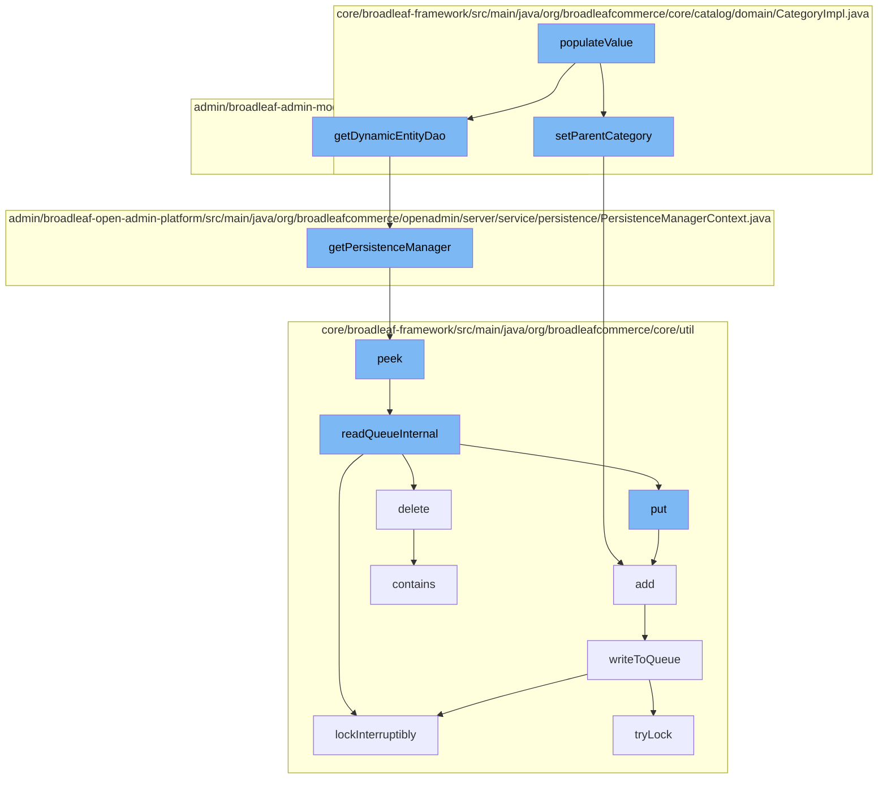

This document will cover the process of populating category values in the Broadleaf Commerce framework. The process includes:

1. Setting the parent category
2. Retrieving the persistence manager
3. Reading from the queue
4. Writing to the queue
5. Adding to the resource purge service.



<SwmSnippet path="/core/broadleaf-framework/src/main/java/org/broadleafcommerce/core/catalog/domain/CategoryImpl.java" line="699">

---

# Setting the Parent Category

The `setParentCategory` function is used to set the parent category for a given category. It checks if the category already exists in the parent category references. If not, it creates a new reference and adds it to the parent category references.

```java
    @Override
    public void setParentCategory(Category category) {
        List<CategoryXref> xrefs = getAllParentCategoryXrefs();
        boolean found = false;
        for (CategoryXref xref : xrefs) {
            if (xref.getCategory().equals(category)) {
                xref.setDefaultReference(true);
                found = true;
            } else if (xref.getDefaultReference() != null && xref.getDefaultReference()) {
                xref.setDefaultReference(null);
            }
        }
        if (!found && category != null) {
            CategoryXref xref = new CategoryXrefImpl();
            xref.setSubCategory(this);
            xref.setCategory(category);
            xref.setDefaultReference(true);
            allParentCategoryXrefs.add(xref);
        }
    }
```

---

</SwmSnippet>

<SwmSnippet path="/admin/broadleaf-open-admin-platform/src/main/java/org/broadleafcommerce/openadmin/server/service/persistence/PersistenceManagerContext.java" line="49">

---

# Retrieving the Persistence Manager

The `getPersistenceManager` function is used to retrieve the persistence manager from the context. The persistence manager is responsible for managing the persistence of entities in the application.

```java
    public PersistenceManager getPersistenceManager() {
        return !persistenceManager.empty()?persistenceManager.peek():null;
    }
```

---

</SwmSnippet>

<SwmSnippet path="/core/broadleaf-framework/src/main/java/org/broadleafcommerce/core/util/queue/ZookeeperDistributedQueue.java" line="222">

---

# Reading from the Queue

The `peek` function is used to read the first element from the queue without removing it. This is used to check the next element to be processed.

```java
    @Override
    public T peek() {
        try {
            Map<String, T> elements = readQueueInternal(1, false, 0L);
            Iterator<Map.Entry<String, T>> entries = elements.entrySet().iterator();
            if (entries.hasNext()) {
                return entries.next().getValue();
            }
            
            return null;
        } catch (InterruptedException e) {
            Thread.currentThread().interrupt();
            return null;
        }
    }
```

---

</SwmSnippet>

<SwmSnippet path="/core/broadleaf-framework/src/main/java/org/broadleafcommerce/core/util/queue/ZookeeperDistributedQueue.java" line="503">

---

# Writing to the Queue

The `writeToQueue` function is used to add elements to the queue. It locks the queue, checks the remaining capacity, and adds the elements. If the queue is full, it waits until there is space available.

```java
    protected int writeToQueue(List<? extends T> entries, final long timeout) throws InterruptedException {
        if (entries == null || entries.isEmpty()) {
            return 0;
        }
        
        int entryCount = 0;
        long waitTime = timeout;
        synchronized (QUEUE_MONITOR) {
            while (true) {
                boolean locked = false;
                DistributedLock lock = getQueueAccessLock();
                if (timeout < 0L) {
                    lock.lockInterruptibly();
                    locked = true;
                } else if (timeout > 0L && waitTime > 0L) {
                    long start = System.currentTimeMillis();
                    locked = lock.tryLock(waitTime, TimeUnit.MILLISECONDS);
                    long end = System.currentTimeMillis();
                    waitTime -= (end - start);
                } else {
                    locked = lock.tryLock();
```

---

</SwmSnippet>

<SwmSnippet path="/core/broadleaf-framework/src/main/java/org/broadleafcommerce/core/util/service/ResourcePurgeServiceImpl.java" line="593">

---

# Adding to the Resource Purge Service

The `add` function is used to add an entry to the resource purge service. This service is responsible for purging resources that are no longer needed.

```java
        public Long add(Long entry) {
            if (! cache.containsKey(entry)) {
                return cache.put(entry, new Long(System.currentTimeMillis()));
            }
            return null;
        }
```

---

</SwmSnippet>

&nbsp;

*This is an auto-generated document by Swimm AI 🌊 and has not yet been verified by a human*

<SwmMeta version="3.0.0" repo-id="Z2l0aHViJTNBJTNBQnJvYWRsZWFmQ29tbWVyY2UtZGVtbyUzQSUzQWdpbGFkbmF2b3Q=" repo-name="BroadleafCommerce-demo" doc-type="flows"><sup>Powered by [Swimm](/)</sup></SwmMeta>
