This document will cover the process of populating model variables in the Broadleaf Commerce framework, which includes:

1. Adding content items to the model
2. Looking up structured content items by name and type
3. Evaluating and prioritizing content
4. Building structured content DTOs
5. Adding or updating persistence packages.

```mermaid
graph TD;
subgraph admin/broadleaf-contentmanagement-module/src/main/java/org/broadleafcommerce/cms
  populateModelVariables:::mainFlowStyle --> add
end
subgraph admin/broadleaf-contentmanagement-module/src/main/java/org/broadleafcommerce/cms
  populateModelVariables:::mainFlowStyle --> getContentItems
end
subgraph admin/broadleaf-contentmanagement-module/src/main/java/org/broadleafcommerce/cms
  add --> addOrUpdate
end
subgraph admin/broadleaf-contentmanagement-module/src/main/java/org/broadleafcommerce/cms
  getContentItems:::mainFlowStyle --> lookupStructuredContentItemsByName
end
subgraph admin/broadleaf-contentmanagement-module/src/main/java/org/broadleafcommerce/cms
  getContentItems:::mainFlowStyle --> lookupStructuredContentItemsByType
end
subgraph admin/broadleaf-contentmanagement-module/src/main/java/org/broadleafcommerce/cms
  lookupStructuredContentItemsByName:::mainFlowStyle --> evaluateAndPriortizeContent
end
subgraph admin/broadleaf-contentmanagement-module/src/main/java/org/broadleafcommerce/cms
  lookupStructuredContentItemsByType:::mainFlowStyle --> evaluateAndPriortizeContent
end
subgraph admin/broadleaf-contentmanagement-module/src/main/java/org/broadleafcommerce/cms
  lookupStructuredContentItemsByType:::mainFlowStyle --> buildStructuredContentDTOList
end
subgraph admin/broadleaf-contentmanagement-module/src/main/java/org/broadleafcommerce/cms
  evaluateAndPriortizeContent --> add
end
subgraph admin/broadleaf-contentmanagement-module/src/main/java/org/broadleafcommerce/cms
  buildStructuredContentDTOList:::mainFlowStyle --> add
end
subgraph admin/broadleaf-contentmanagement-module/src/main/java/org/broadleafcommerce/cms
  buildStructuredContentDTOList:::mainFlowStyle --> buildStructuredContentDTO
end
subgraph admin/broadleaf-contentmanagement-module/src/main/java/org/broadleafcommerce/cms
  buildStructuredContentDTO --> buildItemCriteriaDTOList
end
subgraph admin/broadleaf-contentmanagement-module/src/main/java/org/broadleafcommerce/cms
  buildStructuredContentDTO --> buildFieldValues
end
subgraph admin/broadleaf-contentmanagement-module/src/main/java/org/broadleafcommerce/cms
  buildItemCriteriaDTOList --> add
end

classDef mainFlowStyle color:#000000,fill:#7CB9F4
classDef rootsStyle color:#000000,fill:#00FFF4
classDef Style1 color:#000000,fill:#00FFAA
classDef Style2 color:#000000,fill:#FFFF00
classDef Style3 color:#000000,fill:#AA7CB9
```



<SwmSnippet path="/admin/broadleaf-contentmanagement-module/src/main/java/org/broadleafcommerce/cms/web/processor/ContentProcessor.java" line="1">

---

# Adding content items to the model

The `populateModelVariables` function starts the process by calling the `add` function and `getContentItems` function. The `add` function is responsible for adding new entities to the persistence package, while `getContentItems` retrieves the content items to be added to the model.

```java
/*-
 * #%L
 * BroadleafCommerce CMS Module
 * %%
 * Copyright (C) 2009 - 2024 Broadleaf Commerce
 * %%
 * Licensed under the Broadleaf Fair Use License Agreement, Version 1.0
 * (the "Fair Use License" located  at http://license.broadleafcommerce.org/fair_use_license-1.0.txt)
 * unless the restrictions on use therein are violated and require payment to Broadleaf in which case
 * the Broadleaf End User License Agreement (EULA), Version 1.1
```

---

</SwmSnippet>

<SwmSnippet path="/admin/broadleaf-contentmanagement-module/src/main/java/org/broadleafcommerce/cms/structure/service/StructuredContentServiceImpl.java" line="294">

---

# Looking up structured content items by name and type

The `lookupStructuredContentItemsByName` function is called by `getContentItems` to retrieve structured content items by their name. It uses the `evaluateAndPriortizeContent` function to prioritize the content items based on certain criteria.

```java
    @Override
    public List<StructuredContentDTO> lookupStructuredContentItemsByName(StructuredContentType contentType, String contentName,
                                                                         Locale locale, Integer count, Map<String, Object> ruleDTOs,
                                                                         boolean secure) {
        List<StructuredContentDTO> contentDTOList = null;
        Locale languageOnlyLocale = findLanguageOnlyLocale(locale);
        BroadleafRequestContext context = BroadleafRequestContext.getBroadleafRequestContext();
        Long site = (context.getNonPersistentSite() != null) ? context.getNonPersistentSite().getId() : null;
        String cacheKey = buildNameKey(context.getSandBox(), site, languageOnlyLocale, contentType.getName(), contentName, secure);

        if (context.isProductionSandBox()) {
            contentDTOList = getStructuredContentListFromCache(cacheKey);
        }

        if (contentDTOList == null) {
            List<StructuredContent> productionContentList = structuredContentDao.findActiveStructuredContentByNameAndType(
                    contentType, contentName, locale, languageOnlyLocale);
            contentDTOList = buildStructuredContentDTOList(productionContentList, secure);

            if (context.isProductionSandBox()) {
                addStructuredContentListToCache(cacheKey, contentDTOList);
```

---

</SwmSnippet>

<SwmSnippet path="/admin/broadleaf-contentmanagement-module/src/main/java/org/broadleafcommerce/cms/structure/service/StructuredContentServiceImpl.java" line="175">

---

# Evaluating and prioritizing content

The `evaluateAndPriortizeContent` function is used to prioritize the content items based on certain rules. It shuffles the content items and adds them to the return list based on their priority.

```java
    @Override
    public List<StructuredContentDTO> evaluateAndPriortizeContent(List<StructuredContentDTO> structuredContentList, int count, Map<String, Object> ruleDTOs) {
        // some optimization for single item lists which don't require prioritization
        if (structuredContentList.size() == 1) {
            return processUnprioritizedContent(structuredContentList, ruleDTOs);
        }

        structuredContentList = modifyStructuredContentDtoList(structuredContentList);

        Iterator<StructuredContentDTO> structuredContentIterator = structuredContentList.iterator();
        List<StructuredContentDTO> returnList = new ArrayList<>();
        List<StructuredContentDTO> tmpList = new ArrayList<>();
        Integer lastPriority = Integer.MIN_VALUE;

        while (structuredContentIterator.hasNext()) {
            StructuredContentDTO sc = structuredContentIterator.next();

            if (!lastPriority.equals(sc.getPriority())) {
                // If we've moved to another priority, then shuffle all of the items
                // with the previous priority and add them to the return list.
                if (tmpList.size() > 1) {
```

---

</SwmSnippet>

<SwmSnippet path="/admin/broadleaf-contentmanagement-module/src/main/java/org/broadleafcommerce/cms/structure/service/StructuredContentServiceImpl.java" line="458">

---

# Building structured content DTOs

The `buildItemCriteriaDTOList` function is used to build a list of ItemCriteriaDTOs from a given StructuredContent object. These DTOs are then used to populate the model variables.

```java
    protected List<ItemCriteriaDTO> buildItemCriteriaDTOList(StructuredContent sc) {
        List<ItemCriteriaDTO> itemCriteriaDTOList = new ArrayList<>();
        Set<StructuredContentItemCriteria> qualifyingItemCriteria = SetUtils.emptyIfNull(sc.getQualifyingItemCriteria());

        for (StructuredContentItemCriteria criteria : qualifyingItemCriteria) {
            ItemCriteriaDTO criteriaDTO = entityConfiguration.createEntityInstance(ItemCriteriaDTO.class.getName(), ItemCriteriaDTO.class);
            criteriaDTO.setMatchRule(criteria.getMatchRule());
            criteriaDTO.setQty(criteria.getQuantity());
            itemCriteriaDTOList.add(criteriaDTO);
        }

        return itemCriteriaDTOList;
    }
```

---

</SwmSnippet>

<SwmSnippet path="/admin/broadleaf-contentmanagement-module/src/main/java/org/broadleafcommerce/cms/admin/server/handler/PageTemplateCustomPersistenceHandler.java" line="299">

---

# Adding or updating persistence packages

The `addOrUpdate` function is used to add or update entities in the persistence package. It validates the entity before adding or updating it in the persistence package.

```java
    protected Entity addOrUpdate(PersistencePackage persistencePackage, DynamicEntityDao dynamicEntityDao, RecordHelper helper) throws ServiceException {
        String ceilingEntityFullyQualifiedClassname = persistencePackage.getCeilingEntityFullyQualifiedClassname();
        try {
            String pageId = persistencePackage.getCustomCriteria()[1];

            if (StringUtils.isBlank(pageId)) {
                return persistencePackage.getEntity();
            }

            Page page = pageService.findPageById(Long.valueOf(pageId));

            Property[] properties = dynamicFieldUtil.buildDynamicPropertyList(getFieldGroups(page, null), PageTemplate.class);
            Map<String, FieldMetadata> md = new HashMap<String, FieldMetadata>();
            for (Property property : properties) {
                md.put(property.getName(), property.getMetadata());
            }

            boolean validated = helper.validate(persistencePackage.getEntity(), new PageTemplateImpl(), md);
            if (!validated) {
                throw new ValidationException(persistencePackage.getEntity(), "Page dynamic fields failed validation");
            }
```

---

</SwmSnippet>

&nbsp;

*This is an auto-generated document by Swimm AI 🌊 and has not yet been verified by a human*

<SwmMeta version="3.0.0" repo-id="Z2l0aHViJTNBJTNBQnJvYWRsZWFmQ29tbWVyY2UtZGVtbyUzQSUzQWdpbGFkbmF2b3Q=" repo-name="BroadleafCommerce-demo" doc-type="flows"><sup>Powered by [Swimm](/)</sup></SwmMeta>
