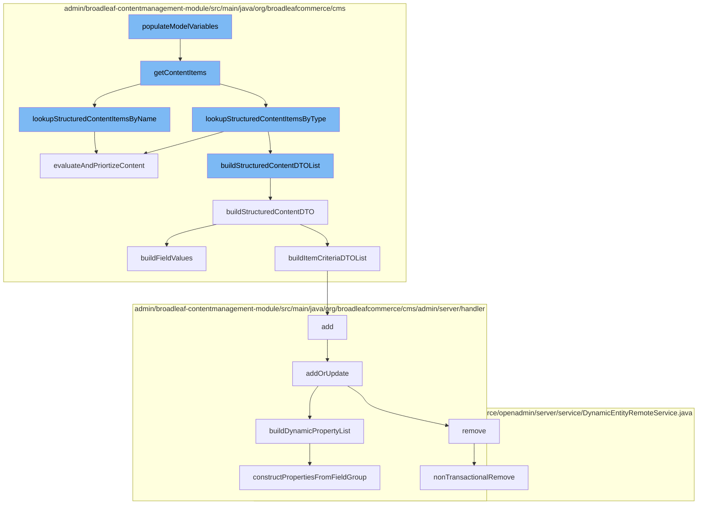

This document will cover the process of populating model variables in the BroadleafCommerce-demo project. The process includes the following steps:

1. Retrieving content items
2. Looking up structured content items by name and type
3. Evaluating and prioritizing content
4. Building structured content DTO
5. Building field values
6. Adding or updating page templates
7. Building dynamic property list



<SwmSnippet path="/admin/broadleaf-contentmanagement-module/src/main/java/org/broadleafcommerce/cms/web/processor/ContentProcessor.java" line="260">

---

# Retrieving content items

The `getContentItems` method retrieves content items based on the content name and structured content type. If the structured content type is null, it looks up structured content items by name. If the content name is null or empty, it looks up structured content items by type. Otherwise, it looks up structured content items by both name and type.

```java
    /**
     * @param contentName name of the content to be looked up (can be null)
     * @param maxResults maximum results to return
     * @param request servlet request
     * @param mvelParameters values that should be considered when filtering the content list by rules
     * @param structuredContentType the type of content that should be returned
     * @param locale current locale
     * @param arguments Thymeleaf Arguments passed into the tag
     * @param element element context that this Thymeleaf processor is being executed in
     * @return
     */
    protected List<StructuredContentDTO> getContentItems(String contentName, Integer maxResults, HttpServletRequest request,
                                                         Map<String, Object> mvelParameters,
                                                         SandBox currentSandbox,
                                                         StructuredContentType structuredContentType,
                                                         Locale locale, String tagName, Map<String, String> tagAttributes,
                                                         Map<String, Object> newModelVars, BroadleafTemplateContext context) {
        List<StructuredContentDTO> contentItems;
        if (structuredContentType == null) {
            contentItems = structuredContentService.lookupStructuredContentItemsByName(contentName, locale, maxResults, mvelParameters, isSecure(request));
        } else {
```

---

</SwmSnippet>

<SwmSnippet path="/admin/broadleaf-contentmanagement-module/src/main/java/org/broadleafcommerce/cms/structure/service/StructuredContentServiceImpl.java" line="294">

---

# Looking up structured content items by name and type

The `lookupStructuredContentItemsByName` method looks up structured content items by name and type. It first checks if the content DTO list is in the cache. If not, it retrieves the production content list and builds the structured content DTO list. The content DTO list is then evaluated and prioritized.

```java
    @Override
    public List<StructuredContentDTO> lookupStructuredContentItemsByName(StructuredContentType contentType, String contentName,
                                                                         Locale locale, Integer count, Map<String, Object> ruleDTOs,
                                                                         boolean secure) {
        List<StructuredContentDTO> contentDTOList = null;
        Locale languageOnlyLocale = findLanguageOnlyLocale(locale);
        BroadleafRequestContext context = BroadleafRequestContext.getBroadleafRequestContext();
        Long site = (context.getNonPersistentSite() != null) ? context.getNonPersistentSite().getId() : null;
        String cacheKey = buildNameKey(context.getSandBox(), site, languageOnlyLocale, contentType.getName(), contentName, secure);

        if (context.isProductionSandBox()) {
            contentDTOList = getStructuredContentListFromCache(cacheKey);
        }

        if (contentDTOList == null) {
            List<StructuredContent> productionContentList = structuredContentDao.findActiveStructuredContentByNameAndType(
                    contentType, contentName, locale, languageOnlyLocale);
            contentDTOList = buildStructuredContentDTOList(productionContentList, secure);

            if (context.isProductionSandBox()) {
                addStructuredContentListToCache(cacheKey, contentDTOList);
```

---

</SwmSnippet>

<SwmSnippet path="/admin/broadleaf-contentmanagement-module/src/main/java/org/broadleafcommerce/cms/structure/service/StructuredContentServiceImpl.java" line="175">

---

# Evaluating and prioritizing content

The `evaluateAndPriortizeContent` method evaluates and prioritizes the content. It processes the content rules for each structured content DTO and shuffles the items with the same priority. The method returns a list of prioritized content items.

```java
    @Override
    public List<StructuredContentDTO> evaluateAndPriortizeContent(List<StructuredContentDTO> structuredContentList, int count, Map<String, Object> ruleDTOs) {
        // some optimization for single item lists which don't require prioritization
        if (structuredContentList.size() == 1) {
            return processUnprioritizedContent(structuredContentList, ruleDTOs);
        }

        structuredContentList = modifyStructuredContentDtoList(structuredContentList);

        Iterator<StructuredContentDTO> structuredContentIterator = structuredContentList.iterator();
        List<StructuredContentDTO> returnList = new ArrayList<>();
        List<StructuredContentDTO> tmpList = new ArrayList<>();
        Integer lastPriority = Integer.MIN_VALUE;

        while (structuredContentIterator.hasNext()) {
            StructuredContentDTO sc = structuredContentIterator.next();

            if (!lastPriority.equals(sc.getPriority())) {
                // If we've moved to another priority, then shuffle all of the items
                // with the previous priority and add them to the return list.
                if (tmpList.size() > 1) {
```

---

</SwmSnippet>

<SwmSnippet path="/admin/broadleaf-contentmanagement-module/src/main/java/org/broadleafcommerce/cms/structure/service/StructuredContentServiceImpl.java" line="577">

---

# Building structured content DTO

The `buildStructuredContentDTO` method builds a structured content DTO from a structured content. It sets the content name, content type, id, priority, and locale code. It also builds field values and item criteria DTO list if the structured content has qualifying item criteria.

```java
    /**
     * Converts a StructuredContent into a StructuredContentDTO.   If the item contains fields with
     * broadleaf cms urls, the urls are converted to utilize the domain.
     * <p/>
     * The StructuredContentDTO is built via the {@link EntityConfiguration}. To override the actual type that is returned,
     * include an override in an applicationContext like any other entity override.
     *
     * @param sc
     * @param secure
     * @return
     */
    @Override
    public StructuredContentDTO buildStructuredContentDTO(StructuredContent sc, boolean secure) {
        StructuredContentDTO scDTO = entityConfiguration.createEntityInstance(StructuredContentDTO.class.getName(), StructuredContentDTO.class);
        Set<StructuredContentItemCriteria> qualifyingItemCriteria = SetUtils.emptyIfNull(sc.getQualifyingItemCriteria());
        scDTO.setContentName(sc.getContentName());
        scDTO.setContentType(sc.getStructuredContentType().getName());
        scDTO.setId(sc.getId());
        scDTO.setPriority(sc.getPriority());

        if (sc.getLocale() != null) {
```

---

</SwmSnippet>

<SwmSnippet path="/admin/broadleaf-contentmanagement-module/src/main/java/org/broadleafcommerce/cms/structure/service/StructuredContentServiceImpl.java" line="472">

---

# Building field values

The `buildFieldValues` method builds field values for a structured content DTO. It iterates over the structured content field Xrefs and sets the value for each field. If the field has a CMS prefix, it builds the field value with the CMS prefix. Otherwise, it sets the value based on the field type.

```java
    /**
     * Parses the given {@link StructuredContent} into its {@link StructuredContentDTO} representation. This will also
     * format the values from {@link StructuredContentDTO#getValues()} into their actual data types. For instance, if the
     * given {@link StructuredContent} has a DATE field, then this method will ensure that the resulting object in the values
     * map of the DTO is a {@link Date} rather than just a String representing a date.
     * <p/>
     * Current support of parsing field types is:
     * DATE - {@link Date}
     * BOOLEAN - {@link Boolean}
     * DECIMAL - {@link BigDecimal}
     * INTEGER - {@link Integer}
     * MONEY - {@link Money}
     * <p/>
     * All other fields are treated as strings. This will also fix URL strings that have the CMS prefix (like images) by
     * prepending the standard CMS prefix with the particular environment prefix
     *
     * @param sc
     * @param scDTO
     * @param secure
     * @see {@link StaticAssetService#getStaticAssetEnvironmentUrlPrefix()}
     */
```

---

</SwmSnippet>

<SwmSnippet path="/admin/broadleaf-contentmanagement-module/src/main/java/org/broadleafcommerce/cms/admin/server/handler/PageTemplateCustomPersistenceHandler.java" line="299">

---

# Adding or updating page templates

The `addOrUpdate` method adds or updates a page template. It validates the entity and updates the page fields. If a page field is dirty, it merges the page field. If a page field is new, it persists the page field.

```java
    protected Entity addOrUpdate(PersistencePackage persistencePackage, DynamicEntityDao dynamicEntityDao, RecordHelper helper) throws ServiceException {
        String ceilingEntityFullyQualifiedClassname = persistencePackage.getCeilingEntityFullyQualifiedClassname();
        try {
            String pageId = persistencePackage.getCustomCriteria()[1];

            if (StringUtils.isBlank(pageId)) {
                return persistencePackage.getEntity();
            }

            Page page = pageService.findPageById(Long.valueOf(pageId));

            Property[] properties = dynamicFieldUtil.buildDynamicPropertyList(getFieldGroups(page, null), PageTemplate.class);
            Map<String, FieldMetadata> md = new HashMap<String, FieldMetadata>();
            for (Property property : properties) {
                md.put(property.getName(), property.getMetadata());
            }

            boolean validated = helper.validate(persistencePackage.getEntity(), new PageTemplateImpl(), md);
            if (!validated) {
                throw new ValidationException(persistencePackage.getEntity(), "Page dynamic fields failed validation");
            }
```

---

</SwmSnippet>

<SwmSnippet path="/admin/broadleaf-contentmanagement-module/src/main/java/org/broadleafcommerce/cms/admin/server/handler/DynamicFieldPersistenceHandlerHelper.java" line="109">

---

# Building dynamic property list

The `buildDynamicPropertyList` method builds a dynamic property list from field groups. It constructs properties from each field group and sorts the properties.

```java
    /**
     * Builds all of the metadata for all of the dynamic properties within a {@link StructuredContentType}, gleaned from
     * the {@link FieldGroup}s and {@link FieldDefinition}s.
     *
     * @param fieldGroups groups that the {@link Property}s are built from
     * @param inheritedType the value that each built {@link FieldMetadata} for each property will use to notate where the
     * dynamic field actually came from (meaning {@link FieldMetadata#setAvailableToTypes(String[])} and {@link FieldMetadata#setInheritedFromType(String)}
     * @return
     */
    public Property[] buildDynamicPropertyList(List<FieldGroup> fieldGroups, Class<?> inheritedType) {
        List<Property> propertiesList = new ArrayList<Property>();
        for (FieldGroup group : fieldGroups) {
            constructPropertiesFromFieldGroup(inheritedType, propertiesList, group, 0l);
        }
        Property property = constructIdProperty(inheritedType);
        propertiesList.add(property);

        Property[] properties = sortProperties(propertiesList);
        return properties;
    }
```

---

</SwmSnippet>

&nbsp;

*This is an auto-generated document by Swimm AI 🌊 and has not yet been verified by a human*

<SwmMeta version="3.0.0" repo-id="Z2l0aHViJTNBJTNBQnJvYWRsZWFmQ29tbWVyY2UtZGVtbyUzQSUzQWdpbGFkbmF2b3Q=" repo-name="BroadleafCommerce-demo" doc-type="flows"><sup>Powered by [Swimm](/)</sup></SwmMeta>
