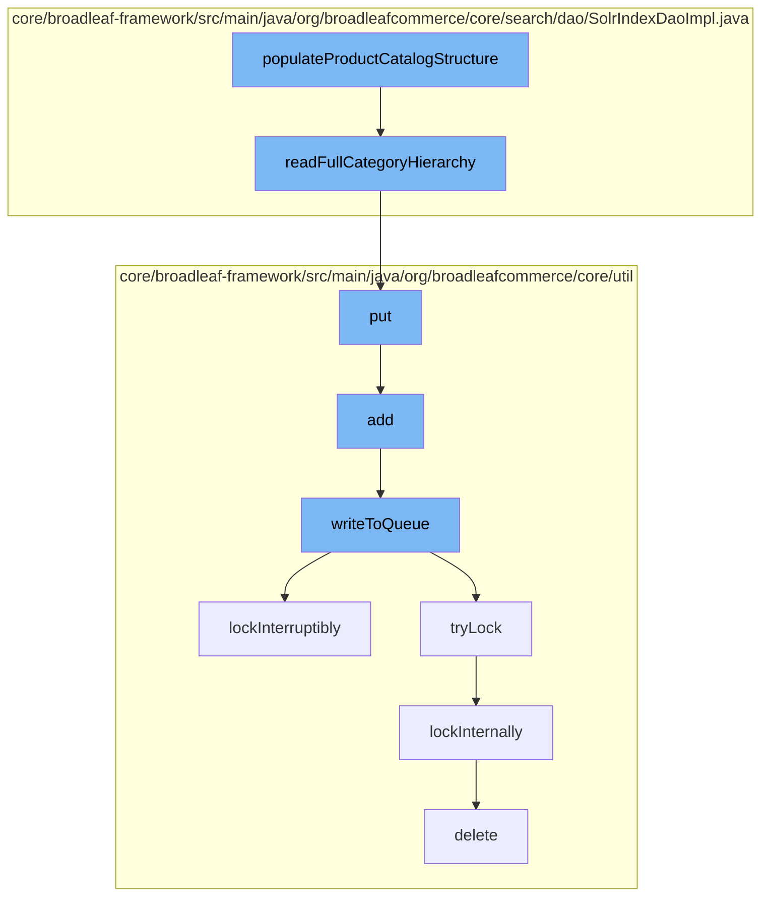

This document will cover the process of populating the product catalog structure in the Broadleaf Commerce framework, which includes:

1. Reading the full category hierarchy
2. Adding the hierarchy to a distributed queue
3. Writing the hierarchy to the queue
4. Locking the queue to prevent concurrent modifications
5. Deleting the lock once the operation is complete.



<SwmSnippet path="/core/broadleaf-framework/src/main/java/org/broadleafcommerce/core/search/dao/SolrIndexDaoImpl.java" line="124">

---

# Reading the full category hierarchy

The `readFullCategoryHierarchy` function is used to build a map of categories to their parent categories. It iterates over the categories and for each one, it fetches its parent categories and adds them to the hierarchy. If a category has already been processed, it is skipped to avoid circular references.

```java
    /**
     * Build up a map of category to parent categories
     *
     * @param categoryHierarchy
     */
    protected void readFullCategoryHierarchy(Map<Long, Set<Long>> categoryHierarchy, Set<Long> builtCategories) {
        Map<Long, Set<Long>> nextLevel = new HashMap<>();
        Long[] categoryIds = categoryHierarchy.keySet().toArray(new Long[categoryHierarchy.keySet().size()]);
        int batchSize = 800;
        int count = 0;
        int pos = 0;
        while (pos < categoryIds.length) {
            int remaining = categoryIds.length - pos;
            int mySize = remaining > batchSize ? batchSize : remaining;
            Long[] temp = new Long[mySize];
            System.arraycopy(categoryIds, pos, temp, 0, mySize);
            TypedQuery<ParentCategoryByCategory> query = em.createNamedQuery("BC_READ_PARENT_CATEGORY_IDS_BY_CATEGORIES", ParentCategoryByCategory.class);
            query.setParameter("categoryIds", sandBoxHelper.mergeCloneIds(CategoryImpl.class, temp));
            List<ParentCategoryByCategory> results = query.getResultList();
            for (ParentCategoryByCategory item : results) {
                //only the sandbox child
```

---

</SwmSnippet>

<SwmSnippet path="/core/broadleaf-framework/src/main/java/org/broadleafcommerce/core/util/queue/ZookeeperDistributedQueue.java" line="393">

---

# Adding the hierarchy to a distributed queue

The `put` function is used to add the category hierarchy to a distributed queue. It calls the `writeToQueue` function to perform the actual write operation.

```java
    @Override
    public void put(T e) throws InterruptedException {
        final ArrayList<T> elementsToAdd = new ArrayList<>();
        elementsToAdd.add(e);
        writeToQueue(elementsToAdd, -1L);
    }
```

---

</SwmSnippet>

<SwmSnippet path="/core/broadleaf-framework/src/main/java/org/broadleafcommerce/core/util/queue/ZookeeperDistributedQueue.java" line="503">

---

# Writing the hierarchy to the queue

The `writeToQueue` function writes the category hierarchy to the queue. It first checks if the queue has enough capacity. If it does, it adds the entries to the queue. If the queue is full, it waits until there is space available.

```java
    protected int writeToQueue(List<? extends T> entries, final long timeout) throws InterruptedException {
        if (entries == null || entries.isEmpty()) {
            return 0;
        }
        
        int entryCount = 0;
        long waitTime = timeout;
        synchronized (QUEUE_MONITOR) {
            while (true) {
                boolean locked = false;
                DistributedLock lock = getQueueAccessLock();
                if (timeout < 0L) {
                    lock.lockInterruptibly();
                    locked = true;
                } else if (timeout > 0L && waitTime > 0L) {
                    long start = System.currentTimeMillis();
                    locked = lock.tryLock(waitTime, TimeUnit.MILLISECONDS);
                    long end = System.currentTimeMillis();
                    waitTime -= (end - start);
                } else {
                    locked = lock.tryLock();
```

---

</SwmSnippet>

<SwmSnippet path="/core/broadleaf-framework/src/main/java/org/broadleafcommerce/core/util/lock/ReentrantDistributedZookeeperLock.java" line="335">

---

# Locking the queue to prevent concurrent modifications

The `lockInterruptibly` function is used to acquire a lock on the queue. This prevents other threads from modifying the queue while the category hierarchy is being written to it.

```java
    @Override
    public void lockInterruptibly() throws InterruptedException {
        if (Thread.interrupted()) {
            throw new InterruptedException("Thread was interrupted prior to trying to acquire the lock.");
        }
        
        lockInternally(-1L);
    }
```

---

</SwmSnippet>

<SwmSnippet path="/core/broadleaf-framework/src/main/java/org/broadleafcommerce/core/util/dao/CodeTypeDaoImpl.java" line="51">

---

# Deleting the lock once the operation is complete

The `delete` function is used to delete the lock once the operation is complete. This allows other threads to acquire the lock and modify the queue.

```java
    public void delete(CodeType codeType) {
        if (!em.contains(codeType)) {
            codeType = (CodeType) em.find(CodeTypeImpl.class, codeType.getId());
        }
        em.remove(codeType);
    }
```

---

</SwmSnippet>

&nbsp;

*This is an auto-generated document by Swimm AI 🌊 and has not yet been verified by a human*

<SwmMeta version="3.0.0" repo-id="Z2l0aHViJTNBJTNBQnJvYWRsZWFmQ29tbWVyY2UtZGVtbyUzQSUzQWdpbGFkbmF2b3Q=" repo-name="BroadleafCommerce-demo" doc-type="flows"><sup>Powered by [Swimm](/)</sup></SwmMeta>
