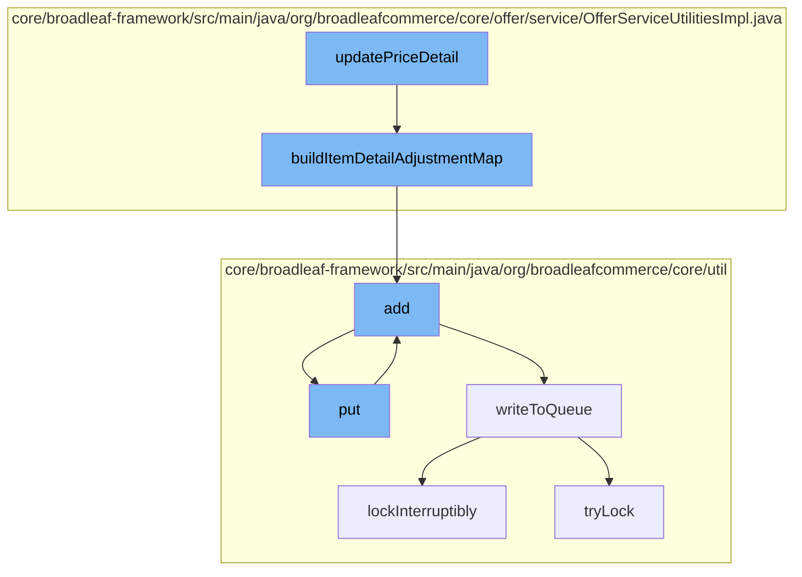

This document will cover the process of updating price details in the Broadleaf Commerce framework. The process includes the following steps:

1. Updating the price detail
2. Building an item detail adjustment map
3. Adding the adjustment to the resource purge service
4. Putting the adjustment into the distributed queue
5. Writing the adjustment to the queue
6. Locking the queue to prevent concurrent modifications.



<SwmSnippet path="/core/broadleaf-framework/src/main/java/org/broadleafcommerce/core/offer/service/OfferServiceUtilitiesImpl.java" line="404">

---

# Updating the price detail

The `updatePriceDetail` function is the starting point of this process. It is responsible for updating the price details of an item.

```java
    @Override
    public Map<Long, OrderItemPriceDetailAdjustment> buildItemDetailAdjustmentMap(OrderItemPriceDetail itemDetail) {
        Map<Long, OrderItemPriceDetailAdjustment> itemAdjustmentMap = new HashMap<Long, OrderItemPriceDetailAdjustment>();
        
        List<OrderItemPriceDetailAdjustment> adjustmentsToRemove = new ArrayList<OrderItemPriceDetailAdjustment>();
        for (OrderItemPriceDetailAdjustment adjustment : itemDetail.getOrderItemPriceDetailAdjustments()) {
            if (itemAdjustmentMap.containsKey(adjustment.getOffer().getId())) {
                if (LOG.isDebugEnabled()) {
                    StringBuilder sb = new StringBuilder("Detected collisions for item adjustments with ids ")
                        .append(itemAdjustmentMap.get(adjustment.getOffer().getId()).getId())
                        .append(" and ")
                        .append(adjustment.getId());
                    LOG.debug(sb.toString());
                }
                adjustmentsToRemove.add(adjustment);
            } else {
                itemAdjustmentMap.put(adjustment.getOffer().getId(), adjustment);
            }
        }
        
        for (OrderItemPriceDetailAdjustment adjustment : adjustmentsToRemove) {
```

---

</SwmSnippet>

<SwmSnippet path="/core/broadleaf-framework/src/main/java/org/broadleafcommerce/core/offer/service/OfferServiceUtilitiesImpl.java" line="405">

---

# Building an item detail adjustment map

The `buildItemDetailAdjustmentMap` function is called by `updatePriceDetail`. It creates a map of adjustments for the item detail, which is used to update the price.

```java
    public Map<Long, OrderItemPriceDetailAdjustment> buildItemDetailAdjustmentMap(OrderItemPriceDetail itemDetail) {
        Map<Long, OrderItemPriceDetailAdjustment> itemAdjustmentMap = new HashMap<Long, OrderItemPriceDetailAdjustment>();
        
        List<OrderItemPriceDetailAdjustment> adjustmentsToRemove = new ArrayList<OrderItemPriceDetailAdjustment>();
        for (OrderItemPriceDetailAdjustment adjustment : itemDetail.getOrderItemPriceDetailAdjustments()) {
            if (itemAdjustmentMap.containsKey(adjustment.getOffer().getId())) {
                if (LOG.isDebugEnabled()) {
                    StringBuilder sb = new StringBuilder("Detected collisions for item adjustments with ids ")
                        .append(itemAdjustmentMap.get(adjustment.getOffer().getId()).getId())
                        .append(" and ")
                        .append(adjustment.getId());
                    LOG.debug(sb.toString());
                }
                adjustmentsToRemove.add(adjustment);
            } else {
                itemAdjustmentMap.put(adjustment.getOffer().getId(), adjustment);
            }
        }
        
        for (OrderItemPriceDetailAdjustment adjustment : adjustmentsToRemove) {
            itemDetail.getOrderItemPriceDetailAdjustments().remove(adjustment);
```

---

</SwmSnippet>

<SwmSnippet path="/core/broadleaf-framework/src/main/java/org/broadleafcommerce/core/util/service/ResourcePurgeServiceImpl.java" line="593">

---

# Adding the adjustment to the resource purge service

The `add` function is called by `buildItemDetailAdjustmentMap`. It adds the adjustment to a cache in the resource purge service.

```java
        public Long add(Long entry) {
            if (! cache.containsKey(entry)) {
                return cache.put(entry, new Long(System.currentTimeMillis()));
            }
            return null;
        }
```

---

</SwmSnippet>

<SwmSnippet path="/core/broadleaf-framework/src/main/java/org/broadleafcommerce/core/util/queue/ZookeeperDistributedQueue.java" line="393">

---

# Putting the adjustment into the distributed queue

The `put` function is called by `add`. It adds the adjustment to a distributed queue, which is used to handle the adjustments in a distributed system.

```java
    @Override
    public void put(T e) throws InterruptedException {
        final ArrayList<T> elementsToAdd = new ArrayList<>();
        elementsToAdd.add(e);
        writeToQueue(elementsToAdd, -1L);
    }
```

---

</SwmSnippet>

<SwmSnippet path="/core/broadleaf-framework/src/main/java/org/broadleafcommerce/core/util/queue/ZookeeperDistributedQueue.java" line="503">

---

# Writing the adjustment to the queue

The `writeToQueue` function is called by `put`. It writes the adjustment to the queue, ensuring that it is properly stored and ready to be processed.

```java
    protected int writeToQueue(List<? extends T> entries, final long timeout) throws InterruptedException {
        if (entries == null || entries.isEmpty()) {
            return 0;
        }
        
        int entryCount = 0;
        long waitTime = timeout;
        synchronized (QUEUE_MONITOR) {
            while (true) {
                boolean locked = false;
                DistributedLock lock = getQueueAccessLock();
                if (timeout < 0L) {
                    lock.lockInterruptibly();
                    locked = true;
                } else if (timeout > 0L && waitTime > 0L) {
                    long start = System.currentTimeMillis();
                    locked = lock.tryLock(waitTime, TimeUnit.MILLISECONDS);
                    long end = System.currentTimeMillis();
                    waitTime -= (end - start);
                } else {
                    locked = lock.tryLock();
```

---

</SwmSnippet>

<SwmSnippet path="/core/broadleaf-framework/src/main/java/org/broadleafcommerce/core/util/lock/ReentrantDistributedZookeeperLock.java" line="335">

---

# Locking the queue to prevent concurrent modifications

The `lockInterruptibly` function is called by `writeToQueue`. It locks the queue to prevent concurrent modifications, ensuring that the adjustment is safely written to the queue.

```java
    @Override
    public void lockInterruptibly() throws InterruptedException {
        if (Thread.interrupted()) {
            throw new InterruptedException("Thread was interrupted prior to trying to acquire the lock.");
        }
        
        lockInternally(-1L);
    }
```

---

</SwmSnippet>

&nbsp;

*This is an auto-generated document by Swimm AI 🌊 and has not yet been verified by a human*

<SwmMeta version="3.0.0" repo-id="Z2l0aHViJTNBJTNBQnJvYWRsZWFmQ29tbWVyY2UtZGVtbyUzQSUzQWdpbGFkbmF2b3Q=" repo-name="BroadleafCommerce-demo" doc-type="flows"><sup>Powered by [Swimm](/)</sup></SwmMeta>
