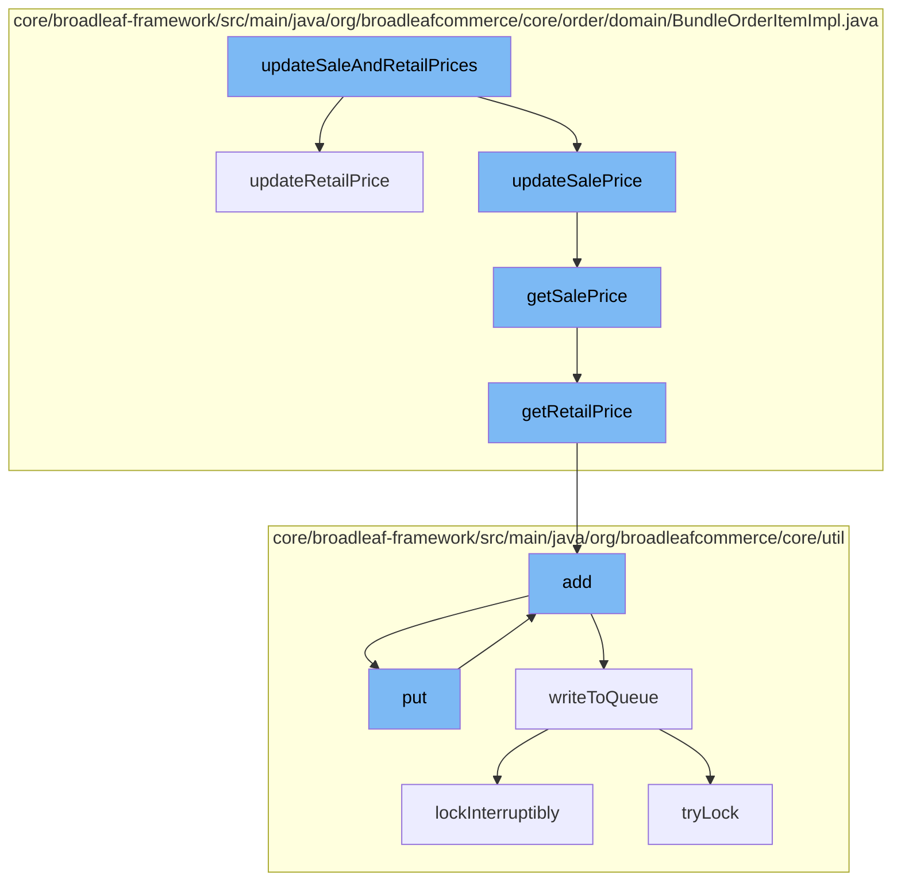

This document will cover the process of updating and managing prices in the BroadleafCommerce-demo project. We'll cover:

1. The function of `updateSaleAndRetailPrices`.
2. How `updateSaleAndRetailPrices` interacts with other functions.
3. The flow of data through these functions.



<SwmSnippet path="/core/broadleaf-framework/src/main/java/org/broadleafcommerce/core/order/domain/BundleOrderItemImpl.java" line="352">

---

# The Function of `updateSaleAndRetailPrices`

`updateSaleAndRetailPrices` is the main function that initiates the process of updating the sale and retail prices of items in a bundle. It checks if the retail price is overridden and if the items should be summed. If the conditions are met, it updates the base retail price and the retail price.

```java
    private boolean updateRetailPrice() {
        if (isRetailPriceOverride()) {
            return false;
        }
        // Only need to update prices if we are not summing the contained items to determine
        // the price.
        if (! shouldSumItems()) {
            if (getSku() != null && !getSku().getRetailPrice().equals(retailPrice)) {
                baseRetailPrice = getSku().getRetailPrice().getAmount();
                retailPrice = getSku().getRetailPrice().getAmount();
                return true;
            }
        }
        return false;
    }
```

---

</SwmSnippet>

<SwmSnippet path="/core/broadleaf-framework/src/main/java/org/broadleafcommerce/core/order/domain/BundleOrderItemImpl.java" line="352">

---

# Interaction with `updateRetailPrice` and `updateSalePrice`

`updateSaleAndRetailPrices` calls `updateRetailPrice` and `updateSalePrice` to update the prices of the items in the bundle. `updateRetailPrice` checks if the retail price is overridden and updates the retail price if necessary. `updateSalePrice` retrieves the sale price and updates it.

```java
    private boolean updateRetailPrice() {
        if (isRetailPriceOverride()) {
            return false;
        }
        // Only need to update prices if we are not summing the contained items to determine
        // the price.
        if (! shouldSumItems()) {
            if (getSku() != null && !getSku().getRetailPrice().equals(retailPrice)) {
                baseRetailPrice = getSku().getRetailPrice().getAmount();
                retailPrice = getSku().getRetailPrice().getAmount();
                return true;
            }
        }
        return false;
    }
```

---

</SwmSnippet>

<SwmSnippet path="/core/broadleaf-framework/src/main/java/org/broadleafcommerce/core/order/domain/BundleOrderItemImpl.java" line="255">

---

# Data Flow Through the Functions

`getRetailPrice` and `getSalePrice` are called to retrieve the current prices. These functions calculate the prices based on the items in the bundle and their quantities. The calculated prices are then added to the retail and sale prices respectively.

```java
    @Override
    public Money getRetailPrice() {
        if (shouldSumItems()) {
            Money bundleRetailPrice = BroadleafCurrencyUtils.getMoney(getOrder().getCurrency());
            for (DiscreteOrderItem discreteOrderItem : discreteOrderItems) {
                BigDecimal itemRetailPrice = discreteOrderItem.getRetailPrice().getAmount();
                BigDecimal quantityPrice = itemRetailPrice.multiply(new BigDecimal(discreteOrderItem.getQuantity()));
                bundleRetailPrice = bundleRetailPrice.add(BroadleafCurrencyUtils.getMoney(quantityPrice, getOrder().getCurrency()));
            }
            for (BundleOrderItemFeePrice fee : getBundleOrderItemFeePrices()) {
                bundleRetailPrice = bundleRetailPrice.add(fee.getAmount());
            }
            return bundleRetailPrice;
        } else {
            return super.getRetailPrice();
        }
    }
```

---

</SwmSnippet>

<SwmSnippet path="/core/broadleaf-framework/src/main/java/org/broadleafcommerce/core/util/service/ResourcePurgeServiceImpl.java" line="593">

---

# Interaction with ResourcePurgeServiceImpl and ZookeeperDistributedQueue

The `add` function in `ResourcePurgeServiceImpl` is called to add the new price to a cache. If the price is not already in the cache, it is added and the current time is recorded.

```java
        public Long add(Long entry) {
            if (! cache.containsKey(entry)) {
                return cache.put(entry, new Long(System.currentTimeMillis()));
            }
            return null;
        }
```

---

</SwmSnippet>

<SwmSnippet path="/core/broadleaf-framework/src/main/java/org/broadleafcommerce/core/util/queue/ZookeeperDistributedQueue.java" line="393">

---

The `put` function in `ZookeeperDistributedQueue` is called to add the new price to a distributed queue. This ensures that the price update is distributed across all instances of the application.

```java
    @Override
    public void put(T e) throws InterruptedException {
        final ArrayList<T> elementsToAdd = new ArrayList<>();
        elementsToAdd.add(e);
        writeToQueue(elementsToAdd, -1L);
    }
```

---

</SwmSnippet>

&nbsp;

*This is an auto-generated document by Swimm AI 🌊 and has not yet been verified by a human*

<SwmMeta version="3.0.0" repo-id="Z2l0aHViJTNBJTNBQnJvYWRsZWFmQ29tbWVyY2UtZGVtbyUzQSUzQWdpbGFkbmF2b3Q=" repo-name="BroadleafCommerce-demo" doc-type="flows"><sup>Powered by [Swimm](/)</sup></SwmMeta>
