This document will cover the process of pricing fulfillment items in the Broadleaf Commerce framework. The process includes the following steps:

1. Executing the main function
2. Populating the total item amount
3. Fixing rounding issues for order savings
4. Distributing order savings to items
5. Calculating the total price for all fulfillment items
6. Fixing rounding issues for item totals.

```mermaid
graph TD;
subgraph core/broadleaf-framework/src/main/java/org/broadleafcommerce/core
  execute:::mainFlowStyle --> populateItemTotalAmount
end
subgraph core/broadleaf-framework/src/main/java/org/broadleafcommerce/core
  execute:::mainFlowStyle --> fixOrderSavingsRoundingIssues
end
subgraph core/broadleaf-framework/src/main/java/org/broadleafcommerce/core
  execute:::mainFlowStyle --> distributeOrderSavingsToItems
end
subgraph core/broadleaf-framework/src/main/java/org/broadleafcommerce/core
  execute:::mainFlowStyle --> calculateTotalPriceForAllFulfillmentItems
end
subgraph core/broadleaf-framework/src/main/java/org/broadleafcommerce/core
  execute:::mainFlowStyle --> fixItemTotalRoundingIssues
end
subgraph core/broadleaf-framework/src/main/java/org/broadleafcommerce/core/util
  populateItemTotalAmount:::mainFlowStyle --> add
end
subgraph core/broadleaf-framework/src/main/java/org/broadleafcommerce/core/util
  populateItemTotalAmount:::mainFlowStyle --> put
end
subgraph core/broadleaf-framework/src/main/java/org/broadleafcommerce/core
  fixOrderSavingsRoundingIssues --> applyDifferenceToProratedAdj
end
subgraph core/broadleaf-framework/src/main/java/org/broadleafcommerce/core/util
  distributeOrderSavingsToItems --> add
end
subgraph core/broadleaf-framework/src/main/java/org/broadleafcommerce/core/util
  calculateTotalPriceForAllFulfillmentItems --> add
end
subgraph core/broadleaf-framework/src/main/java/org/broadleafcommerce/core
  fixItemTotalRoundingIssues:::mainFlowStyle --> applyDifferenceToAmount
end
subgraph core/broadleaf-framework/src/main/java/org/broadleafcommerce/core
  fixItemTotalRoundingIssues:::mainFlowStyle --> sumItemAmount
end
subgraph core/broadleaf-framework/src/main/java/org/broadleafcommerce/core
  fixItemTotalRoundingIssues:::mainFlowStyle --> getTotalPrice
end
subgraph core/broadleaf-framework/src/main/java/org/broadleafcommerce/core/util
  applyDifferenceToAmount --> add
end
subgraph core/broadleaf-framework/src/main/java/org/broadleafcommerce/core/util
  sumItemAmount --> add
end
subgraph core/broadleaf-framework/src/main/java/org/broadleafcommerce/core/util
  getTotalPrice --> add
end
subgraph core/broadleaf-framework/src/main/java/org/broadleafcommerce/core
  getTotalPrice --> convertToMoney
end
subgraph core/broadleaf-framework/src/main/java/org/broadleafcommerce/core/util
  add --> put
end

classDef mainFlowStyle color:#000000,fill:#7CB9F4
classDef rootsStyle color:#000000,fill:#00FFF4
classDef Style1 color:#000000,fill:#00FFAA
classDef Style2 color:#000000,fill:#FFFF00
classDef Style3 color:#000000,fill:#AA7CB9
```



<SwmSnippet path="/core/broadleaf-framework/src/main/java/org/broadleafcommerce/core/pricing/service/workflow/FulfillmentItemPricingActivity.java" line="104">

---

# Executing the main function

The `execute` function is the main entry point for the pricing process. It calls several other functions to calculate and adjust the pricing for each item in the order.

```java
    /**
     * Sets the fulfillment amount which includes the relative portion of the total price for 
     * the corresponding order item.
     * 
     * @param order
     * @param partialOrderItemMap
     */
    protected void populateItemTotalAmount(Order order, Map<OrderItem, List<FulfillmentGroupItem>> partialOrderItemMap) {
        for (FulfillmentGroup fulfillmentGroup : order.getFulfillmentGroups()) {
            for (FulfillmentGroupItem fgItem : fulfillmentGroup.getFulfillmentGroupItems()) {
                OrderItem orderItem = fgItem.getOrderItem();
                int fgItemQty = fgItem.getQuantity();
                int orderItemQty = orderItem.getQuantity();
                Money totalItemAmount = orderItem.getTotalPrice();

                if (fgItemQty != orderItemQty) {
                    // We need to keep track of all of these items in case we need to distribute a remainder 
                    // to one or more of the items.
                    List<FulfillmentGroupItem> fgItemList = partialOrderItemMap.get(orderItem);
                    if (fgItemList == null) {
                        fgItemList = new ArrayList<>();
```

---

</SwmSnippet>

<SwmSnippet path="/core/broadleaf-framework/src/main/java/org/broadleafcommerce/core/pricing/service/workflow/FulfillmentItemPricingActivity.java" line="111">

---

# Populating the total item amount

The `populateItemTotalAmount` function sets the total amount for each item in the order, taking into account the quantity of each item.

```java
    protected void populateItemTotalAmount(Order order, Map<OrderItem, List<FulfillmentGroupItem>> partialOrderItemMap) {
        for (FulfillmentGroup fulfillmentGroup : order.getFulfillmentGroups()) {
            for (FulfillmentGroupItem fgItem : fulfillmentGroup.getFulfillmentGroupItems()) {
                OrderItem orderItem = fgItem.getOrderItem();
                int fgItemQty = fgItem.getQuantity();
                int orderItemQty = orderItem.getQuantity();
                Money totalItemAmount = orderItem.getTotalPrice();

                if (fgItemQty != orderItemQty) {
                    // We need to keep track of all of these items in case we need to distribute a remainder 
                    // to one or more of the items.
                    List<FulfillmentGroupItem> fgItemList = partialOrderItemMap.get(orderItem);
                    if (fgItemList == null) {
                        fgItemList = new ArrayList<>();
                        partialOrderItemMap.put(orderItem, fgItemList);
                    }
                    fgItemList.add(fgItem);
                    fgItem.setTotalItemAmount(totalItemAmount.multiply(fgItemQty).divide(orderItemQty));
                } else {
                    fgItem.setTotalItemAmount(totalItemAmount);
                }
```

---

</SwmSnippet>

<SwmSnippet path="/core/broadleaf-framework/src/main/java/org/broadleafcommerce/core/pricing/service/workflow/FulfillmentItemPricingActivity.java" line="295">

---

# Fixing rounding issues for order savings

The `fixOrderSavingsRoundingIssues` function adjusts the savings for each item in the order to ensure that the total savings amount is correctly distributed among the items, taking into account any rounding issues.

```java
    public long applyDifferenceToAmount(FulfillmentGroupItem fgItem, long numApplicationsNeeded, Money unitAmount) {
        BigDecimal numTimesToApply = new BigDecimal(Math.min(numApplicationsNeeded, fgItem.getQuantity()));

        Money oldAmount = fgItem.getTotalItemAmount();
        Money changeToAmount = unitAmount.multiply(numTimesToApply);

        fgItem.setTotalItemAmount(oldAmount.add(changeToAmount));
        return numTimesToApply.longValue();
    }
```

---

</SwmSnippet>

<SwmSnippet path="/core/broadleaf-framework/src/main/java/org/broadleafcommerce/core/pricing/service/workflow/FulfillmentItemPricingActivity.java" line="305">

---

# Distributing order savings to items

The `distributeOrderSavingsToItems` function distributes the total savings amount among the items in the order, based on the proportion of the total order price that each item represents.

```java
    public long applyDifferenceToProratedAdj(FulfillmentGroupItem fgItem, long numApplicationsNeeded, Money unitAmount) {
        BigDecimal numTimesToApply = new BigDecimal(Math.min(numApplicationsNeeded, fgItem.getQuantity()));

        Money oldAmount = fgItem.getProratedOrderAdjustmentAmount();
        Money changeToAmount = unitAmount.multiply(numTimesToApply);

        fgItem.setProratedOrderAdjustmentAmount(oldAmount.add(changeToAmount));
        return numTimesToApply.longValue();
    }
```

---

</SwmSnippet>

<SwmSnippet path="/core/broadleaf-framework/src/main/java/org/broadleafcommerce/core/pricing/service/workflow/FulfillmentItemPricingActivity.java" line="593">

---

# Calculating the total price for all fulfillment items

The `calculateTotalPriceForAllFulfillmentItems` function calculates the total price for all items in the order, taking into account any adjustments made for savings and rounding issues.

```java

```

---

</SwmSnippet>

<SwmSnippet path="/core/broadleaf-framework/src/main/java/org/broadleafcommerce/core/pricing/service/workflow/FulfillmentItemPricingActivity.java" line="593">

---

# Fixing rounding issues for item totals

The `fixItemTotalRoundingIssues` function adjusts the total price for each item in the order to ensure that the total order price is correctly calculated, taking into account any rounding issues.

```java

```

---

</SwmSnippet>

&nbsp;

*This is an auto-generated document by Swimm AI 🌊 and has not yet been verified by a human*

<SwmMeta version="3.0.0" repo-id="Z2l0aHViJTNBJTNBQnJvYWRsZWFmQ29tbWVyY2UtZGVtbyUzQSUzQWdpbGFkbmF2b3Q=" repo-name="BroadleafCommerce-demo" doc-type="flows"><sup>Powered by [Swimm](/)</sup></SwmMeta>
