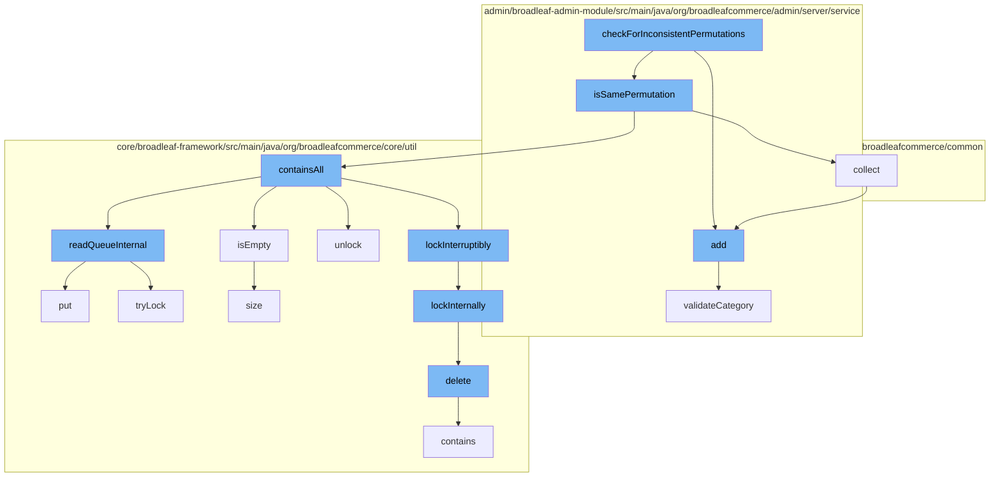

This document will cover the process of checking for inconsistent permutations in the BroadleafCommerce-demo repository. The process includes the following steps:

1. Invoking the `checkForInconsistentPermutations` function
2. Calling the `add` and `isSamePermutation` functions
3. Executing the `collect`, `containsAll`, `lockInterruptibly`, `delete`, `isEmpty`, `readQueueInternal`, and `put` functions
4. Implementing the `add`, `collect`, `readQueueInternal`, `lockInternally`, `delete`, `contains`, `size`, `put`, `add`, and `validateCategory` functions.



<SwmSnippet path="/admin/broadleaf-admin-module/src/main/java/org/broadleafcommerce/admin/server/service/AdminCatalogServiceImpl.java" line="1">

---

# Invoking the `checkForInconsistentPermutations` function

The `checkForInconsistentPermutations` function is the entry point of the process. It is responsible for initiating the check for inconsistent permutations in the system.

```java
/*-
 * #%L
 * BroadleafCommerce Admin Module
 * %%
 * Copyright (C) 2009 - 2024 Broadleaf Commerce
 * %%
 * Licensed under the Broadleaf Fair Use License Agreement, Version 1.0
 * (the "Fair Use License" located  at http://license.broadleafcommerce.org/fair_use_license-1.0.txt)
 * unless the restrictions on use therein are violated and require payment to Broadleaf in which case
 * the Broadleaf End User License Agreement (EULA), Version 1.1
```

---

</SwmSnippet>

<SwmSnippet path="/admin/broadleaf-admin-module/src/main/java/org/broadleafcommerce/admin/server/service/AdminCatalogServiceImpl.java" line="11">

---

# Calling the `add` and `isSamePermutation` functions

`checkForInconsistentPermutations` function calls `add` and `isSamePermutation` functions. The `add` function is responsible for adding a new category to the system, while `isSamePermutation` checks if two permutations are the same.

```java
 * (the "Commercial License" located at http://license.broadleafcommerce.org/commercial_license-1.1.txt)
 * shall apply.
 * 
 * Alternatively, the Commercial License may be replaced with a mutually agreed upon license (the "Custom License")
 * between you and Broadleaf Commerce. You may not use this file except in compliance with the applicable license.
 * #L%
 */
package org.broadleafcommerce.admin.server.service;

import org.apache.commons.collections.CollectionUtils;
```

---

</SwmSnippet>

<SwmSnippet path="/admin/broadleaf-admin-module/src/main/java/org/broadleafcommerce/admin/server/service/AdminCatalogServiceImpl.java" line="21">

---

# Executing the `collect`, `containsAll`, `lockInterruptibly`, `delete`, `isEmpty`, `readQueueInternal`, and `put` functions

The `isSamePermutation` function then calls several other functions to perform various operations. The `collect` function collects elements from an array, `containsAll` checks if a collection contains all elements of another collection, `lockInterruptibly` locks the process, `delete` removes a code type, `isEmpty` checks if a queue is empty, `readQueueInternal` reads data from a queue, and `put` adds an element to a queue.

```java
import org.apache.commons.logging.Log;
import org.apache.commons.logging.LogFactory;
import org.broadleafcommerce.admin.server.service.extension.AdminCatalogServiceExtensionManager;
import org.broadleafcommerce.common.extension.ExtensionResultHolder;
import org.broadleafcommerce.common.extension.ExtensionResultStatusType;
import org.broadleafcommerce.common.util.BLCCollectionUtils;
import org.broadleafcommerce.common.util.BLCMessageUtils;
import org.broadleafcommerce.core.catalog.dao.SkuDao;
import org.broadleafcommerce.core.catalog.domain.Product;
import org.broadleafcommerce.core.catalog.domain.ProductOption;
```

---

</SwmSnippet>

<SwmSnippet path="/admin/broadleaf-admin-module/src/main/java/org/broadleafcommerce/admin/server/service/AdminCatalogServiceImpl.java" line="31">

---

# Implementing the `add`, `collect`, `readQueueInternal`, `lockInternally`, `delete`, `contains`, `size`, `put`, `add`, and `validateCategory` functions

Each of these functions is implemented in its respective class. They perform specific operations that contribute to the overall process of checking for inconsistent permutations.

```java
import org.broadleafcommerce.core.catalog.domain.ProductOptionValue;
import org.broadleafcommerce.core.catalog.domain.Sku;
import org.broadleafcommerce.core.catalog.service.CatalogService;
import org.springframework.beans.factory.annotation.Value;
import org.springframework.stereotype.Service;

import java.util.ArrayList;
import java.util.Collection;
import java.util.HashMap;
import java.util.List;
```

---

</SwmSnippet>

&nbsp;

*This is an auto-generated document by Swimm AI 🌊 and has not yet been verified by a human*

<SwmMeta version="3.0.0" repo-id="Z2l0aHViJTNBJTNBQnJvYWRsZWFmQ29tbWVyY2UtZGVtbyUzQSUzQWdpbGFkbmF2b3Q=" repo-name="BroadleafCommerce-demo" doc-type="flows"><sup>Powered by [Swimm](/)</sup></SwmMeta>
