This document will cover the process of finding related products in the BroadleafCommerce-demo repository. The process includes the following steps:

 1. Invoking the `findByCategory` function
 2. Calling the `getRelatedProducts` function
 3. Building the product list
 4. Finding related products
 5. Building cross-sale, up-sale, and featured products lists
 6. Removing duplicates from the list
 7. Adding all products to the list
 8. Putting the products in the list
 9. Checking if the list contains all products
10. Clearing the list
11. Building the default parent category path.

```mermaid
graph TD;
subgraph core/broadleaf-framework-web/src/main/java/org/broadleafcommerce/core/web
  findByCategory:::mainFlowStyle --> getRelatedProducts
end
subgraph core/broadleaf-framework-web/src/main/java/org/broadleafcommerce/core/web
  getRelatedProducts:::mainFlowStyle --> buildProductList
end
subgraph core/broadleaf-framework/src/main/java/org/broadleafcommerce/core/catalog
  getRelatedProducts:::mainFlowStyle --> findRelatedProducts
end
subgraph core/broadleaf-framework-web/src/main/java/org/broadleafcommerce/core/web
  buildProductList:::mainFlowStyle --> add
end
subgraph core/broadleaf-framework/src/main/java/org/broadleafcommerce/core/catalog
  findRelatedProducts:::mainFlowStyle --> buildCrossSaleProductsList
end
subgraph core/broadleaf-framework/src/main/java/org/broadleafcommerce/core/catalog
  findRelatedProducts:::mainFlowStyle --> buildUpSaleProductsList
end
subgraph core/broadleaf-framework/src/main/java/org/broadleafcommerce/core/catalog
  findRelatedProducts:::mainFlowStyle --> buildFeaturedProductsList
end
subgraph core/broadleaf-framework/src/main/java/org/broadleafcommerce/core/catalog
  buildCrossSaleProductsList:::mainFlowStyle --> getCumulativeCrossSaleProducts
end
subgraph core/broadleaf-framework/src/main/java/org/broadleafcommerce/core/catalog
  buildUpSaleProductsList:::mainFlowStyle --> getCumulativeUpSaleProducts
end
subgraph core/broadleaf-framework/src/main/java/org/broadleafcommerce/core/catalog
  buildFeaturedProductsList:::mainFlowStyle --> getCumulativeFeaturedProducts
end
subgraph core/broadleaf-framework/src/main/java/org/broadleafcommerce/core/catalog
  buildFeaturedProductsList:::mainFlowStyle --> removeDuplicatesFromList
end
subgraph core/broadleaf-framework/src/main/java/org/broadleafcommerce/core/catalog
  getCumulativeFeaturedProducts --> buildDefaultParentCategoryPath
end
subgraph core/broadleaf-framework/src/main/java/org/broadleafcommerce/core/util
  getCumulativeFeaturedProducts --> addAll
end
subgraph core/broadleaf-framework/src/main/java/org/broadleafcommerce/core/util
  removeDuplicatesFromList --> addAll
end
subgraph core/broadleaf-framework/src/main/java/org/broadleafcommerce/core/util
  removeDuplicatesFromList --> clear
end
subgraph core/broadleaf-framework/src/main/java/org/broadleafcommerce/core/util
  removeDuplicatesFromList --> contains
end
subgraph core/broadleaf-framework/src/main/java/org/broadleafcommerce/core/util
  removeDuplicatesFromList --> add
end
subgraph core/broadleaf-framework/src/main/java/org/broadleafcommerce/core/util
  clear --> lockInterruptibly
end
subgraph core/broadleaf-framework/src/main/java/org/broadleafcommerce/core/util
  clear --> delete
end
subgraph core/broadleaf-framework/src/main/java/org/broadleafcommerce/core/util
  contains --> containsAll
end
subgraph core/broadleaf-framework/src/main/java/org/broadleafcommerce/core/util
  add --> put
end
subgraph core/broadleaf-framework/src/main/java/org/broadleafcommerce/core/util
  put --> add
end

classDef mainFlowStyle color:#000000,fill:#7CB9F4
classDef rootsStyle color:#000000,fill:#00FFF4
classDef Style1 color:#000000,fill:#00FFAA
classDef Style2 color:#000000,fill:#FFFF00
classDef Style3 color:#000000,fill:#AA7CB9
```



<SwmSnippet path="/core/broadleaf-framework-web/src/main/java/org/broadleafcommerce/core/web/expression/RelatedProductsVariableExpression.java" line="1">

---

# Invoking the `findByCategory` function

The `findByCategory` function is the entry point for finding related products. It takes a category as input and initiates the process of finding related products.

```java
/*-
 * #%L
 * BroadleafCommerce Framework Web
 * %%
 * Copyright (C) 2009 - 2024 Broadleaf Commerce
 * %%
 * Licensed under the Broadleaf Fair Use License Agreement, Version 1.0
 * (the "Fair Use License" located  at http://license.broadleafcommerce.org/fair_use_license-1.0.txt)
 * unless the restrictions on use therein are violated and require payment to Broadleaf in which case
 * the Broadleaf End User License Agreement (EULA), Version 1.1
 * (the "Commercial License" located at http://license.broadleafcommerce.org/commercial_license-1.1.txt)
 * shall apply.
 * 
 * Alternatively, the Commercial License may be replaced with a mutually agreed upon license (the "Custom License")
 * between you and Broadleaf Commerce. You may not use this file except in compliance with the applicable license.
 * #L%
 */
package org.broadleafcommerce.core.web.expression;

import org.broadleafcommerce.common.web.expression.BroadleafVariableExpression;
import org.broadleafcommerce.core.catalog.domain.Product;
```

---

</SwmSnippet>

<SwmSnippet path="/core/broadleaf-framework-web/src/main/java/org/broadleafcommerce/core/web/expression/RelatedProductsVariableExpression.java" line="70">

---

# Calling the `getRelatedProducts` function

The `getRelatedProducts` function is called by `findByCategory`. It takes a product ID, category ID, quantity, and type as input and returns a list of related products.

```java
    public List<Product> getRelatedProducts(Long productId, Long categoryId, Integer quantity, String type) {
        RelatedProductDTO relatedProductDTO = new RelatedProductDTO();
        relatedProductDTO.setProductId(productId);
        relatedProductDTO.setCategoryId(categoryId);

        if (quantity != null) {
            relatedProductDTO.setQuantity(quantity);
        }

        if (type != null) {
            relatedProductDTO.setType(RelatedProductTypeEnum.getInstance(type));
        }
        List<? extends PromotableProduct> relatedProducts = relatedProductsService.findRelatedProducts(relatedProductDTO);
        return buildProductList(relatedProducts);
    }
```

---

</SwmSnippet>

<SwmSnippet path="/core/broadleaf-framework-web/src/main/java/org/broadleafcommerce/core/web/expression/RelatedProductsVariableExpression.java" line="86">

---

# Building the product list

The `buildProductList` function is called by `getRelatedProducts`. It takes a list of promotable products as input and returns a list of products.

```java
    protected List<Product> buildProductList(List<? extends PromotableProduct> relatedProducts) {
        List<Product> productList = new ArrayList<>();
        if (relatedProducts != null) {
            for (PromotableProduct promProduct : relatedProducts) {
                productList.add(promProduct.getRelatedProduct());
            }
        }
        return productList;
    }
```

---

</SwmSnippet>

<SwmSnippet path="/core/broadleaf-framework/src/main/java/org/broadleafcommerce/core/catalog/service/RelatedProductsServiceImpl.java" line="1">

---

# Finding related products

The `findRelatedProducts` function is called by `getRelatedProducts`. It takes a `RelatedProductDTO` object as input and returns a list of related products.

```java
/*-
 * #%L
 * BroadleafCommerce Framework
 * %%
 * Copyright (C) 2009 - 2024 Broadleaf Commerce
 * %%
 * Licensed under the Broadleaf Fair Use License Agreement, Version 1.0
 * (the "Fair Use License" located  at http://license.broadleafcommerce.org/fair_use_license-1.0.txt)
 * unless the restrictions on use therein are violated and require payment to Broadleaf in which case
 * the Broadleaf End User License Agreement (EULA), Version 1.1
 * (the "Commercial License" located at http://license.broadleafcommerce.org/commercial_license-1.1.txt)
 * shall apply.
 * 
 * Alternatively, the Commercial License may be replaced with a mutually agreed upon license (the "Custom License")
 * between you and Broadleaf Commerce. You may not use this file except in compliance with the applicable license.
 * #L%
 */
package org.broadleafcommerce.core.catalog.service;

import org.broadleafcommerce.core.catalog.dao.CategoryDao;
import org.broadleafcommerce.core.catalog.dao.ProductDao;
```

---

</SwmSnippet>

<SwmSnippet path="/core/broadleaf-framework/src/main/java/org/broadleafcommerce/core/catalog/service/RelatedProductsServiceImpl.java" line="159">

---

# Building cross-sale, up-sale, and featured products lists

The `buildCrossSaleProductsList`, `buildUpSaleProductsList`, and `buildFeaturedProductsList` functions are called by `findRelatedProducts`. They take a product, category, and `RelatedProductDTO` object as input and return a list of cross-sale, up-sale, and featured products respectively.

```java
    /**
     * Returns the crossSale products for the past in product/category
     * @param product
     * @param category
     * @param relatedProductDTO
     * @return
     */
    protected List<? extends PromotableProduct> buildCrossSaleProductsList(Product product, Category category, RelatedProductDTO relatedProductDTO) {
        List<? extends PromotableProduct> crossSaleProducts = null;
        
        if (product != null) {
            if (relatedProductDTO.isCumulativeResults()) {
                crossSaleProducts = product.getCumulativeCrossSaleProducts();
            } else {
                crossSaleProducts = product.getCrossSaleProducts();
            }
        } else if (category != null) {
            if (relatedProductDTO.isCumulativeResults()) {
                crossSaleProducts = category.getCumulativeCrossSaleProducts();
            } else {
                crossSaleProducts = category.getCrossSaleProducts();
```

---

</SwmSnippet>

<SwmSnippet path="/core/broadleaf-framework/src/main/java/org/broadleafcommerce/core/catalog/service/RelatedProductsServiceImpl.java" line="1">

---

# Removing duplicates from the list

The `removeDuplicatesFromList` function is called by `buildCrossSaleProductsList`, `buildUpSaleProductsList`, and `buildFeaturedProductsList`. It takes a list of promotable products as input and returns a list of products with duplicates removed.

```java
/*-
 * #%L
 * BroadleafCommerce Framework
 * %%
 * Copyright (C) 2009 - 2024 Broadleaf Commerce
 * %%
 * Licensed under the Broadleaf Fair Use License Agreement, Version 1.0
 * (the "Fair Use License" located  at http://license.broadleafcommerce.org/fair_use_license-1.0.txt)
 * unless the restrictions on use therein are violated and require payment to Broadleaf in which case
 * the Broadleaf End User License Agreement (EULA), Version 1.1
 * (the "Commercial License" located at http://license.broadleafcommerce.org/commercial_license-1.1.txt)
 * shall apply.
 * 
 * Alternatively, the Commercial License may be replaced with a mutually agreed upon license (the "Custom License")
 * between you and Broadleaf Commerce. You may not use this file except in compliance with the applicable license.
 * #L%
 */
package org.broadleafcommerce.core.catalog.service;

import org.broadleafcommerce.core.catalog.dao.CategoryDao;
import org.broadleafcommerce.core.catalog.dao.ProductDao;
```

---

</SwmSnippet>

<SwmSnippet path="/core/broadleaf-framework/src/main/java/org/broadleafcommerce/core/util/queue/ZookeeperDistributedQueue.java" line="307">

---

# Adding all products to the list

The `addAll` function is called by `getCumulativeFeaturedProducts`. It takes a collection of products as input and adds all products to the list.

```java
    @Override
    public boolean addAll(Collection<? extends T> c) {
        if (c == null || c.isEmpty()) {
            return false;
        }
        try {
            int count = writeToQueue(new ArrayList<>(c), -1L);
            return count == c.size();
        } catch (InterruptedException e) {
            return false;
        }
        
    }
```

---

</SwmSnippet>

<SwmSnippet path="/core/broadleaf-framework/src/main/java/org/broadleafcommerce/core/util/queue/ZookeeperDistributedQueue.java" line="393">

---

# Putting the products in the list

The `put` function is called by `add`. It takes a product as input and puts the product in the list.

```java
    @Override
    public void put(T e) throws InterruptedException {
        final ArrayList<T> elementsToAdd = new ArrayList<>();
        elementsToAdd.add(e);
        writeToQueue(elementsToAdd, -1L);
    }
```

---

</SwmSnippet>

<SwmSnippet path="/core/broadleaf-framework/src/main/java/org/broadleafcommerce/core/util/queue/ZookeeperDistributedQueue.java" line="285">

---

# Checking if the list contains all products

The `containsAll` function is called by `contains`. It takes a collection of products as input and checks if the list contains all products.

```java
    @Override
    public boolean containsAll(Collection<?> c) {
        DistributedLock lock = getQueueAccessLock();
        try {
            lock.lockInterruptibly();
            try {
                Map<String, T> elements = readQueueInternal(geMaxCapacity(), false, 0L);
                if (!elements.isEmpty()) {
                    return elements.values().containsAll(c);
                }
                
                return false;
                
            } finally {
                lock.unlock();
            }
        } catch (InterruptedException e) {
            Thread.currentThread().interrupt();
            throw new DistributedQueueException("The thread was interrupted while trying to determine if elements are contained in the Zookeeper queue, " + getQueueFolderPath(), e);
        }
    }
```

---

</SwmSnippet>

<SwmSnippet path="/core/broadleaf-framework/src/main/java/org/broadleafcommerce/core/util/queue/ZookeeperDistributedQueue.java" line="1">

---

# Clearing the list

The `clear` function is called by `removeDuplicatesFromList`. It clears the list.

```java
/*-
 * #%L
 * BroadleafCommerce Framework
 * %%
 * Copyright (C) 2009 - 2024 Broadleaf Commerce
 * %%
 * Licensed under the Broadleaf Fair Use License Agreement, Version 1.0
 * (the "Fair Use License" located  at http://license.broadleafcommerce.org/fair_use_license-1.0.txt)
 * unless the restrictions on use therein are violated and require payment to Broadleaf in which case
 * the Broadleaf End User License Agreement (EULA), Version 1.1
 * (the "Commercial License" located at http://license.broadleafcommerce.org/commercial_license-1.1.txt)
 * shall apply.
 * 
 * Alternatively, the Commercial License may be replaced with a mutually agreed upon license (the "Custom License")
 * between you and Broadleaf Commerce. You may not use this file except in compliance with the applicable license.
 * #L%
 */
package org.broadleafcommerce.core.util.queue;

import org.apache.commons.logging.Log;
import org.apache.commons.logging.LogFactory;
```

---

</SwmSnippet>

<SwmSnippet path="/core/broadleaf-framework/src/main/java/org/broadleafcommerce/core/catalog/domain/CategoryImpl.java" line="893">

---

# Building the default parent category path

The `buildDefaultParentCategoryPath` function is called by `getCumulativeFeaturedProducts`, `getCumulativeUpSaleProducts`, and `getCumulativeCrossSaleProducts`. It takes a list of categories as input and returns a list of categories with the default parent category path built.

```java
    @Override
    public List<Category> buildDefaultParentCategoryPath(List<Category> currentPath) {
        if (currentPath == null) {
            currentPath = new ArrayList<Category>();
            currentPath.add(0, this);
        }
        if (getDefaultParentCategory() != null && ! currentPath.contains(getDefaultParentCategory())) {
            currentPath.add(0, getDefaultParentCategory());
            getDefaultParentCategory().buildDefaultParentCategoryPath(currentPath);
        }
        return currentPath;
    }
```

---

</SwmSnippet>

&nbsp;

*This is an auto-generated document by Swimm AI 🌊 and has not yet been verified by a human*

<SwmMeta version="3.0.0" repo-id="Z2l0aHViJTNBJTNBQnJvYWRsZWFmQ29tbWVyY2UtZGVtbyUzQSUzQWdpbGFkbmF2b3Q=" repo-name="BroadleafCommerce-demo" doc-type="flows"><sup>Powered by [Swimm](/)</sup></SwmMeta>
