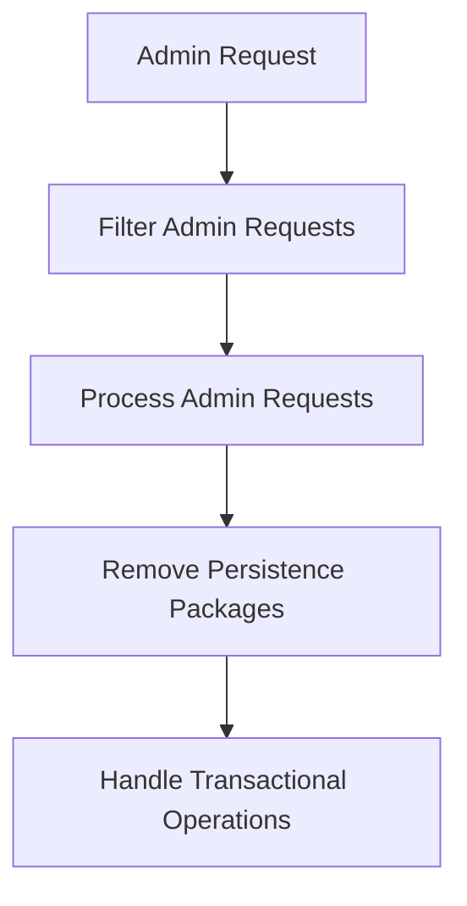

This document will cover the process of handling admin requests in the BroadleafCommerce-demo project. We'll cover:

1. Filtering admin requests
2. Processing admin requests
3. Removing persistence packages
4. Handling transactional operations.

# Filtering Admin Requests

The first step in handling an admin request is to filter it. This is where we decide whether to process the request or forward it to a conflict destination. This decision is based on various factors such as the type of request, the permissions of the user making the request, and the current state of the system. If the request is deemed valid and safe to process, it is passed on to the next step. If not, it is forwarded to a conflict destination, which could be an error page or a request resolution system.

# Processing Admin Requests

Once a request has been filtered and deemed safe to process, it is then processed. This involves executing the action requested by the admin user. This could be anything from updating a product listing, adding a new user, or changing the site's configuration. After the request has been processed, any temporary data used during the processing is cleaned up to ensure the system remains in a consistent state.

# Removing Persistence Packages

In some cases, the processing of an admin request may involve the use of persistence packages. These are temporary data packages that are used to store the state of the system during the processing of a request. Once the request has been processed, these persistence packages are no longer needed and are therefore removed. This is done in a transactional context to ensure data consistency.

# Handling Transactional Operations

The final step in handling an admin request is to handle any transactional operations. These are operations that need to be executed in a specific order and in a way that ensures data consistency. If a transactional operation fails, the system is able to roll back to its previous state before the operation was executed. This ensures that the system remains in a consistent state even in the event of a failure.

&nbsp;

*This is an auto-generated document by Swimm AI 🌊 and has not yet been verified by a human*

<SwmMeta version="3.0.0" repo-id="Z2l0aHViJTNBJTNBQnJvYWRsZWFmQ29tbWVyY2UtZGVtbyUzQSUzQWdpbGFkbmF2b3Q=" repo-name="BroadleafCommerce-demo" doc-type="product-flows">Powered by [Swimm](/)</SwmMeta>
