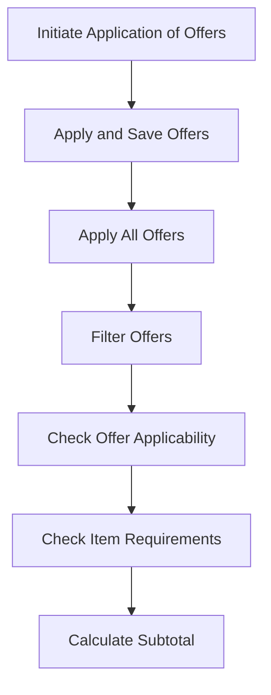

This document will cover the process of applying and saving fulfillment group offers to an order in the BroadleafCommerce-demo repository. We'll cover:

1. Initiating the application of fulfillment group offers to an order.
2. Applying the offers to the order and saving the changes.
3. Applying all the fulfillment group offers to the order.
4. Filtering the offers at the fulfillment group level.
5. Checking if an offer could apply to the items in the order.
6. Checking if the items in the order meet the requirements for the offer.
7. Calculating the subtotal for the qualifying items in the order.

# Initiating the Application of Fulfillment Group Offers to an Order

The process of applying and saving fulfillment group offers to an order begins with the initiation of the application. This is the first step in the process and is responsible for starting the application of fulfillment group offers to an order.

# Applying the Offers to the Order and Saving the Changes

Once the application of fulfillment group offers to an order has been initiated, the next step is to apply the offers to the order and save the changes. This ensures that the offers are properly applied to the order and that these changes are saved for future reference.

# Applying All the Fulfillment Group Offers to the Order

After the offers have been applied to the order and the changes have been saved, the next step is to apply all the fulfillment group offers to the order. This ensures that all relevant offers are applied to the order, maximizing the benefits for the customer.

# Filtering the Offers at the Fulfillment Group Level

Once all the fulfillment group offers have been applied to the order, the next step is to filter the offers at the fulfillment group level. This step ensures that only the most relevant and beneficial offers are applied to the order.

# Checking if an Offer Could Apply to the Items in the Order

After the offers have been filtered at the fulfillment group level, the next step is to check if an offer could apply to the items in the order. This step ensures that the offers are applicable to the items in the order, ensuring that the customer receives the maximum benefits.

# Checking if the Items in the Order Meet the Requirements for the Offer

Once it has been determined that an offer could apply to the items in the order, the next step is to check if the items in the order meet the requirements for the offer. This step ensures that the items in the order are eligible for the offer, ensuring that the customer receives the maximum benefits.

# Calculating the Subtotal for the Qualifying Items in the Order

The final step in the process of applying and saving fulfillment group offers to an order is to calculate the subtotal for the qualifying items in the order. This step ensures that the total cost of the order is accurately calculated, taking into account the discounts from the applied offers.

&nbsp;

*This is an auto-generated document by Swimm AI 🌊 and has not yet been verified by a human*

<SwmMeta version="3.0.0" repo-id="Z2l0aHViJTNBJTNBQnJvYWRsZWFmQ29tbWVyY2UtZGVtbyUzQSUzQWdpbGFkbmF2b3Q=" repo-name="BroadleafCommerce-demo" doc-type="product-flows">Powered by [Swimm](/)</SwmMeta>
