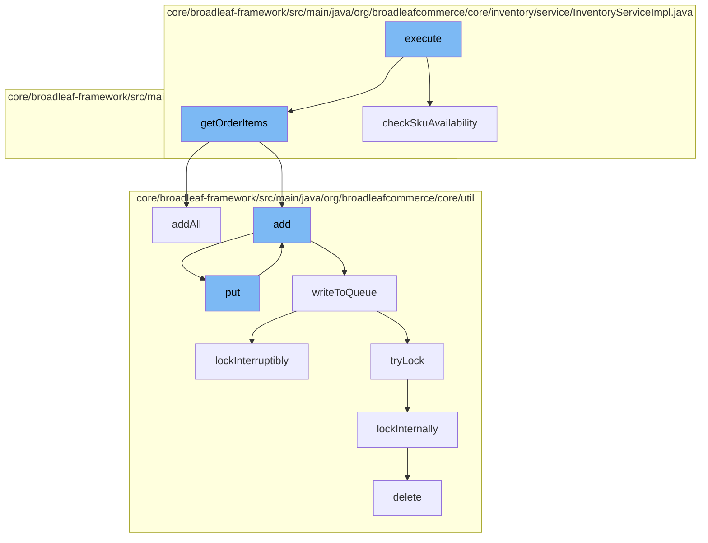

This document will cover the process of validating product availability during the checkout process in the BroadleafCommerce-demo project. The process includes the following steps:

1. Executing the validation activity
2. Checking SKU availability
3. Gathering order items
4. Adding items to the distributed queue
5. Writing to the queue
6. Locking the process
7. Deleting the lock



<SwmSnippet path="/core/broadleaf-framework/src/main/java/org/broadleafcommerce/core/checkout/service/workflow/ValidateAvailabilityActivity.java" line="1">

---

# Executing the validation activity

The `execute` function in `ValidateAvailabilityActivity.java` initiates the process of validating product availability during the checkout process. It calls the `checkSkuAvailability` and `getOrderItems` functions.

```java
/*-
 * #%L
 * BroadleafCommerce Framework
 * %%
 * Copyright (C) 2009 - 2024 Broadleaf Commerce
 * %%
 * Licensed under the Broadleaf Fair Use License Agreement, Version 1.0
 * (the "Fair Use License" located  at http://license.broadleafcommerce.org/fair_use_license-1.0.txt)
 * unless the restrictions on use therein are violated and require payment to Broadleaf in which case
 * the Broadleaf End User License Agreement (EULA), Version 1.1
 * (the "Commercial License" located at http://license.broadleafcommerce.org/commercial_license-1.1.txt)
 * shall apply.
 * 
 * Alternatively, the Commercial License may be replaced with a mutually agreed upon license (the "Custom License")
 * between you and Broadleaf Commerce. You may not use this file except in compliance with the applicable license.
 * #L%
 */
package org.broadleafcommerce.core.checkout.service.workflow;

import org.apache.commons.logging.Log;
import org.apache.commons.logging.LogFactory;
```

---

</SwmSnippet>

<SwmSnippet path="/core/broadleaf-framework/src/main/java/org/broadleafcommerce/core/inventory/service/InventoryServiceImpl.java" line="414">

---

# Checking SKU availability

The `checkSkuAvailability` function in `InventoryServiceImpl.java` checks if the SKU of the product is available. If the SKU is not available, it throws an `InventoryUnavailableException`.

```java
    @Override
    public void checkSkuAvailability(Order order, Sku sku, Integer requestedQuantity) throws InventoryUnavailableException {
        Sku skuForInventory = sku;
        if (enableUseDefaultSkuInventory && ((ProductSkuUsage) sku.getProduct()).getUseDefaultSkuInInventory()){
            skuForInventory = sku.getProduct().getDefaultSku();
        }
        // First check if this Sku is available
        if (!sku.isAvailable()) {
            throw new InventoryUnavailableException("The referenced Sku " + sku.getId() + " is marked as unavailable", sku.getId(), requestedQuantity, 0);
        }
        if (InventoryType.CHECK_QUANTITY.equals(skuForInventory.getInventoryType())) {
            Map<String, Object> inventoryContext = new HashMap<>();
            inventoryContext.put(ContextualInventoryService.ORDER_KEY, order);
            boolean available = isAvailable(sku, requestedQuantity, inventoryContext);
            if (!available) {
                throw new InventoryUnavailableException(sku.getId(),
                        requestedQuantity, retrieveQuantityAvailable(sku, inventoryContext));
            }
        }

        // the other case here is ALWAYS_AVAILABLE and null, which we are treating as being available
```

---

</SwmSnippet>

<SwmSnippet path="/core/broadleaf-framework/src/main/java/org/broadleafcommerce/core/checkout/service/workflow/ValidateProductOptionsActivity.java" line="1">

---

# Gathering order items

The `getOrderItems` function in `ValidateProductOptionsActivity.java` gathers all the items in the order. It calls the `addAll` and `add` functions to add these items to the distributed queue.

```java
/*-
 * #%L
 * BroadleafCommerce Framework
 * %%
 * Copyright (C) 2009 - 2024 Broadleaf Commerce
 * %%
 * Licensed under the Broadleaf Fair Use License Agreement, Version 1.0
 * (the "Fair Use License" located  at http://license.broadleafcommerce.org/fair_use_license-1.0.txt)
 * unless the restrictions on use therein are violated and require payment to Broadleaf in which case
 * the Broadleaf End User License Agreement (EULA), Version 1.1
 * (the "Commercial License" located at http://license.broadleafcommerce.org/commercial_license-1.1.txt)
 * shall apply.
 * 
 * Alternatively, the Commercial License may be replaced with a mutually agreed upon license (the "Custom License")
 * between you and Broadleaf Commerce. You may not use this file except in compliance with the applicable license.
 * #L%
 */
package org.broadleafcommerce.core.checkout.service.workflow;

import org.apache.commons.collections4.ListUtils;
import org.apache.commons.lang.StringUtils;
```

---

</SwmSnippet>

<SwmSnippet path="/core/broadleaf-framework/src/main/java/org/broadleafcommerce/core/util/service/ResourcePurgeServiceImpl.java" line="1">

---

# Adding items to the distributed queue

The `add` function in `ResourcePurgeServiceImpl.java` adds the items to the distributed queue by calling the `put` function.

```java
/*-
 * #%L
 * BroadleafCommerce Framework
 * %%
 * Copyright (C) 2009 - 2024 Broadleaf Commerce
 * %%
 * Licensed under the Broadleaf Fair Use License Agreement, Version 1.0
 * (the "Fair Use License" located  at http://license.broadleafcommerce.org/fair_use_license-1.0.txt)
 * unless the restrictions on use therein are violated and require payment to Broadleaf in which case
 * the Broadleaf End User License Agreement (EULA), Version 1.1
 * (the "Commercial License" located at http://license.broadleafcommerce.org/commercial_license-1.1.txt)
 * shall apply.
 * 
 * Alternatively, the Commercial License may be replaced with a mutually agreed upon license (the "Custom License")
 * between you and Broadleaf Commerce. You may not use this file except in compliance with the applicable license.
 * #L%
 */
package org.broadleafcommerce.core.util.service;

import java.sql.Connection;
import java.sql.SQLException;
```

---

</SwmSnippet>

<SwmSnippet path="/core/broadleaf-framework/src/main/java/org/broadleafcommerce/core/util/queue/ZookeeperDistributedQueue.java" line="503">

---

# Writing to the queue

The `writeToQueue` function in `ZookeeperDistributedQueue.java` writes the items to the queue. It locks the process to ensure that the items are written to the queue without any interruptions.

```java
    protected int writeToQueue(List<? extends T> entries, final long timeout) throws InterruptedException {
        if (entries == null || entries.isEmpty()) {
            return 0;
        }
        
        int entryCount = 0;
        long waitTime = timeout;
        synchronized (QUEUE_MONITOR) {
            while (true) {
                boolean locked = false;
                DistributedLock lock = getQueueAccessLock();
                if (timeout < 0L) {
                    lock.lockInterruptibly();
                    locked = true;
                } else if (timeout > 0L && waitTime > 0L) {
                    long start = System.currentTimeMillis();
                    locked = lock.tryLock(waitTime, TimeUnit.MILLISECONDS);
                    long end = System.currentTimeMillis();
                    waitTime -= (end - start);
                } else {
                    locked = lock.tryLock();
```

---

</SwmSnippet>

<SwmSnippet path="/core/broadleaf-framework/src/main/java/org/broadleafcommerce/core/util/lock/ReentrantDistributedZookeeperLock.java" line="335">

---

# Locking the process

The `lockInterruptibly` function in `ReentrantDistributedZookeeperLock.java` locks the process to ensure that the items are written to the queue without any interruptions. It calls the `lockInternally` function to lock the process.

```java
    @Override
    public void lockInterruptibly() throws InterruptedException {
        if (Thread.interrupted()) {
            throw new InterruptedException("Thread was interrupted prior to trying to acquire the lock.");
        }
        
        lockInternally(-1L);
    }
```

---

</SwmSnippet>

<SwmSnippet path="/core/broadleaf-framework/src/main/java/org/broadleafcommerce/core/util/dao/CodeTypeDaoImpl.java" line="51">

---

# Deleting the lock

The `delete` function in `CodeTypeDaoImpl.java` deletes the lock after the items have been written to the queue. This ensures that other processes can access the queue.

```java
    public void delete(CodeType codeType) {
        if (!em.contains(codeType)) {
            codeType = (CodeType) em.find(CodeTypeImpl.class, codeType.getId());
        }
        em.remove(codeType);
    }
```

---

</SwmSnippet>

&nbsp;

*This is an auto-generated document by Swimm AI 🌊 and has not yet been verified by a human*

<SwmMeta version="3.0.0" repo-id="Z2l0aHViJTNBJTNBQnJvYWRsZWFmQ29tbWVyY2UtZGVtbyUzQSUzQWdpbGFkbmF2b3Q=" repo-name="BroadleafCommerce-demo" doc-type="flows"><sup>Powered by [Swimm](/)</sup></SwmMeta>
