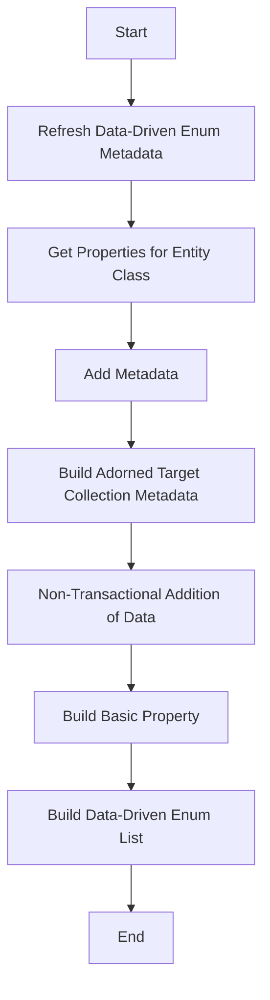

This document will cover the process of building properties from polymorphic entities in the BroadleafCommerce-demo repository. The process includes the following steps:

1. Refreshing data-driven enum metadata
2. Getting properties for entity class
3. Adding metadata
4. Building adorned target collection metadata
5. Non-transactional addition of data
6. Building basic property
7. Building data-driven enum list.

# Refreshing Data-Driven Enum Metadata

The first step in the process of building properties from polymorphic entities is to build a list of data-driven enums. These enums are used to define the possible values that a particular property can take. This is important for ensuring data consistency and integrity.

# Getting Properties for Entity Class

The next step is to build properties for a given entity class. This includes basic properties, component properties, and entity properties. These properties define the characteristics of the entity and how it interacts with other entities in the system.

# Adding Metadata

Metadata from the field type is added to the entity. This metadata is used later in the process to build adorned target collection metadata. Metadata provides additional information about the properties of an entity, such as their type, constraints, and relationships with other entities.

# Building Adorned Target Collection Metadata

Metadata for an adorned target collection is built. This includes setting various properties such as the target class, field name, and sort property. Adorned target collections are used to manage complex relationships between entities, such as many-to-many relationships.

# Non-Transactional Addition of Data

Data is added to the persistence manager in a non-transactional manner. This is used when adding new data to the system. Non-transactional operations are used when the operation does not need to be part of a larger transaction, and can be committed immediately.

# Building Basic Property

A basic property for an entity is built. This includes setting various properties such as the field name, type, and foreign key. Basic properties are the fundamental characteristics of an entity, and are used to define its behavior and relationships with other entities.

# Building Data-Driven Enum List

A list of data-driven enums is built. This is used when refreshing data-driven enum metadata. Data-driven enums are used to define the possible values that a particular property can take, ensuring data consistency and integrity.

&nbsp;

*This is an auto-generated document by Swimm AI 🌊 and has not yet been verified by a human*

<SwmMeta version="3.0.0" repo-id="Z2l0aHViJTNBJTNBQnJvYWRsZWFmQ29tbWVyY2UtZGVtbyUzQSUzQWdpbGFkbmF2b3Q=" repo-name="BroadleafCommerce-demo" doc-type="product-flows">Powered by [Swimm](/)</SwmMeta>
