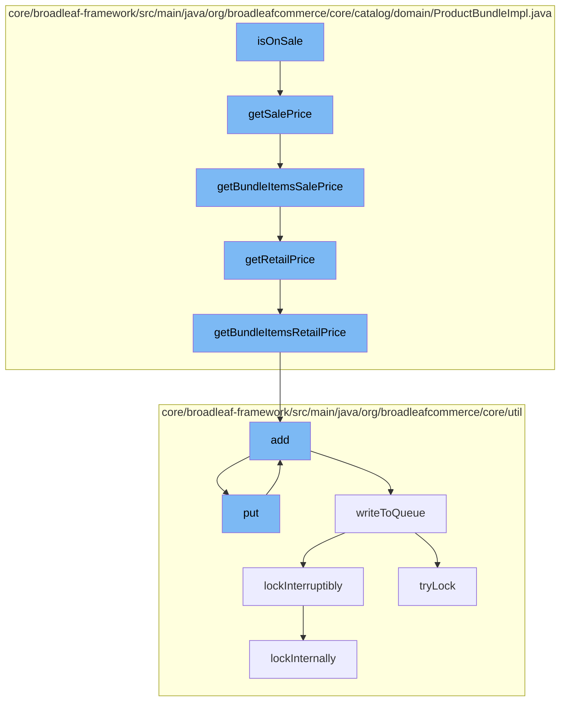

This document will cover the process of determining if a product bundle is on sale in the BroadleafCommerce-demo repository. The process includes the following steps:

1. Checking the sale price of the product bundle
2. Calculating the sale price of the bundle items
3. Checking the retail price of the product bundle
4. Calculating the retail price of the bundle items
5. Adding the calculated prices to a cache
6. Writing the cache to a distributed queue
7. Locking the queue for exclusive access.



<SwmSnippet path="/core/broadleaf-framework/src/main/java/org/broadleafcommerce/core/catalog/domain/ProductBundleImpl.java" line="125">

---

# Checking the Sale Price of the Product Bundle

The `getSalePrice` method is used to determine the sale price of the product bundle. If the pricing model of the product bundle is `ITEM_SUM`, it calls the `getBundleItemsSalePrice` method to calculate the sale price of the bundle items. If the pricing model is `BUNDLE`, it returns the sale price of the default SKU of the product bundle.

```java
    @Override
    public Money getSalePrice() {
        if (ProductBundlePricingModelType.ITEM_SUM.equals(getPricingModel())) {
            return getBundleItemsSalePrice();
        } else if (ProductBundlePricingModelType.BUNDLE.equals(getPricingModel())) {
            return super.getDefaultSku().getSalePrice();
        }
        return null;
    }
```

---

</SwmSnippet>

<SwmSnippet path="/core/broadleaf-framework/src/main/java/org/broadleafcommerce/core/catalog/domain/ProductBundleImpl.java" line="144">

---

# Calculating the Sale Price of the Bundle Items

The `getBundleItemsSalePrice` method is used to calculate the sale price of the bundle items. It iterates over the SKU bundle items and adds up the sale price of each item, multiplied by its quantity. If an item does not have a sale price, it adds up the retail price of the item, multiplied by its quantity.

```java
    @Override
    public Money getBundleItemsSalePrice() {
        Money price = Money.ZERO;
        for (SkuBundleItem item : getSkuBundleItems()){
            if (item.getSalePrice() != null) {
                price = price.add(item.getSalePrice().multiply(item.getQuantity()));
            } else {
                price = price.add(item.getRetailPrice().multiply(item.getQuantity()));
            }
        }
        return price;
    }
```

---

</SwmSnippet>

<SwmSnippet path="/core/broadleaf-framework/src/main/java/org/broadleafcommerce/core/catalog/domain/ProductBundleImpl.java" line="115">

---

# Checking the Retail Price of the Product Bundle

The `getRetailPrice` method is used to determine the retail price of the product bundle. If the pricing model of the product bundle is `ITEM_SUM`, it calls the `getBundleItemsRetailPrice` method to calculate the retail price of the bundle items. If the pricing model is `BUNDLE`, it returns the retail price of the default SKU of the product bundle.

```java
    @Override
    public Money getRetailPrice() {
        if (ProductBundlePricingModelType.ITEM_SUM.equals(getPricingModel())) {
            return getBundleItemsRetailPrice();
        } else if (ProductBundlePricingModelType.BUNDLE.equals(getPricingModel())) {
            return super.getDefaultSku().getRetailPrice();
        }
        return null;
    }
```

---

</SwmSnippet>

<SwmSnippet path="/core/broadleaf-framework/src/main/java/org/broadleafcommerce/core/catalog/domain/ProductBundleImpl.java" line="135">

---

# Calculating the Retail Price of the Bundle Items

The `getBundleItemsRetailPrice` method is used to calculate the retail price of the bundle items. It iterates over the SKU bundle items and adds up the retail price of each item, multiplied by its quantity.

```java
    @Override
    public Money getBundleItemsRetailPrice() {
        Money price = Money.ZERO;
        for (SkuBundleItem item : getSkuBundleItems()) {
            price = price.add(item.getRetailPrice().multiply(item.getQuantity()));
        }
        return price;
    }
```

---

</SwmSnippet>

<SwmSnippet path="/core/broadleaf-framework/src/main/java/org/broadleafcommerce/core/util/service/ResourcePurgeServiceImpl.java" line="593">

---

# Adding the Calculated Prices to a Cache

The `add` method in `ResourcePurgeServiceImpl` is used to add the calculated prices to a cache. If the cache does not already contain the entry, it adds the entry to the cache with the current time as the value.

```java
        public Long add(Long entry) {
            if (! cache.containsKey(entry)) {
                return cache.put(entry, new Long(System.currentTimeMillis()));
            }
            return null;
        }
```

---

</SwmSnippet>

<SwmSnippet path="/core/broadleaf-framework/src/main/java/org/broadleafcommerce/core/util/queue/ZookeeperDistributedQueue.java" line="393">

---

# Writing the Cache to a Distributed Queue

The `put` method in `ZookeeperDistributedQueue` is used to write the cache to a distributed queue. It calls the `writeToQueue` method to perform the write operation.

```java
    @Override
    public void put(T e) throws InterruptedException {
        final ArrayList<T> elementsToAdd = new ArrayList<>();
        elementsToAdd.add(e);
        writeToQueue(elementsToAdd, -1L);
    }
```

---

</SwmSnippet>

<SwmSnippet path="/core/broadleaf-framework/src/main/java/org/broadleafcommerce/core/util/lock/ReentrantDistributedZookeeperLock.java" line="335">

---

# Locking the Queue for Exclusive Access

The `lockInterruptibly` method in `ReentrantDistributedZookeeperLock` is used to lock the queue for exclusive access. It calls the `lockInternally` method to perform the lock operation.

```java
    @Override
    public void lockInterruptibly() throws InterruptedException {
        if (Thread.interrupted()) {
            throw new InterruptedException("Thread was interrupted prior to trying to acquire the lock.");
        }
        
        lockInternally(-1L);
    }
```

---

</SwmSnippet>

&nbsp;

*This is an auto-generated document by Swimm AI 🌊 and has not yet been verified by a human*

<SwmMeta version="3.0.0" repo-id="Z2l0aHViJTNBJTNBQnJvYWRsZWFmQ29tbWVyY2UtZGVtbyUzQSUzQWdpbGFkbmF2b3Q=" repo-name="BroadleafCommerce-demo" doc-type="flows"><sup>Powered by [Swimm](/)</sup></SwmMeta>
