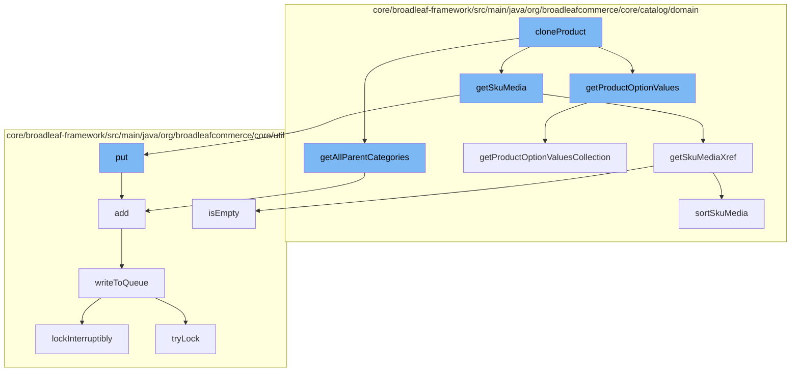

This document will cover the process of product cloning in the BroadleafCommerce-demo repository. The process includes:

1. Cloning the product
2. Retrieving product option values
3. Retrieving all parent categories
4. Retrieving SKU media
5. Adding entries to the distributed queue.



<SwmSnippet path="/admin/broadleaf-admin-module/src/main/java/org/broadleafcommerce/admin/server/service/AdminCatalogServiceImpl.java" line="1">

---

# Cloning the product

The `cloneProduct` function in `AdminCatalogServiceImpl.java` initiates the product cloning process. It calls several other functions to gather necessary information about the product.

```java
/*-
```

---

</SwmSnippet>

<SwmSnippet path="/core/broadleaf-framework/src/main/java/org/broadleafcommerce/core/catalog/domain/SkuImpl.java" line="1047">

---

# Retrieving product option values

The `getProductOptionValues` function is called to retrieve the product option values for the SKU being cloned. It returns a list of `ProductOptionValue` objects.

```java
    @Override
    @Deprecated
    public List<ProductOptionValue> getProductOptionValues() {
        return new ArrayList<>(getProductOptionValuesCollection());
    }
```

---

</SwmSnippet>

<SwmSnippet path="/core/broadleaf-framework/src/main/java/org/broadleafcommerce/core/catalog/domain/CategoryImpl.java" line="1">

---

# Retrieving all parent categories

The `getAllParentCategories` function is called to retrieve all parent categories of the product being cloned.

```java
/*-
```

---

</SwmSnippet>

<SwmSnippet path="/core/broadleaf-framework/src/main/java/org/broadleafcommerce/core/catalog/domain/SkuImpl.java" line="929">

---

# Retrieving SKU media

The `getSkuMedia` function is called to retrieve the SKU media for the product being cloned. It returns a map of `SkuMediaXref` objects.

```java
    @Override
    public Map<String, SkuMediaXref> getSkuMediaXref() {
        Map<String, SkuMediaXref> skuMediaMap = skuMedia;

        if (MapUtils.isEmpty(skuMediaMap)) {
            if (hasDefaultSku()) {
                return lookupDefaultSku().getSkuMediaXref();
            }
        }

        if (isOrderedSkuMedia(skuMediaMap)) {
            skuMediaMap = sortSkuMedia(skuMediaMap);
        }

        return skuMediaMap;
    }
```

---

</SwmSnippet>

<SwmSnippet path="/core/broadleaf-framework/src/main/java/org/broadleafcommerce/core/util/queue/ZookeeperDistributedQueue.java" line="359">

---

# Adding entries to the distributed queue

The `add` function is called to add entries to the distributed queue. This is part of the process of updating the product information in the system.

```java
    @Override
    public boolean add(T e) {
        try {
            final ArrayList<T> lst = new ArrayList<>();
            lst.add(e);
            int count = writeToQueue(lst, 0L);
            if (count != 1) {
                throw new IllegalStateException("The Zookeeper queue was full.");
            } else {
                return true;
            }
        } catch (InterruptedException ex) {
            Thread.currentThread().interrupt();
            return false;
        }
    }
```

---

</SwmSnippet>

&nbsp;

*This is an auto-generated document by Swimm AI 🌊 and has not yet been verified by a human*

<SwmMeta version="3.0.0" repo-id="Z2l0aHViJTNBJTNBQnJvYWRsZWFmQ29tbWVyY2UtZGVtbyUzQSUzQWdpbGFkbmF2b3Q=" repo-name="BroadleafCommerce-demo" doc-type="flows"><sup>Powered by [Swimm](/)</sup></SwmMeta>
