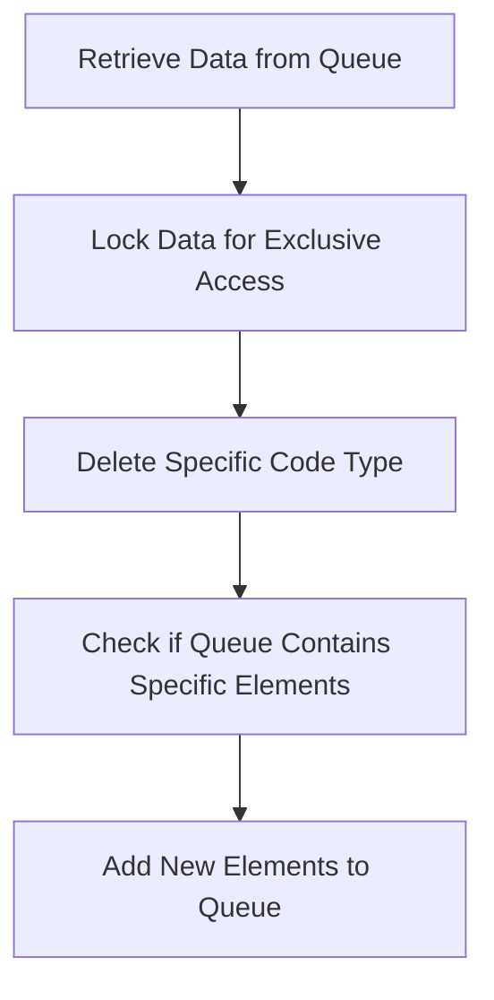

This document will cover the process of managing data persistence in the Broadleaf Commerce framework. We'll cover:

1. Retrieving data from the queue
2. Locking the data for exclusive access
3. Deleting a specific code type
4. Checking if the queue contains specific elements
5. Adding new elements to the queue.

# Retrieving Data from the Queue

The first step in managing data persistence is to retrieve the data that needs to be processed. This is done by accessing the queue, which is a data structure that holds the data in a 'first in, first out' order. The data is retrieved without removing it from the queue, allowing for a review of the data before any actions are taken.

# Locking the Data for Exclusive Access

Once the data is retrieved, it is locked for exclusive access. This means that no other process can access or modify the data while it is being processed. This is crucial to prevent data corruption or inconsistencies, ensuring that the data remains accurate and reliable.

# Deleting a Specific Code Type

In some cases, a specific code type may need to be removed from the database. This could be due to a variety of reasons, such as the code type being outdated or no longer relevant. This step ensures that the database remains clean and efficient, only containing the necessary data.

# Checking if the Queue Contains Specific Elements

Before adding new elements to the queue, it is important to check if the queue already contains these elements. This is to prevent duplication of data, which could lead to confusion and inefficiency. If the elements are already in the queue, they will not be added again.

# Adding New Elements to the Queue

The final step in the process is to add new elements to the queue. These elements could be new data that needs to be processed, or updates to existing data. By adding these elements to the queue, they are scheduled for processing and will be handled in the order they were added.

&nbsp;

*This is an auto-generated document by Swimm AI 🌊 and has not yet been verified by a human*

<SwmMeta version="3.0.0" repo-id="Z2l0aHViJTNBJTNBQnJvYWRsZWFmQ29tbWVyY2UtZGVtbyUzQSUzQWdpbGFkbmF2b3Q=" repo-name="BroadleafCommerce-demo" doc-type="product-flows">Powered by [Swimm](/)</SwmMeta>
