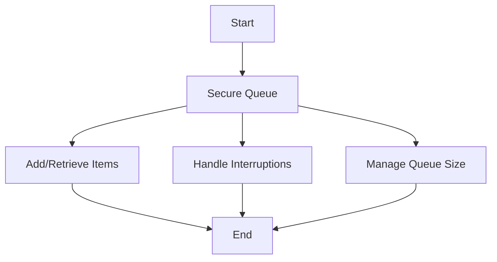

This document will cover the process of managing distributed queues in Broadleaf Commerce, which includes:

1. Securing the queue
2. Adding and retrieving items from the queue
3. Handling interruptions during queue operations
4. Managing the size of the queue.

# Securing the Queue

The first step in managing the distributed queue is to secure it. This is done by acquiring a lock on the queue. This ensures that no other process can interfere with the queue while it is being managed. If the process is interrupted before the lock is acquired, an error is thrown and the process is halted. This is important to prevent data corruption or loss.

# Adding and Retrieving Items from the Queue

Once the queue is secured, items can be added to it. This is done using a function that writes the items to the queue. Similarly, items can be retrieved from the queue. This is important for maintaining the flow of data in the system.

# Handling Interruptions during Queue Operations

During the process of adding or retrieving items from the queue, interruptions may occur. If the process is interrupted while trying to determine if elements are contained in the queue, an error is thrown and the process is halted. This is to ensure the integrity of the data in the queue.

# Managing the Size of the Queue

The size of the queue is also managed during this process. A function is used to determine the size of the queue. If the process is interrupted while trying to determine the queue size, an error is thrown and the process is halted. This is important for maintaining the efficiency of the system, as a queue that is too large can slow down operations.

&nbsp;

*This is an auto-generated document by Swimm AI 🌊 and has not yet been verified by a human*

<SwmMeta version="3.0.0" repo-id="Z2l0aHViJTNBJTNBQnJvYWRsZWFmQ29tbWVyY2UtZGVtbyUzQSUzQWdpbGFkbmF2b3Q=" repo-name="BroadleafCommerce-demo" doc-type="product-flows">Powered by [Swimm](/)</SwmMeta>
