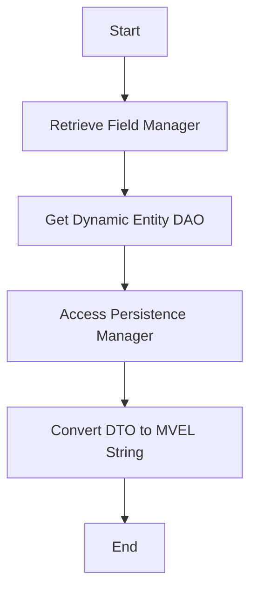

This document will cover the process of validating fields in Broadleaf Commerce, which includes:

1. Retrieving the Field Manager
2. Getting the Dynamic Entity DAO
3. Accessing the Persistence Manager
4. Converting DTO to MVEL string.

# Retrieving the Field Manager

The first step in the field validation process is to retrieve the Field Manager. The Field Manager is a component that manages the fields of an entity. It is responsible for handling the retrieval, update, and deletion of fields. This is crucial as it allows us to interact with the fields that we want to validate.

# Getting the Dynamic Entity DAO

The next step is to get the Dynamic Entity DAO. The Dynamic Entity DAO is a component that provides access to the dynamic entities in the system. Dynamic entities are entities that can be created, updated, and deleted at runtime. This is important as it allows us to interact with the dynamic entities that contain the fields we want to validate.

# Accessing the Persistence Manager

The third step is to access the Persistence Manager. The Persistence Manager is a component that manages the persistence context. It is responsible for handling the retrieval, update, and deletion of entities in the persistence context. This is crucial as it allows us to interact with the entities that contain the fields we want to validate.

# Converting DTO to MVEL string

The final step in the field validation process is to convert the DTO to an MVEL string. DTO stands for Data Transfer Object, and MVEL is a powerful expression language. This conversion is crucial as it allows us to express the validation rules in a format that can be evaluated at runtime. This ensures that the validation rules are applied correctly and consistently across all fields.

&nbsp;

*This is an auto-generated document by Swimm AI 🌊 and has not yet been verified by a human*

<SwmMeta version="3.0.0" repo-id="Z2l0aHViJTNBJTNBQnJvYWRsZWFmQ29tbWVyY2UtZGVtbyUzQSUzQWdpbGFkbmF2b3Q=" repo-name="BroadleafCommerce-demo" doc-type="product-flows">Powered by [Swimm](/)</SwmMeta>
