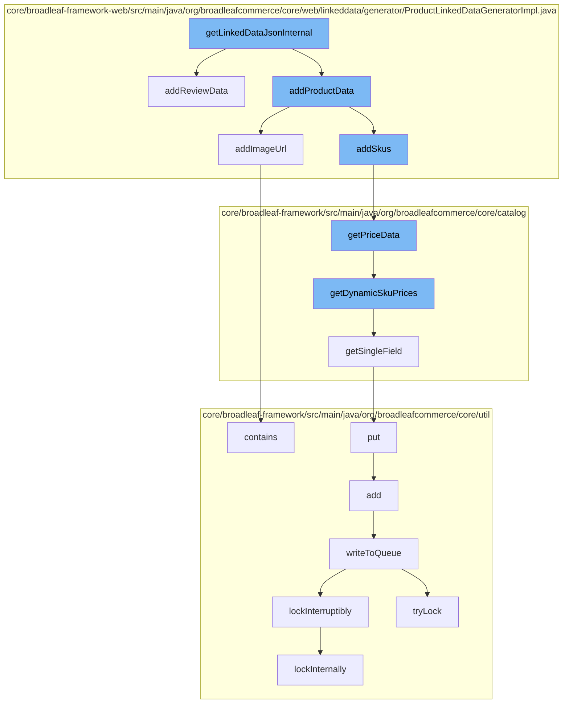

This document will cover the process of generating linked data for a product in the BroadleafCommerce-demo repository. The process includes the following steps:

1. Initialization of the linked data generation
2. Addition of product data
3. Addition of SKU data
4. Retrieval of price data
5. Addition of review data
6. Finalization of the linked data generation.



<SwmSnippet path="/core/broadleaf-framework-web/src/main/java/org/broadleafcommerce/core/web/linkeddata/generator/ProductLinkedDataGeneratorImpl.java" line="1">

---

# Initialization of the linked data generation

The `getLinkedDataJsonInternal` function is the entry point for generating linked data for a product. It calls `addProductData` and `addReviewData` to add product-specific and review-specific data to the linked data JSON object.

```java
/*-
 * #%L
 * BroadleafCommerce Framework Web
 * %%
 * Copyright (C) 2009 - 2024 Broadleaf Commerce
 * %%
 * Licensed under the Broadleaf Fair Use License Agreement, Version 1.0
 * (the "Fair Use License" located  at http://license.broadleafcommerce.org/fair_use_license-1.0.txt)
 * unless the restrictions on use therein are violated and require payment to Broadleaf in which case
 * the Broadleaf End User License Agreement (EULA), Version 1.1
```

---

</SwmSnippet>

<SwmSnippet path="/core/broadleaf-framework-web/src/main/java/org/broadleafcommerce/core/web/linkeddata/generator/ProductLinkedDataGeneratorImpl.java" line="11">

---

# Addition of product data

The `addProductData` function is responsible for adding product-specific data to the linked data JSON object. It calls `addImageUrl` and `addSkus` to add image URL and SKU data to the product data.

```java
 * (the "Commercial License" located at http://license.broadleafcommerce.org/commercial_license-1.1.txt)
 * shall apply.
 * 
 * Alternatively, the Commercial License may be replaced with a mutually agreed upon license (the "Custom License")
 * between you and Broadleaf Commerce. You may not use this file except in compliance with the applicable license.
 * #L%
 */
package org.broadleafcommerce.core.web.linkeddata.generator;

import org.broadleafcommerce.common.media.domain.Media;
```

---

</SwmSnippet>

<SwmSnippet path="/core/broadleaf-framework-web/src/main/java/org/broadleafcommerce/core/web/linkeddata/generator/ProductLinkedDataGeneratorImpl.java" line="21">

---

# Addition of SKU data

The `addSkus` function is responsible for adding SKU-specific data to the product data. It calls `getPriceData` to retrieve price data for the SKU.

```java
import org.broadleafcommerce.common.money.Money;
import org.broadleafcommerce.core.catalog.domain.Product;
import org.broadleafcommerce.core.catalog.domain.Sku;
import org.broadleafcommerce.core.catalog.service.CatalogService;
import org.broadleafcommerce.core.inventory.service.type.InventoryType;
import org.broadleafcommerce.core.rating.domain.RatingSummary;
import org.broadleafcommerce.core.rating.domain.ReviewDetail;
import org.broadleafcommerce.core.rating.service.RatingService;
import org.broadleafcommerce.core.rating.service.type.RatingType;
import org.broadleafcommerce.core.web.catalog.ProductHandlerMapping;
```

---

</SwmSnippet>

<SwmSnippet path="/core/broadleaf-framework/src/main/java/org/broadleafcommerce/core/catalog/domain/SkuImpl.java" line="31">

---

# Retrieval of price data

The `getPriceData` function retrieves price data for a SKU. It calls `getDynamicSkuPrices` to retrieve dynamic SKU prices, which in turn calls `getSingleField` to retrieve a single field from the SKU pricing consideration context.

```java
import org.broadleafcommerce.common.extensibility.jpa.clone.IgnoreEnterpriseBehavior;
import org.broadleafcommerce.common.extensibility.jpa.copy.DirectCopyTransform;
import org.broadleafcommerce.common.extensibility.jpa.copy.DirectCopyTransformMember;
import org.broadleafcommerce.common.extensibility.jpa.copy.DirectCopyTransformTypes;
import org.broadleafcommerce.common.i18n.service.DynamicTranslationProvider;
import org.broadleafcommerce.common.media.domain.Media;
import org.broadleafcommerce.common.money.Money;
import org.broadleafcommerce.common.presentation.AdminPresentation;
import org.broadleafcommerce.common.presentation.AdminPresentationCollection;
import org.broadleafcommerce.common.presentation.AdminPresentationDataDrivenEnumeration;
```

---

</SwmSnippet>

<SwmSnippet path="/core/broadleaf-framework-web/src/main/java/org/broadleafcommerce/core/web/linkeddata/generator/ProductLinkedDataGeneratorImpl.java" line="41">

---

# Addition of review data

The `addReviewData` function is responsible for adding review-specific data to the linked data JSON object. It retrieves rating summary for the product and adds aggregate rating and individual reviews to the product data.

```java
import javax.annotation.Resource;
import javax.servlet.http.HttpServletRequest;

/**
 * This generator generates structured data specific to product pages.
 * <p>
 * See <a href="http://schema.org/Product" target="_blank">http://schema.org/Product</a>, 
 * <a href="http://schema.org/Offer" target="_blank">http://schema.org/Offer</a>, 
 * and <a href="http://schema.org/AggregateOffer" target="_blank">http://schema.org/AggregateOffer</a>
 *
```

---

</SwmSnippet>

<SwmSnippet path="/core/broadleaf-framework-web/src/main/java/org/broadleafcommerce/core/web/linkeddata/generator/ProductLinkedDataGeneratorImpl.java" line="51">

---

# Finalization of the linked data generation

After all product-specific, SKU-specific, and review-specific data have been added, the `getLinkedDataJsonInternal` function finalizes the linked data generation process by returning the linked data JSON object.

```java
 * @author Jacob Mitash
 * @author Nathan Moore (nathanmoore).
 */
@Service(value = "blProductLinkedDataGenerator")
public class ProductLinkedDataGeneratorImpl extends AbstractLinkedDataGenerator {
    protected static final String IN_STOCK = "InStock";
    protected static final String OUT_OF_STOCK = "OutOfStock";
    protected final static DateFormat ISO_8601_FORMAT = new SimpleDateFormat("YYYY-MM-DD");

    @Resource(name = "blRatingService")
```

---

</SwmSnippet>

&nbsp;

*This is an auto-generated document by Swimm AI 🌊 and has not yet been verified by a human*

<SwmMeta version="3.0.0" repo-id="Z2l0aHViJTNBJTNBQnJvYWRsZWFmQ29tbWVyY2UtZGVtbyUzQSUzQWdpbGFkbmF2b3Q=" repo-name="BroadleafCommerce-demo" doc-type="flows"><sup>Powered by [Swimm](/)</sup></SwmMeta>
