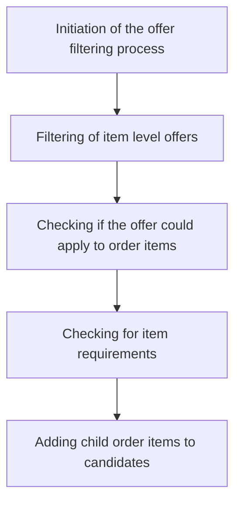

This document will cover the process of filtering offers in the BroadleafCommerce-demo project. We'll cover:

1. The initiation of the offer filtering process
2. Filtering of item level offers
3. Checking if the offer could apply to order items
4. Checking for item requirements
5. Adding child order items to candidates

# The initiation of the offer filtering process

The offer filtering process begins by identifying the type of offers that need to be filtered. This could be either order level offers or item level offers. Order level offers are discounts that apply to the total order value, while item level offers are discounts that apply to specific items in the order.

# Filtering of item level offers

Once the type of offer is identified, the system filters the item level offers. This involves checking each item in the order to see if it matches the criteria of the offer. If an item matches the criteria, it is considered a candidate for the offer.

# Checking if the offer could apply to order items

After the item level offers are filtered, the system checks if the offer could apply to the order items. This involves checking the requirements of the offer and comparing them with the attributes of the order items. If the order items meet the requirements of the offer, they are considered eligible for the offer.

# Checking for item requirements

The system then checks for item requirements. This involves checking if the order items meet the specific requirements set by the offer. These requirements could include things like a minimum quantity or a specific product category. If the order items meet these requirements, they are added to the list of candidates for the offer.

# Adding child order items to candidates

Finally, the system adds child order items to the list of candidates. Child order items are items that are part of a parent item in the order. For example, if a customer orders a pizza with extra toppings, the extra toppings would be considered child items of the pizza. If these child items meet the requirements of the offer, they are added to the list of candidates for the offer.

&nbsp;

*This is an auto-generated document by Swimm AI 🌊 and has not yet been verified by a human*

<SwmMeta version="3.0.0" repo-id="Z2l0aHViJTNBJTNBQnJvYWRsZWFmQ29tbWVyY2UtZGVtbyUzQSUzQWdpbGFkbmF2b3Q=" repo-name="BroadleafCommerce-demo" doc-type="product-flows">Powered by [Swimm](/)</SwmMeta>
