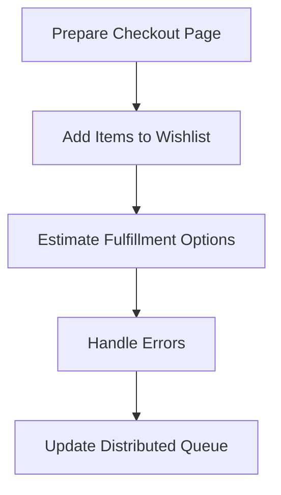

This document will cover the One-Page Checkout Process in BroadleafCommerce-demo, which includes:

1. Preparing the checkout page
2. Adding items to the wishlist
3. Estimating fulfillment options
4. Handling errors during the checkout process
5. Updating the distributed queue.

# Preparing the Checkout Page

The checkout process begins with the preparation of the necessary data for the checkout page. This includes the fulfillment options, estimation, and error handling. This step is crucial for providing the user with all the necessary information to complete their purchase.

# Adding Items to the Wishlist

The user has the option to add items to their wishlist during the checkout process. This allows the user to save items they are interested in but may not want to purchase immediately. The wishlist can be accessed and modified at any time by the user.

# Estimating Fulfillment Options

The system retrieves all fulfillment options for the cart and estimates the cost of applying these options on the first shippable fulfillment group. This provides the user with an estimate of the total cost of their purchase, including shipping, before they complete the checkout process.

# Handling Errors

Any errors that occur during the checkout process are handled to ensure a smooth user experience. This includes errors related to fulfillment options, estimation, and adding items to the wishlist. The user is notified of any errors and provided with instructions on how to resolve them.

# Updating the Distributed Queue

Throughout the checkout process, elements are added to the distributed queue. This ensures that all actions taken during the checkout process are properly recorded and can be processed in the correct order.

&nbsp;

*This is an auto-generated document by Swimm AI 🌊 and has not yet been verified by a human*

<SwmMeta version="3.0.0" repo-id="Z2l0aHViJTNBJTNBQnJvYWRsZWFmQ29tbWVyY2UtZGVtbyUzQSUzQWdpbGFkbmF2b3Q=" repo-name="BroadleafCommerce-demo" doc-type="product-flows">Powered by [Swimm](/)</SwmMeta>
