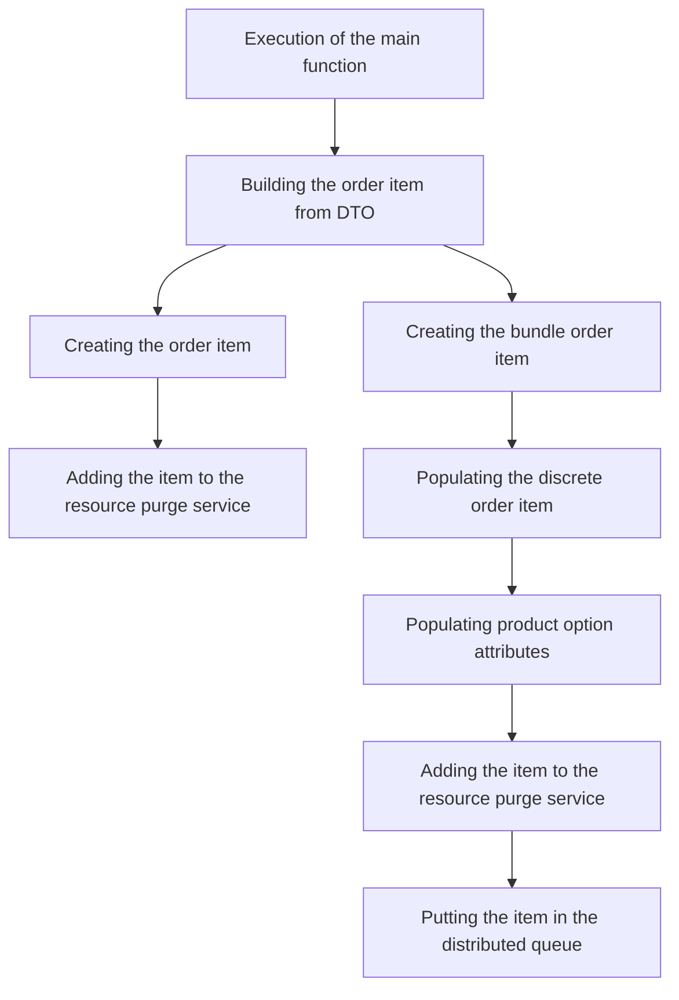

This document will cover the process of adding an order item in the BroadleafCommerce-demo project. We'll cover:

1. Execution of the main function
2. Building the order item from DTO
3. Creating the order item
4. Creating the bundle order item
5. Populating the discrete order item
6. Populating product option attributes
7. Adding the item to the resource purge service
8. Putting the item in the distributed queue.

# Execution of the Main Function

The process of adding an order item begins with the execution of the main function. This is the entry point of the order item addition process. It triggers the subsequent steps of building the order item from DTO and adding the item to the resource purge service.

# Building the Order Item from DTO

The order item is created from the provided DTO (Data Transfer Object). This step involves setting the item's properties such as name, quantity, order, and other attributes based on the information contained in the DTO.

# Creating the Order Item

An order item is created based on the provided OrderItemRequest. It sets the item's name, quantity, order, and other properties. This step ensures that the order item is properly initialized and ready for further processing.

# Creating the Bundle Order Item

A bundle order item is created if the order contains multiple items that are bundled together. This step involves creating a new bundle order item and adding it to the order.

# Populating the Discrete Order Item

The discrete order item is populated with the provided OrderItemRequest. It sets the item's SKU, quantity, category, product, order, and other properties. This step ensures that the order item has all the necessary information for processing.

# Populating Product Option Attributes

The product option attributes for the order item are populated. It iterates over the provided attributes and adds them to the order item. This step ensures that all the product options selected by the customer are properly recorded in the order item.

# Adding the Item to the Resource Purge Service

The item is added to the resource purge service. This service is responsible for managing the lifecycle of resources in the system. Adding the item to this service ensures that it is properly managed and can be cleaned up when no longer needed.

# Putting the Item in the Distributed Queue

The item is put in the distributed queue. This step ensures that the order item is properly queued for processing. The distributed queue allows for efficient processing of order items across multiple servers.

&nbsp;

*This is an auto-generated document by Swimm AI 🌊 and has not yet been verified by a human*

<SwmMeta version="3.0.0" repo-id="Z2l0aHViJTNBJTNBQnJvYWRsZWFmQ29tbWVyY2UtZGVtbyUzQSUzQWdpbGFkbmF2b3Q=" repo-name="BroadleafCommerce-demo" doc-type="product-flows">Powered by [Swimm](/)</SwmMeta>
