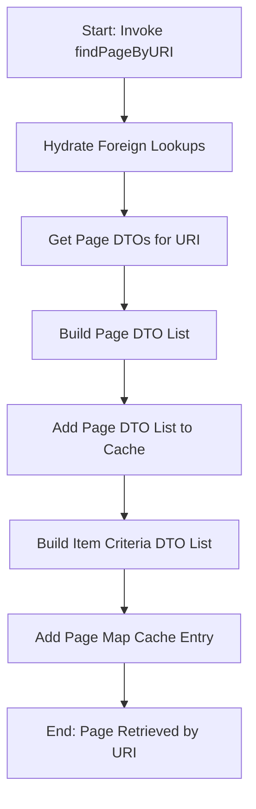

This document will cover the process of retrieving a page by its URI in the BroadleafCommerce-demo repository. We'll cover:

1. The initiation of the page retrieval process
2. The hydration of foreign lookups
3. The retrieval of a list of Page Data Transfer Objects (DTOs) for the URI
4. The construction of a list of Page DTOs
5. The addition of the list of Page DTOs to cache
6. The construction of a list of Item Criteria DTOs
7. The addition of a page map cache entry

# Invoking the `findPageByURI` function

The process of retrieving a page by its URI begins with the invocation of the `findPageByURI` function. This function takes a URI as input and initiates the process of finding the corresponding page. This is the first step in the user's journey to retrieve a specific page.

# Hydrating foreign lookups

The next step in the process is to hydrate foreign lookups. This involves populating a map in the `PageDTO` object with the foreign key relationships of the page. This step is crucial for ensuring that all related data is available when the page is retrieved.

# Getting a list of Page DTOs for the URI

Once the foreign lookups have been hydrated, the `getPageDTOListForURI` function is called to retrieve a list of `PageDTO` objects that match the given URI. This list will contain all the pages that have the same URI, allowing the user to choose the specific page they are looking for.

# Building a list of Page DTOs

The `buildPageDTOList` function is then called to create a list of `PageDTO` objects. This list is used to populate the page cache, which allows for quick retrieval of pages in the future. This step improves the efficiency of the page retrieval process, providing a better user experience.

# Adding the list of Page DTOs to cache

The `addPageListToCache` function is called to add the list of `PageDTO` objects to the page cache. This cache is used to quickly retrieve pages by their URI, improving the speed and efficiency of the page retrieval process.

# Building a list of Item Criteria DTOs

The `buildItemCriteriaDTOList` function is called to create a list of `ItemCriteriaDTO` objects. These objects represent the criteria that a page must meet to be included in the list of pages for a given URI. This step ensures that only relevant pages are retrieved, improving the accuracy of the page retrieval process.

# Adding a page map cache entry

Finally, the `addPageMapCacheEntry` function is called to add an entry to the page map cache. This cache is used to quickly retrieve the keys of the pages that match a given URI. This step further improves the efficiency of the page retrieval process, ensuring that users can quickly and easily retrieve the pages they are looking for.

&nbsp;

*This is an auto-generated document by Swimm AI 🌊 and has not yet been verified by a human*

<SwmMeta version="3.0.0" repo-id="Z2l0aHViJTNBJTNBQnJvYWRsZWFmQ29tbWVyY2UtZGVtbyUzQSUzQWdpbGFkbmF2b3Q=" repo-name="BroadleafCommerce-demo" doc-type="product-flows">Powered by [Swimm](/)</SwmMeta>
