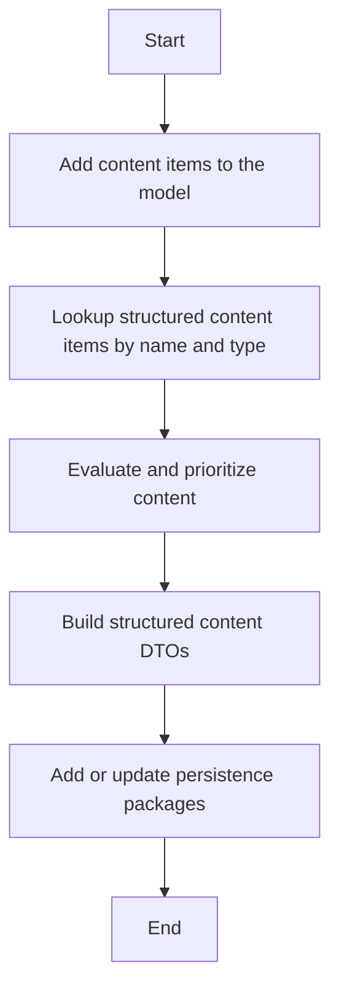

This document will cover the process of populating model variables in the Broadleaf Commerce framework, which includes:

1. Adding content items to the model
2. Looking up structured content items by name and type
3. Evaluating and prioritizing content
4. Building structured content DTOs
5. Adding or updating persistence packages.

# Adding content items to the model

The process begins by adding new entities to the model. These entities are the content items that will be displayed on the website. This is done by retrieving the content items from the database and adding them to the model.

# Looking up structured content items by name and type

The system then retrieves structured content items by their name and type. Structured content items are specific types of content that have been organized in a particular way for display. This could include things like product listings, blog posts, or news articles. The system retrieves these items based on their name and type to ensure that the correct content is being added to the model.

# Evaluating and prioritizing content

Once the content items have been retrieved, they are evaluated and prioritized. This means that the system determines which content items are most relevant to the user and should be displayed first. This could be based on a variety of factors, such as the user's browsing history, their preferences, or the popularity of the content item.

# Building structured content DTOs

After the content items have been prioritized, the system builds structured content DTOs (Data Transfer Objects). These are objects that contain the data of the content items in a format that can be easily transferred and used by the model. This includes all the necessary information about the content item, such as its name, type, and any associated data.

# Adding or updating persistence packages

Finally, the system adds or updates the persistence packages. These are packages that contain the data of the content items in a format that can be stored and retrieved from the database. This ensures that the data of the content items is saved and can be retrieved and displayed again in the future.

&nbsp;

*This is an auto-generated document by Swimm AI 🌊 and has not yet been verified by a human*

<SwmMeta version="3.0.0" repo-id="Z2l0aHViJTNBJTNBQnJvYWRsZWFmQ29tbWVyY2UtZGVtbyUzQSUzQWdpbGFkbmF2b3Q=" repo-name="BroadleafCommerce-demo" doc-type="product-flows">Powered by [Swimm](/)</SwmMeta>
