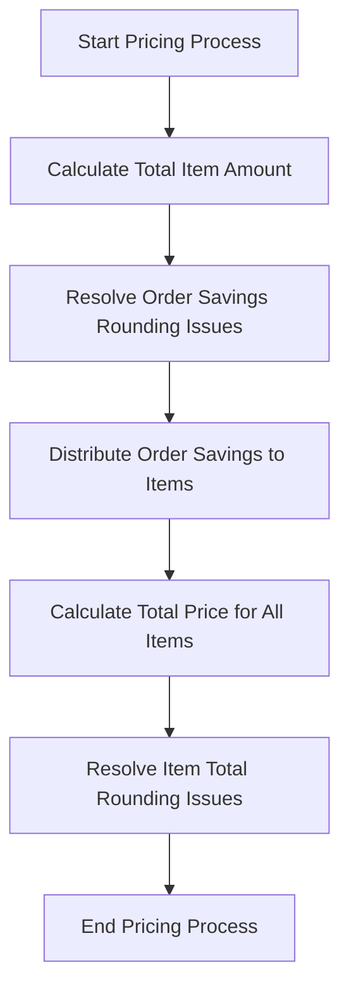

This document will cover the process of pricing fulfillment items in the Broadleaf Commerce framework. We'll cover:

1. The initiation of the pricing process
2. The calculation of the total item amount
3. The resolution of rounding issues for order savings
4. The distribution of order savings to items
5. The calculation of the total price for all fulfillment items
6. The resolution of rounding issues for item totals.

# Initiating the Pricing Process

The pricing process begins when a customer places an order. This process is responsible for calculating the total cost of the order, taking into account the price of each item, the quantity of each item, and any applicable discounts or savings.

# Calculating the Total Item Amount

The total amount for each item in the order is calculated based on the price of the item and the quantity ordered. If a customer orders multiple quantities of the same item, the total amount for that item is the product of the item's price and the quantity ordered.

# Resolving Order Savings Rounding Issues

When calculating the total savings for an order, rounding issues may occur due to the precision of currency calculations. To ensure that the total savings amount is accurately distributed among the items in the order, any rounding discrepancies are resolved. This ensures that the total savings displayed to the customer is accurate.

# Distributing Order Savings to Items

Once the total savings for the order has been calculated and any rounding issues have been resolved, the savings are distributed among the items in the order. The distribution is done proportionally, based on the price of each item. This means that more expensive items will receive a larger portion of the total savings.

# Calculating the Total Price for All Fulfillment Items

After the savings have been distributed, the total price for all items in the order is calculated. This includes the price of each item, the quantity of each item, and the distributed savings. This gives the final total cost of the order.

# Resolving Item Total Rounding Issues

Just like with the order savings, rounding issues may occur when calculating the total price for all items in the order. Any such issues are resolved to ensure that the total price displayed to the customer is accurate.

&nbsp;

*This is an auto-generated document by Swimm AI 🌊 and has not yet been verified by a human*

<SwmMeta version="3.0.0" repo-id="Z2l0aHViJTNBJTNBQnJvYWRsZWFmQ29tbWVyY2UtZGVtbyUzQSUzQWdpbGFkbmF2b3Q=" repo-name="BroadleafCommerce-demo" doc-type="product-flows">Powered by [Swimm](/)</SwmMeta>
