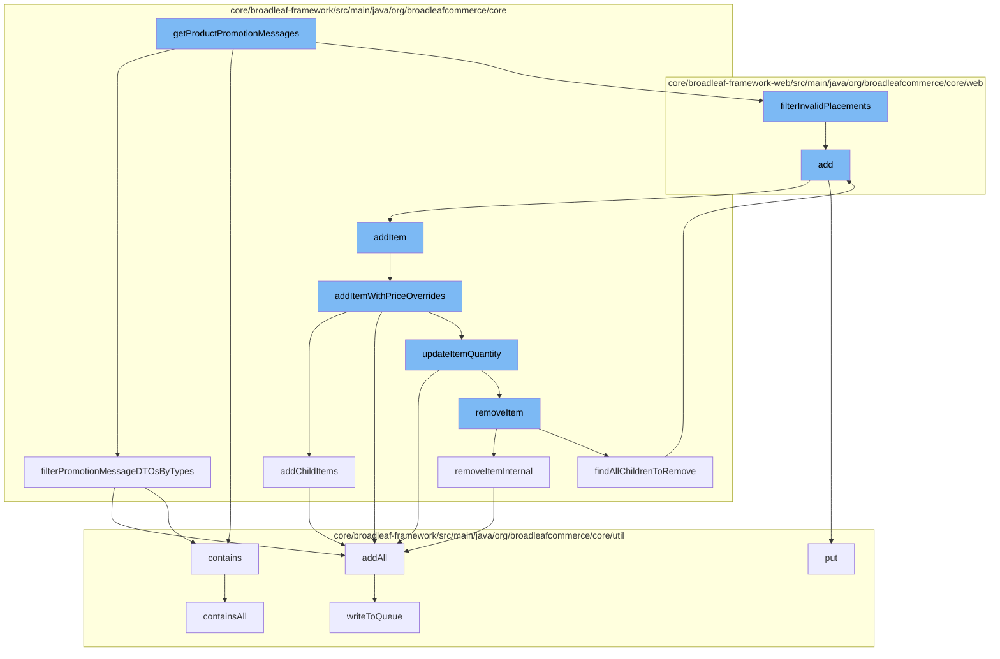

This document will cover the process of product promotion and wishlist management in BroadleafCommerce-demo. The topics covered include:

1. Retrieving product promotion messages
2. Filtering promotion messages by types
3. Adding items to a wishlist
4. Updating item quantity in the wishlist
5. Removing items from the wishlist.



<SwmSnippet path="/core/broadleaf-framework-web/src/main/java/org/broadleafcommerce/core/web/expression/PromotionMessageVariableExpression.java" line="1">

---

# Retrieving product promotion messages

The `getProductPromotionMessages` function is the entry point of the flow. It retrieves product promotion messages for display on the website.

```java
/*-
 * #%L
 * BroadleafCommerce Framework Web
 * %%
 * Copyright (C) 2009 - 2024 Broadleaf Commerce
 * %%
 * Licensed under the Broadleaf Fair Use License Agreement, Version 1.0
 * (the "Fair Use License" located  at http://license.broadleafcommerce.org/fair_use_license-1.0.txt)
 * unless the restrictions on use therein are violated and require payment to Broadleaf in which case
 * the Broadleaf End User License Agreement (EULA), Version 1.1
```

---

</SwmSnippet>

<SwmSnippet path="/core/broadleaf-framework/src/main/java/org/broadleafcommerce/core/promotionMessage/util/BLCPromotionMessageUtils.java" line="122">

---

# Filtering promotion messages by types

The `filterPromotionMessageDTOsByTypes` function is called to filter the retrieved promotion messages based on their types. This ensures that only relevant promotion messages are displayed to the user.

```java
    /**
     * Given a map of {@link PromotionMessagePlacementType}s to {@link PromotionMessageDTO}s and a list
     * of {@link PromotionMessagePlacementType}s, filter the map into a list.
     *
     * @param promotionMessages
     * @param placementTypes
     * @return a list of filtered message DTOs
     */
    public static List<PromotionMessageDTO> filterPromotionMessageDTOsByTypes(Map<String, List<PromotionMessageDTO>> promotionMessages,
            List<String> placementTypes) {
        List<PromotionMessageDTO> filteredPromotionMessages = new ArrayList<>();

        for (String type : promotionMessages.keySet()) {
            if (placementTypes.contains(type)) {
                filteredPromotionMessages.addAll(promotionMessages.get(type));
            }
        }
        return filteredPromotionMessages;
    }
```

---

</SwmSnippet>

<SwmSnippet path="/core/broadleaf-framework-web/src/main/java/org/broadleafcommerce/core/web/controller/account/BroadleafManageWishlistController.java" line="62">

---

# Adding items to a wishlist

The `add` function is used to add items to a user's wishlist. It first checks if the wishlist exists, if not, it creates one. Then it adds the item to the wishlist and saves the updated wishlist.

```java
    public String add(HttpServletRequest request, HttpServletResponse response, Model model,
                      OrderItemRequestDTO itemRequest, String wishlistName) throws IOException, AddToCartException, PricingException  {
        Order wishlist = orderService.findNamedOrderForCustomer(wishlistName, CustomerState.getCustomer(request));

        if (wishlist == null) {
            wishlist = orderService.createNamedOrderForCustomer(wishlistName, CustomerState.getCustomer(request));
        }
        
        wishlist = orderService.addItem(wishlist.getId(), itemRequest, false);
        wishlist = orderService.save(wishlist, true);

        return getAccountWishlistRedirect();
    }
```

---

</SwmSnippet>

<SwmSnippet path="/core/broadleaf-framework/src/main/java/org/broadleafcommerce/core/order/service/OrderServiceImpl.java" line="655">

---

# Updating item quantity in the wishlist

The `addItem` function calls `addItemWithPriceOverrides` to add an item to the order with price overrides. If a similar item already exists in the order, the quantity of the item is updated instead of adding a new item.

```java
    @Override
    @Transactional(value = "blTransactionManager", rollbackFor = {AddToCartException.class})
    public Order addItem(Long orderId, OrderItemRequestDTO orderItemRequestDTO, boolean priceOrder) throws AddToCartException {
        // Don't allow overrides from this method.
        orderItemRequestDTO.setOverrideRetailPrice(null);
        orderItemRequestDTO.setOverrideSalePrice(null);
        return addItemWithPriceOverrides(orderId, orderItemRequestDTO, priceOrder);
    }
```

---

</SwmSnippet>

<SwmSnippet path="/core/broadleaf-framework/src/main/java/org/broadleafcommerce/core/order/service/OrderServiceImpl.java" line="851">

---

# Removing items from the wishlist

The `removeItemInternal` function is used to remove an item from the order. It first locks the order for modification, then removes the item and finally unlocks the order.

```java
    protected Order removeItemInternal(Long orderId, Long orderItemId, boolean priceOrder) throws WorkflowException {
        OrderItemRequestDTO orderItemRequestDTO = new OrderItemRequestDTO();
        orderItemRequestDTO.setOrderItemId(orderItemId);
        CartOperationRequest cartOpRequest = new CartOperationRequest(findOrderById(orderId), orderItemRequestDTO, priceOrder);
        Session session = em.unwrap(Session.class);
        FlushMode current = session.getHibernateFlushMode();
        if (!autoFlushRemoveFromCart) {
            //Performance measure. Hibernate will sometimes perform an autoflush when performing query operations and this can
            //be expensive. It is possible to avoid the autoflush if there's no concern about queries in the flow returning
            //incorrect results because something has not been flushed to the database yet.
            session.setHibernateFlushMode(FlushMode.MANUAL);
        }
        ProcessContext<CartOperationRequest> context;
        try {
            context = (ProcessContext<CartOperationRequest>) removeItemWorkflow.doActivities(cartOpRequest);
        } finally {
            if (!autoFlushRemoveFromCart) {
                session.setHibernateFlushMode(current);
            }
        }
        context.getSeedData().getOrder().getOrderMessages().addAll(((ActivityMessages) context).getActivityMessages());
```

---

</SwmSnippet>

&nbsp;

*This is an auto-generated document by Swimm AI 🌊 and has not yet been verified by a human*

<SwmMeta version="3.0.0" repo-id="Z2l0aHViJTNBJTNBQnJvYWRsZWFmQ29tbWVyY2UtZGVtbyUzQSUzQWdpbGFkbmF2b3Q=" repo-name="BroadleafCommerce-demo" doc-type="flows"><sup>Powered by [Swimm](/)</sup></SwmMeta>
