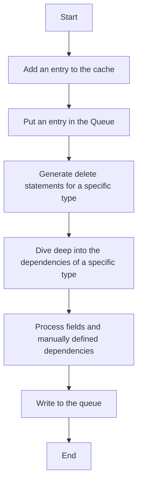

This document will cover the process of purging order history in the BroadleafCommerce-demo repository. We'll cover the following steps:

1. Adding an entry to the cache
2. Putting an entry in the Queue
3. Generating delete statements for a specific type
4. Diving deep into the dependencies of a specific type
5. Processing fields and manually defined dependencies
6. Writing to the queue.

# Adding an entry to the cache

The first step in the process is to add an entry to the cache. This is done to keep track of the orders that are being processed. If the cache does not already contain the entry, it is added with the current time in milliseconds. This timestamp is used to determine the age of the entry in the cache.

# Putting an entry in the Queue

The next step is to put an entry in the Queue. This is done to manage the order of processing. The entry is added to a list of elements to add, which is then written to the queue. This ensures that the orders are processed in the order they were added to the queue.

# Generating delete statements for a specific type

Once the entry is in the queue, the system generates delete statements for a specific type. This is done to prepare for the removal of the order from the system. The system dives into the dependencies of the type to ensure that all related data is also removed.

# Diving deep into the dependencies of a specific type

The system dives deep into the dependencies of a specific type to ensure that all related data is also removed. This includes processing fields and manually defined dependencies. This is done to ensure that no orphaned data is left behind when the order is removed.

# Processing fields and manually defined dependencies

The system processes fields and manually defined dependencies of a specific type. This is done to ensure that all related data is also removed. This includes adding entries to the Queue for each dependency to ensure they are also processed.

# Writing to the queue

The final step in the process is to write the entries to the Queue. This is done to ensure that the orders and their dependencies are processed in the order they were added. If the queue is full, an exception is thrown and the process is halted until space is available in the queue.

&nbsp;

*This is an auto-generated document by Swimm AI 🌊 and has not yet been verified by a human*

<SwmMeta version="3.0.0" repo-id="Z2l0aHViJTNBJTNBQnJvYWRsZWFmQ29tbWVyY2UtZGVtbyUzQSUzQWdpbGFkbmF2b3Q=" repo-name="BroadleafCommerce-demo" doc-type="product-flows">Powered by [Swimm](/)</SwmMeta>
