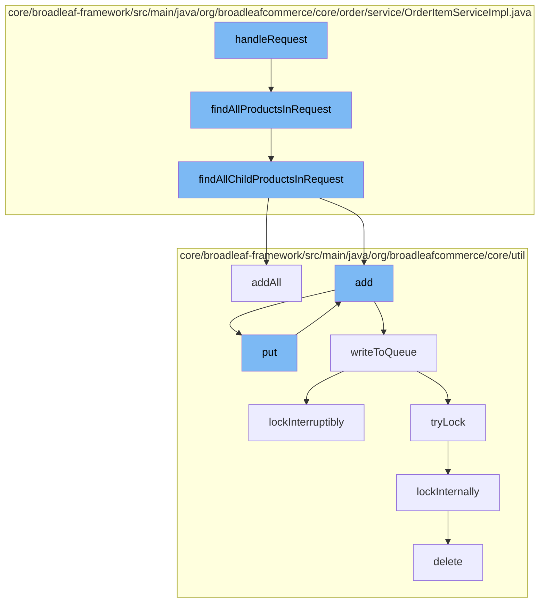

This document will cover the process of handling product requests in the BroadleafCommerce-demo repository. The process includes:

1. Retrieving all products in a request
2. Finding all child products in a request
3. Adding all products to a distributed queue
4. Writing to the queue
5. Locking the queue for write operations
6. Deleting the lock once the operation is complete.



<SwmSnippet path="/core/broadleaf-framework/src/main/java/org/broadleafcommerce/core/order/service/OrderItemServiceImpl.java" line="592">

---

# Retrieving all products in a request

The function `findAllProductsInRequest` is used to retrieve all products in a request. It calls `findAllChildProductsInRequest` to get all child products and adds them to a set, which is then returned.

```java
    @Override
    public Set<Product> findAllProductsInRequest(ConfigurableOrderItemRequest itemRequest) {
        Set<Product> allProductsSet = findAllChildProductsInRequest(itemRequest.getChildOrderItems());
        allProductsSet.add(itemRequest.getProduct());
        return allProductsSet;
    }
```

---

</SwmSnippet>

<SwmSnippet path="/core/broadleaf-framework/src/main/java/org/broadleafcommerce/core/order/service/OrderItemServiceImpl.java" line="599">

---

# Finding all child products in a request

The function `findAllChildProductsInRequest` is used to retrieve all child products in a request. It iterates over the child items in the request, retrieves the product associated with each child item, and adds it to a set, which is then returned.

```java
    protected Set<Product> findAllChildProductsInRequest(List<OrderItemRequestDTO> childItems) {
        Set<Product> allProductsSet = new HashSet<Product>();
        for (OrderItemRequestDTO child : childItems) {
            ConfigurableOrderItemRequest configChild = (ConfigurableOrderItemRequest) child;
            Product childProduct = configChild.getProduct();
            if (childProduct != null) {
                allProductsSet.add(childProduct);
            } else {
                List<OrderItemRequestDTO> productChoices = new ArrayList<OrderItemRequestDTO>(configChild.getProductChoices());
                allProductsSet.addAll(findAllChildProductsInRequest(productChoices));
            }
        }
        return allProductsSet;
    }
```

---

</SwmSnippet>

<SwmSnippet path="/core/broadleaf-framework/src/main/java/org/broadleafcommerce/core/util/queue/ZookeeperDistributedQueue.java" line="307">

---

# Adding all products to a distributed queue

The function `addAll` is used to add all products to a distributed queue. It writes the products to the queue and returns a boolean indicating whether all products were successfully added.

```java
    @Override
    public boolean addAll(Collection<? extends T> c) {
        if (c == null || c.isEmpty()) {
            return false;
        }
        try {
            int count = writeToQueue(new ArrayList<>(c), -1L);
            return count == c.size();
        } catch (InterruptedException e) {
            return false;
        }
        
    }
```

---

</SwmSnippet>

<SwmSnippet path="/core/broadleaf-framework/src/main/java/org/broadleafcommerce/core/util/queue/ZookeeperDistributedQueue.java" line="503">

---

# Writing to the queue

The function `writeToQueue` is used to write the products to the queue. It locks the queue for write operations, writes the products, and then unlocks the queue.

```java
    protected int writeToQueue(List<? extends T> entries, final long timeout) throws InterruptedException {
        if (entries == null || entries.isEmpty()) {
            return 0;
        }
        
        int entryCount = 0;
        long waitTime = timeout;
        synchronized (QUEUE_MONITOR) {
            while (true) {
                boolean locked = false;
                DistributedLock lock = getQueueAccessLock();
                if (timeout < 0L) {
                    lock.lockInterruptibly();
                    locked = true;
                } else if (timeout > 0L && waitTime > 0L) {
                    long start = System.currentTimeMillis();
                    locked = lock.tryLock(waitTime, TimeUnit.MILLISECONDS);
                    long end = System.currentTimeMillis();
                    waitTime -= (end - start);
                } else {
                    locked = lock.tryLock();
```

---

</SwmSnippet>

<SwmSnippet path="/core/broadleaf-framework/src/main/java/org/broadleafcommerce/core/util/lock/ReentrantDistributedZookeeperLock.java" line="335">

---

# Locking the queue for write operations

The function `lockInterruptibly` is used to lock the queue for write operations. It calls `lockInternally` to perform the actual locking.

```java
    @Override
    public void lockInterruptibly() throws InterruptedException {
        if (Thread.interrupted()) {
            throw new InterruptedException("Thread was interrupted prior to trying to acquire the lock.");
        }
        
        lockInternally(-1L);
    }
```

---

</SwmSnippet>

<SwmSnippet path="/core/broadleaf-framework/src/main/java/org/broadleafcommerce/core/util/dao/CodeTypeDaoImpl.java" line="51">

---

# Deleting the lock once the operation is complete

The function `delete` is used to delete the lock once the write operation is complete. It removes the lock from the entity manager.

```java
    public void delete(CodeType codeType) {
        if (!em.contains(codeType)) {
            codeType = (CodeType) em.find(CodeTypeImpl.class, codeType.getId());
        }
        em.remove(codeType);
    }
```

---

</SwmSnippet>

&nbsp;

*This is an auto-generated document by Swimm AI 🌊 and has not yet been verified by a human*

<SwmMeta version="3.0.0" repo-id="Z2l0aHViJTNBJTNBQnJvYWRsZWFmQ29tbWVyY2UtZGVtbyUzQSUzQWdpbGFkbmF2b3Q=" repo-name="BroadleafCommerce-demo" doc-type="flows"><sup>Powered by [Swimm](/)</sup></SwmMeta>
