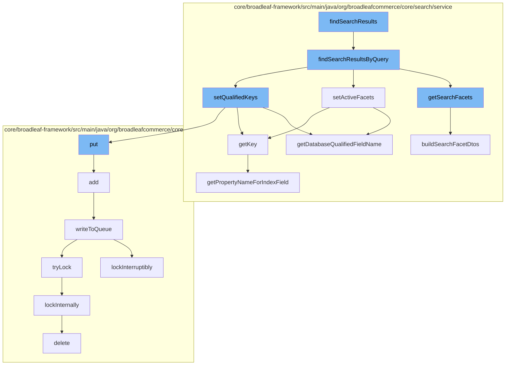

This document will cover the process of searching for products in the BroadleafCommerce-demo repository. The process includes the following steps:

1. Initiating the search
2. Setting qualified keys for the search
3. Fetching search facets
4. Setting active facets
5. Writing to the queue
6. Locking the queue
7. Deleting the lock



<SwmSnippet path="/core/broadleaf-framework/src/main/java/org/broadleafcommerce/core/search/service/DatabaseSearchServiceImpl.java" line="99">

---

# Initiating the search

The `findSearchResultsByQuery` function initiates the search process. It creates a new `SearchResult` object, sets the qualified keys for the search, fetches the products matching the query, fetches the search facets, sets the active facets, and finally sets the products and facets in the result.

```java
    @Override
    public SearchResult findSearchResultsByQuery(String query, SearchCriteria searchCriteria) {
        SearchResult result = new SearchResult();
        setQualifiedKeys(searchCriteria);
        List<Product> products = catalogService.findFilteredActiveProductsByQuery(query, searchCriteria);
        List<SearchFacetDTO> facets = getSearchFacets();
        setActiveFacets(facets, searchCriteria);
        result.setProducts(products);
        result.setFacets(facets);
        result.setTotalResults(products.size());
        result.setPage(1);
        result.setPageSize(products.size());
        return result;
    }
```

---

</SwmSnippet>

<SwmSnippet path="/core/broadleaf-framework/src/main/java/org/broadleafcommerce/core/search/service/DatabaseSearchServiceImpl.java" line="102">

---

# Setting qualified keys for the search

`setQualifiedKeys` function is called to set the qualified keys for the search. These keys are used to narrow down the search results.

```java
        setQualifiedKeys(searchCriteria);
```

---

</SwmSnippet>

<SwmSnippet path="/core/broadleaf-framework/src/main/java/org/broadleafcommerce/core/search/service/DatabaseSearchServiceImpl.java" line="119">

---

# Fetching search facets

`getSearchFacets` function is used to fetch the search facets. These facets are used to categorize the search results.

```java
    @Override
    public List<SearchFacetDTO> getSearchFacets() {
        String cacheKey = CACHE_KEY_PREFIX + "blc-search";
        List<SearchFacetDTO> facets = getCache().get(cacheKey);
        
        if (facets == null) {
            facets = buildSearchFacetDtos(searchFacetDao.readAllSearchFacets(FieldEntity.PRODUCT));
            getCache().put(cacheKey, facets);
        }
        return facets;
    }
```

---

</SwmSnippet>

<SwmSnippet path="/core/broadleaf-framework/src/main/java/org/broadleafcommerce/core/search/service/DatabaseSearchServiceImpl.java" line="105">

---

# Setting active facets

`setActiveFacets` function is called to set the active facets for the search. These facets are used to filter the search results.

```java
        setActiveFacets(facets, searchCriteria);
```

---

</SwmSnippet>

<SwmSnippet path="/core/broadleaf-framework/src/main/java/org/broadleafcommerce/core/util/queue/ZookeeperDistributedQueue.java" line="359">

---

# Writing to the queue

`add` function is used to add the search result to the queue. If the queue is full, an exception is thrown.

```java
    @Override
    public boolean add(T e) {
        try {
            final ArrayList<T> lst = new ArrayList<>();
            lst.add(e);
            int count = writeToQueue(lst, 0L);
            if (count != 1) {
                throw new IllegalStateException("The Zookeeper queue was full.");
            } else {
                return true;
            }
        } catch (InterruptedException ex) {
            Thread.currentThread().interrupt();
            return false;
        }
    }
```

---

</SwmSnippet>

<SwmSnippet path="/core/broadleaf-framework/src/main/java/org/broadleafcommerce/core/util/lock/ReentrantDistributedZookeeperLock.java" line="335">

---

# Locking the queue

`lockInterruptibly` function is used to lock the queue while writing to it. This ensures that no other process can write to the queue at the same time.

```java
    @Override
    public void lockInterruptibly() throws InterruptedException {
        if (Thread.interrupted()) {
            throw new InterruptedException("Thread was interrupted prior to trying to acquire the lock.");
        }
        
        lockInternally(-1L);
    }
```

---

</SwmSnippet>

<SwmSnippet path="/core/broadleaf-framework/src/main/java/org/broadleafcommerce/core/util/dao/CodeTypeDaoImpl.java" line="51">

---

# Deleting the lock

`delete` function is used to delete the lock after writing to the queue. This allows other processes to write to the queue.

```java
    public void delete(CodeType codeType) {
        if (!em.contains(codeType)) {
            codeType = (CodeType) em.find(CodeTypeImpl.class, codeType.getId());
        }
        em.remove(codeType);
    }
```

---

</SwmSnippet>

&nbsp;

*This is an auto-generated document by Swimm AI 🌊 and has not yet been verified by a human*

<SwmMeta version="3.0.0" repo-id="Z2l0aHViJTNBJTNBQnJvYWRsZWFmQ29tbWVyY2UtZGVtbyUzQSUzQWdpbGFkbmF2b3Q=" repo-name="BroadleafCommerce-demo" doc-type="flows"><sup>Powered by [Swimm](/)</sup></SwmMeta>
