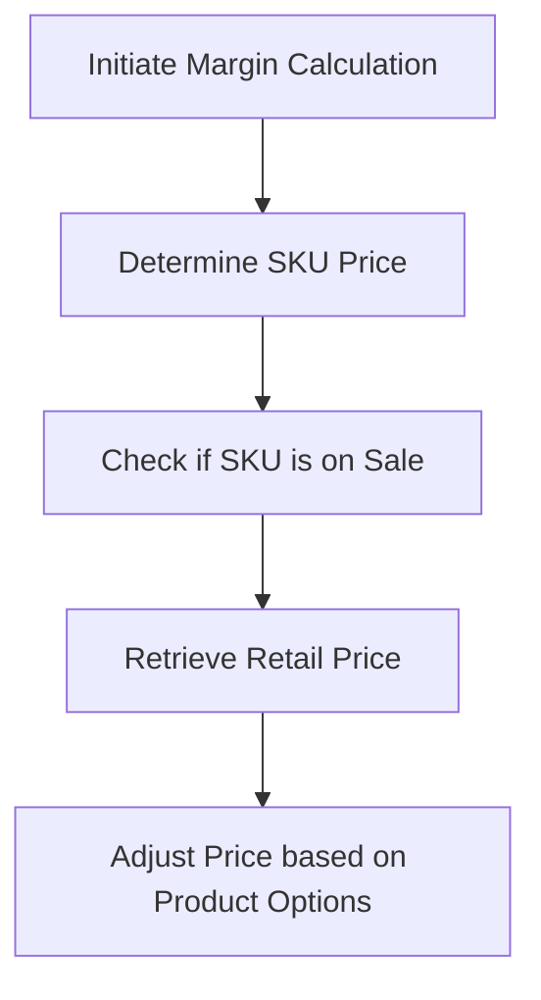

This document will cover the process of calculating the margin for a product SKU in the BroadleafCommerce-demo repository. We'll cover:

1. Initiating the margin calculation
2. Determining the SKU price
3. Checking if the SKU is on sale
4. Retrieving the retail price
5. Adjusting the price based on product options.

# Initiating the Margin Calculation

The process of calculating the margin for a SKU begins by determining the price of the SKU. This is the first step in the margin calculation process and sets the stage for the subsequent steps.

# Determining the SKU Price

The price of the SKU is determined by checking if the SKU is on sale. If the SKU is on sale, the sale price is used; otherwise, the retail price is used. This decision affects the final margin calculation and ultimately the profitability of the SKU.

# Checking if the SKU is on Sale

The system checks if the SKU is on sale by comparing the sale price and the retail price. If the sale price is less than the retail price, the SKU is considered to be on sale. This information is crucial as it affects the final price determination of the SKU.

# Retrieving the Retail Price

The retail price of the SKU is retrieved. This is the price at which the SKU is usually sold when it's not on sale. The retail price is used in the margin calculation when the SKU is not on sale.

# Adjusting the Price based on Product Options

The price of the SKU is adjusted based on the selected product options. Each product option may have a price adjustment associated with it. These adjustments are added to the SKU price to get the final price. This ensures that the margin calculation takes into account the price variations due to different product options.

&nbsp;

*This is an auto-generated document by Swimm AI 🌊 and has not yet been verified by a human*

<SwmMeta version="3.0.0" repo-id="Z2l0aHViJTNBJTNBQnJvYWRsZWFmQ29tbWVyY2UtZGVtbyUzQSUzQWdpbGFkbmF2b3Q=" repo-name="BroadleafCommerce-demo" doc-type="product-flows">Powered by [Swimm](/)</SwmMeta>
