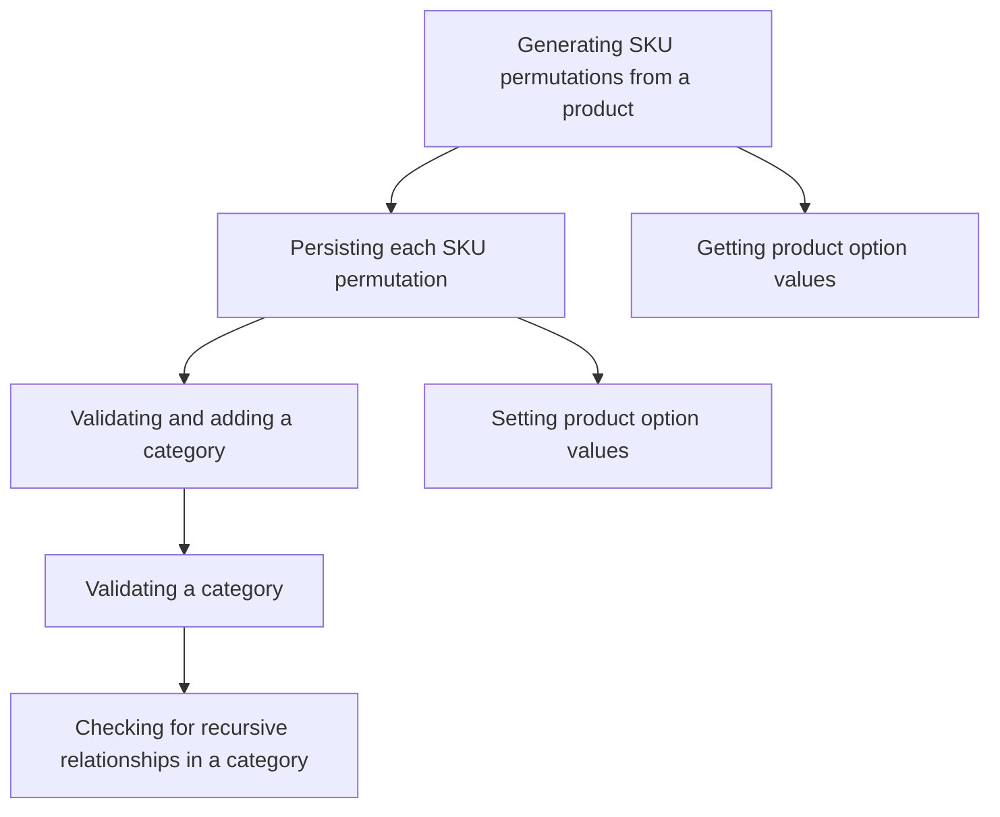

This document will cover the SKU Permutations Process in the BroadleafCommerce-demo repository. We'll cover:

1. Generating SKU permutations from a product
2. Persisting each SKU permutation
3. Validating and adding a category
4. Validating a category
5. Checking for recursive relationships in a category
6. Getting product option values
7. Setting product option values.

# Generating SKU permutations from a product

The process of generating SKU permutations for a product is initiated. This involves creating different combinations of product attributes (like size, color, etc.) to form unique SKUs. Each SKU represents a specific variant of the product.

# Persisting each SKU permutation

Each SKU permutation is saved as a new instance in the product. This means that each unique combination of product attributes is stored separately, allowing for detailed tracking and management of each product variant.

# Validating and adding a category

Before a category can be added, it is validated to ensure it meets the necessary criteria. Once validated, the category is added. This ensures that the product is correctly categorized, aiding in product search and organization.

# Validating a category

The category is validated by checking for self-link and recursive relationships. This ensures that a category does not have a parent category that is itself, preventing potential issues with category hierarchy and navigation.

# Checking for recursive relationships in a category

The system checks for recursive relationships in a category. This is to ensure that a category does not have a parent category that is itself, which could lead to confusion and errors in the category structure.

# Getting product option values

The system retrieves the product option values for a SKU. These values represent the specific attributes of a product variant, such as its size, color, etc.

# Setting product option values

The system sets the product option values for a SKU. This involves assigning specific attribute values to a product variant, defining its unique characteristics.

&nbsp;

*This is an auto-generated document by Swimm AI 🌊 and has not yet been verified by a human*

<SwmMeta version="3.0.0" repo-id="Z2l0aHViJTNBJTNBQnJvYWRsZWFmQ29tbWVyY2UtZGVtbyUzQSUzQWdpbGFkbmF2b3Q=" repo-name="BroadleafCommerce-demo" doc-type="product-flows">Powered by [Swimm](/)</SwmMeta>
